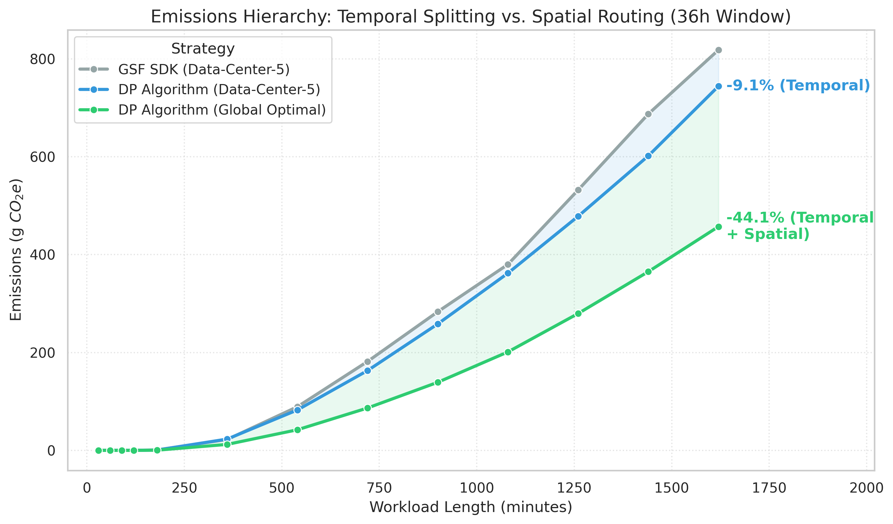
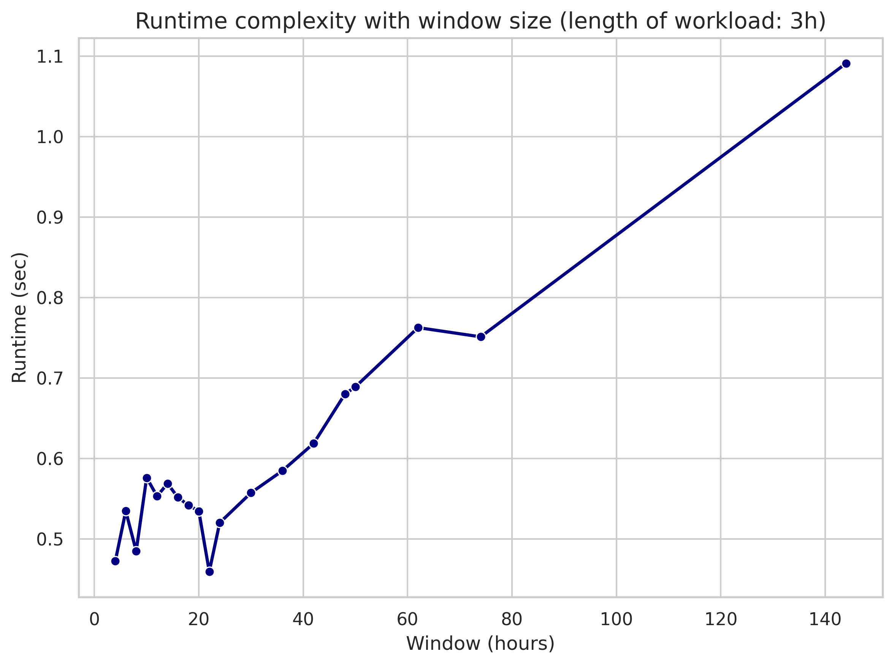
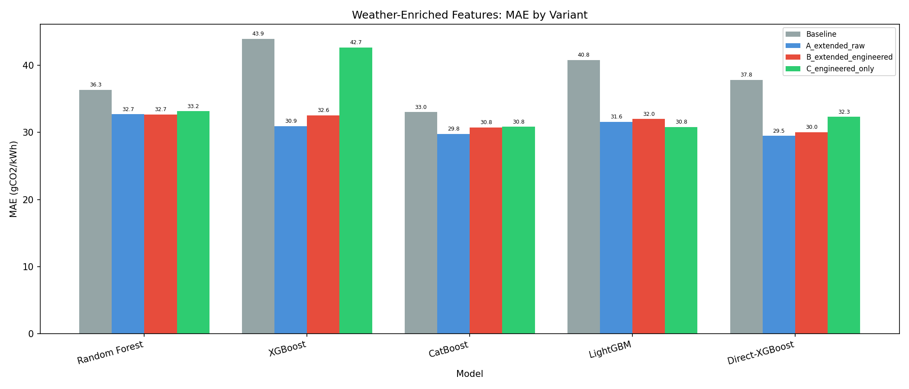

# Algorithms

The core of the Carbon-Aware AI Agent is its **Spatio-Temporal Scheduler**, a high-performance C++ engine that solves a complex resource allocation problem to minimize the carbon footprint of AI workloads.

---

## The Core Dependency: Carbon Intelligence

The scheduler does not operate in a vacuum. Its ability to optimize is strictly dependent on high-fidelity, regional carbon intensity data provided by the **Forecasting Service (Stats Component)**.

### The Scheduler-Stats Relationship

The scheduler consumes the following data streams to build its optimization model:

* **Carbon Intensity Forecasts ($c_i$):** Predicted gCO2/kWh for each region $i$ at 30-minute intervals.
* **Grid Load Forecasts ($l_i$):** Background load at each data center to calculate available headroom.
* **Physical Capacity ($r_i$):** The maximum compute throughput of each location.

Without these forecasts, the scheduler defaults to a greedy "earliest-available" placement, losing the benefits of grid flexibility. The relationship is formalized by the cost function $c_i(\text{time})$, which the scheduler minimizes over the allowed execution window.

---

## Problem Formalization

The scheduling task is modeled as a constrained optimization problem over a 2D surface of $m$ locations and $n$ time blocks.

### The Objective Function

Minimize the total additional carbon cost incurred across all locations $i$ and time slots $j$:

$$\text{Minimize } \sum_{i,j} [c_{i,j}(l_{i,j} + w_{i,j}) - c_{i,j}(l_{i,j})]$$

Where:

* $w_{i,j}$ is the workload allocated to location $i$ at time $j$.
* $l_{i,j}$ is the existing background load.
* $c_{i,j}$ is the non-decreasing cost function (Carbon Intensity $\times$ Energy Efficiency).

### Constraints

1. **Workload Completion**: $\sum w_{i,j} \ge W + kP$
    * $W$ is the total required work.
    * $k$ is the number of "start" actions.
    * $P$ is the **Startup Energy Tax** (penalty for pausing/resuming).
2. **Physical Bottleneck**: $w_{i,j} + l_{i,j} \le r_{i,j}$ (Capacity limit).
3. **Temporal Window**: All $w_{i,j}$ must fall between the earliest start and latest finish deadlines.

---

## The Spatio-Temporal DP Algorithm

To solve this efficiently across multiple data centers, the system employs a two-phase deterministic **Dynamic Programming (DP)** approach.

### Phase 1: Per-Location Temporal Optimization

For each data center, the algorithm calculates the optimal cost for *all possible* workload amounts $W' \in [0, W]$.

* **State Representation**: $DP[i][w][s]$ represents the minimum cost to achieve $w$ work in the first $i$ blocks, given the current state $s$ (active or idle).
* **Effective Work Transformation**: The algorithm uses a transformation where it minimizes cost over "effective work" $E = \sum w_i - kP$. This allows the penalty $P$ for non-contiguous execution to be handled natively within the state transitions.
* **Optimization**: This phase is parallelized across locations and utilizes **AVX-512 SIMD** instructions to accelerate the DP table transitions.

### Phase 2: Multi-Location Spatial Routing

Once per-location costs are pre-computed, the results are merged using a **Multiple Choice Knapsack** algorithm.

* The algorithm selects exactly one "optimal path" from each data center's pre-computed table.
* It finds the combination of per-location work amounts that sums to $W$ while minimizing the global sum of costs.

---

## Natural Inputs & Physical Units

To make the system accessible to AI engineers, the scheduler translates "natural" hardware specifications into the mathematical units required by the DP engine, ensuring the final cost reflects real-world carbon emissions.

### Hardware Specification Translation

Instead of abstract workload units, users provide:

* **GPU Model**: (e.g., Nvidia A100 SXM4, V100 PCIe).
* **GPU Count**: Total number of parallel accelerators.
* **Model Size (GB)**: The memory footprint of the weights.
* **Runtime (Hours)**: The expected duration of the task.

The system performs a multi-stage translation to derive the internal parameters:

1. **Workload Magnitude ($W$)**: Calculated in **Floating Point Operations (FLO)**.
2. **Startup Energy Tax ($P$)**: This penalty includes the energy required for BIOS/POST surges, OS/container initialization, and the SXM/PCIe bus energy used to transfer model weights into VRAM.
3. **Physical Throughput ($r_{i,j}$)**: The maximum workload completed in a 5-minute block is strictly capped by the physical throughput of the requested GPU cluster.

### The Cost Function: `LocationCost`

The algorithm's internal cost is calculated by the `LocationCost` struct, which maps workload units to physical carbon emissions in grams ($g$):

$$\text{Cost (gCO}_2) = \text{Workload (FLO)} \times \text{Efficiency (kWh/FLO)} \times \text{Intensity (gCO}_2/\text{kWh)}$$

By calculating cost in absolute physical units, the "minimum cost" identified by the DP engine corresponds exactly to the global minimum of greenhouse gas emissions for that specific hardware profile.

---

## Technical Implementation

The scheduler is implemented in **C++23** to leverage low-level hardware optimizations:

* **AVX-512 Vectorization**: Massively parallelizes the inner DP loop for sub-millisecond table updates.
* **Lock-Free Queues**: Manages incoming scheduling requests without thread contention.
* **Asynchronous I/O**: Uses `std::async` and coroutines to fetch forecast data and persist results concurrently.

```cpp
--8<-- "code/scheduler/src/SchedulerAlgo.hpp:131:179"
```

---

## Quantitative Analysis

### The Emissions Hierarchy

Experimental data shows a clear hierarchy in how carbon is saved. While temporal flexibility (splitting a job within one region) is useful, **spatial flexibility** (routing between regions) is the primary driver of impact.


/// caption
The emissions hierarchy, demonstrating the massive savings potential of spatial routing over temporal-only optimization.
///

### Algorithmic Scalability

Despite the complexity of the DP model, the C++ implementation ensures that scheduling overhead remains negligible, enabling real-time orchestration.


/// caption
Execution time scales linearly with the scheduling window, remaining well under 1.2 seconds for a 144-hour horizon.
///

### Mathematical Guarantee

Because the DP engine's search space is a superset of traditional contiguous schedulers, it **mathematically guarantees** that the produced schedule will have a carbon footprint less than or equal to the GSF SDK baseline.


/// caption
Our DP scheduler consistently outperforms the contiguous GSF SDK baseline, especially as workload size increases.
///

---

## Forecasting Dependency: Performance

While the scheduler is the "brain," its effectiveness depends on the accuracy of the "eyes" (the Forecasting service).


/// caption
The Direct-XGBoost forecasting model achieved a 10.6% improvement in MAE, providing more reliable data for the scheduler's optimization passes.
///


/// caption
Performance improvement at different forecast horizons after weather integration.
///

For a detailed breakdown of the forecasting model's development and evaluation, see the [Implementation](implementation.md) and [Testing](testing.md) pages.
