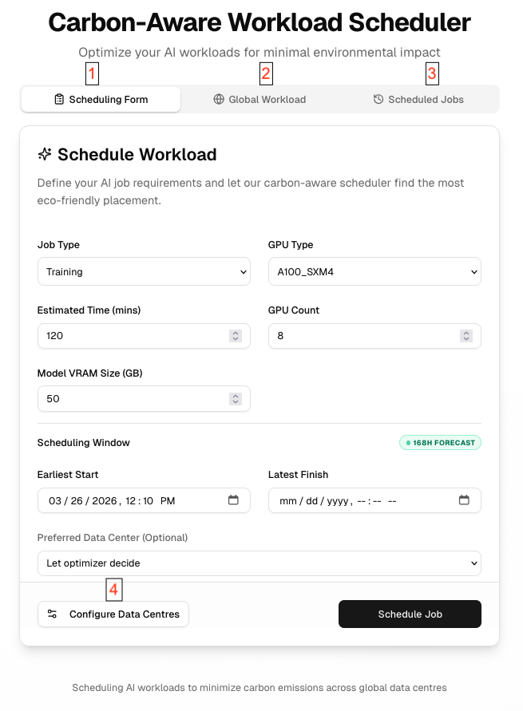
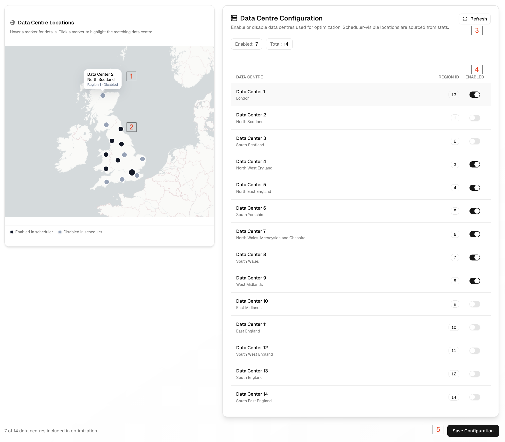
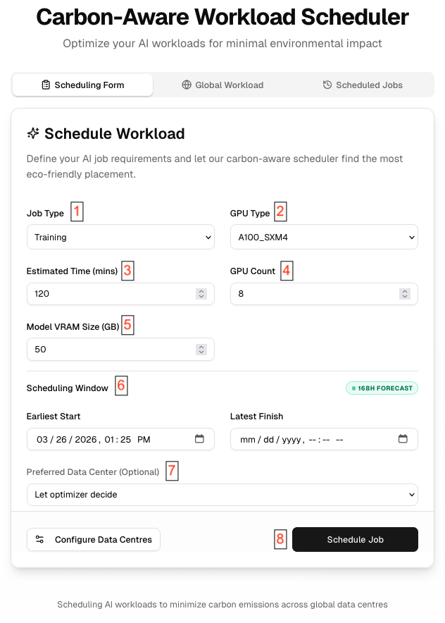
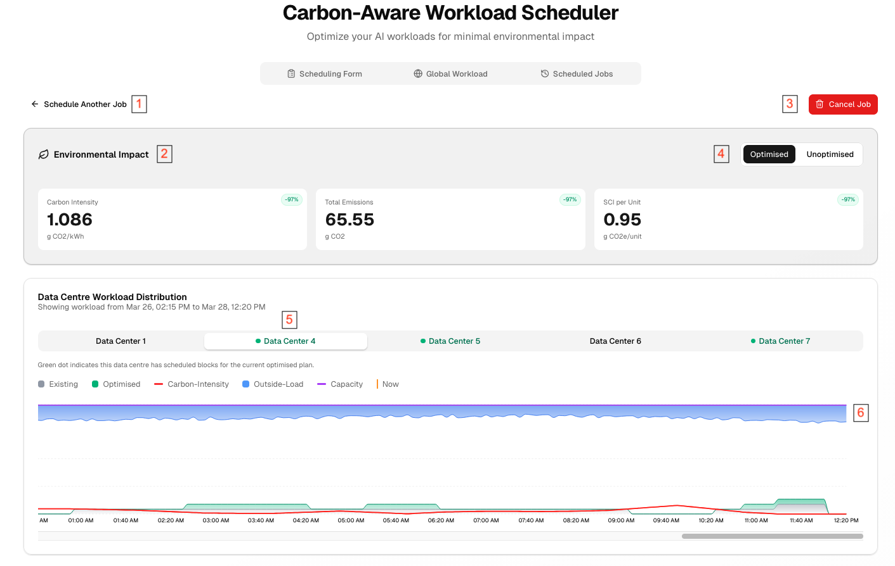
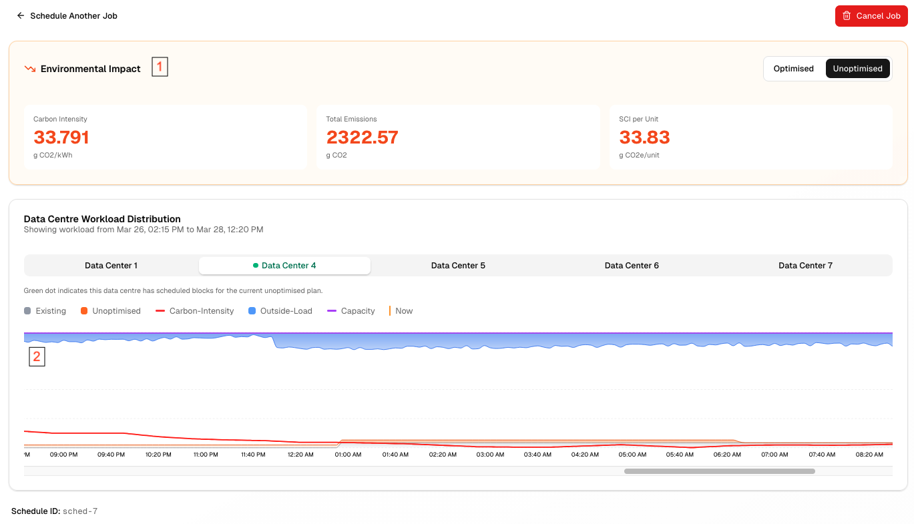
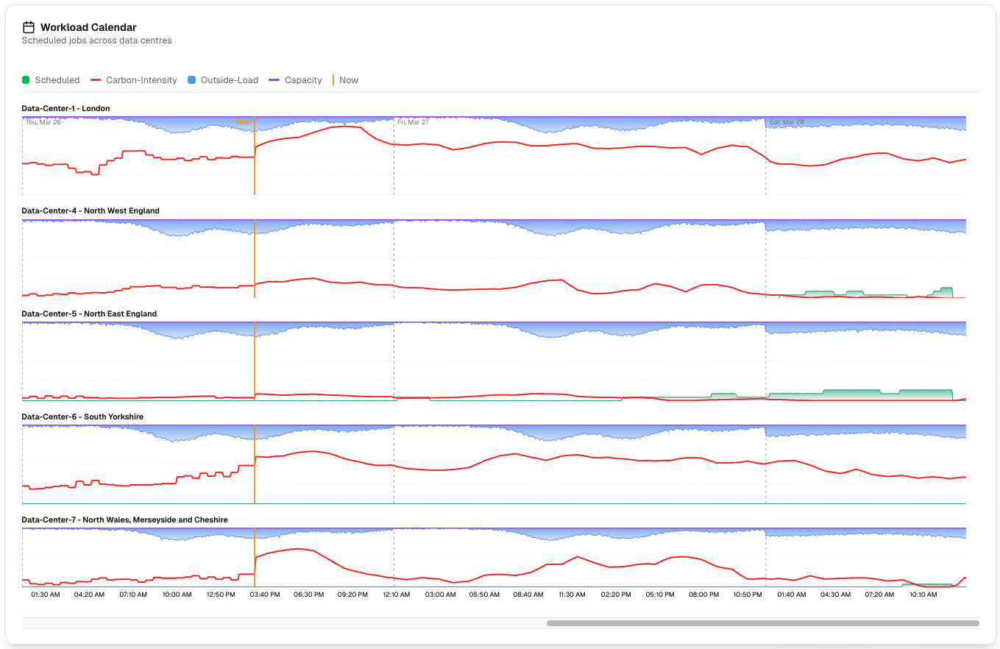
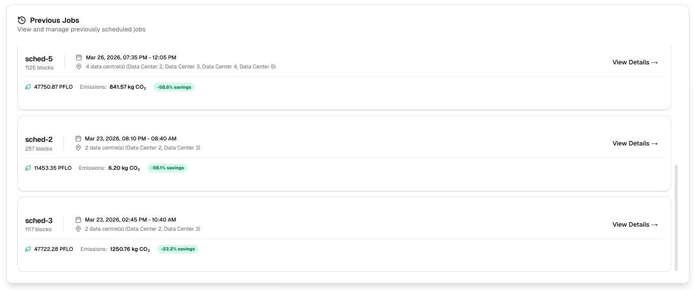
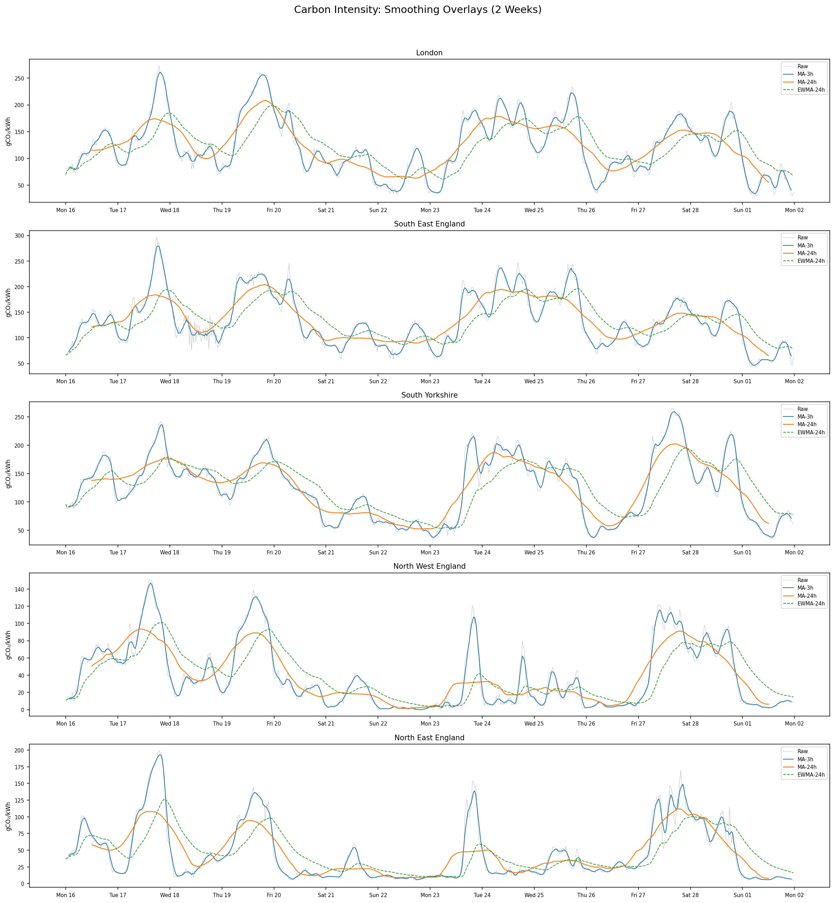

# Appendices

---

## User Manual
#### Using the Scheduling form
When you open up the site, you will be greeted by the scheduling form by default:

/// caption
Pages you can navigate to through the scheduling form.
///
1. Opens the scheduling form shown in Figure 1. Can be used to schedule a job
2. Opens the global workload page to see information on all active datacenters
3. Opens the previous jobs page to see list of previous jobs and its statistics.
4. Open the datacenter configuration page where the user can select which datacenters they want active during scheduling.

#### Configuring Active Datacenters
Once "Configure Data Centers" is clicked on the sheduling form (number 4 from Figure 1), the user is redirected to this page:

/// caption
Features of datacenter configuration page.
///
1. Hovering over a datacenter location on the map displays its information
2. Active datacenters are shown as black spots on the map, while inactive are shown as grey
3. Refresh button updates datacenter information fetched from the API. Only used if information sent from API changes.
4. Toggle to activate/deactivate datacenters that will be used in scheduling
5. "Save Configuration" persists active datacenters to be used for scheduling and redirects user back to Scheduling Form.

#### Submitting a Job
User can submit a job to get a schedule by filling in all inputs that allign with industry standard noted in the Scheduling form.

/// caption
Filling in sheduling form to submit a job.
///
1. User has to choose job type between: Training, Inference, and Batch
2. User selects GPU Type. Currently, it presents a choice between: A100_SXM4 and V100_PCIE however the user can modify this through their own API.
3. User inputs estimated time of the job 
4. User inputs how many active GPUs in processing
5. User inputs the Model VRAM Size needed for the workload
6. User inputs time constraints for the job. Includes the date and time.
7. User can select an active datacenter to schedule the entire job in (Only temporal optimisation). Default scheduling across all datacenters allow for greater savings.
8. Once all inputs have been filled in, user can press "Schedule Job" to receive an optimised schedule.

#### Viewing Scheduling Results
Once user has submitted a job, they can view the impact and statistics of the optimisation below:

/// caption
Viewing Optimised schedule
///
1. User can go back to schedule another job, current job is persisted.
2. User can see environmental impact of scheduled job along with its percentage savings. Statistics are from industry standard metrics.
3. User can cancel the job, resulting in this schedule no longer being stored in the program.
4. User can switch between Optimised and Unoptimised views to compare schedules and impact. More on this view below.
5. User can navigate between each active datacenter to see its schedule. Any datacenter that the current job is scheduled in will be indicated in green to make it easier for the user to find.
6. This shart shows information about the datacenter across the timeframe inputted by the user when scheduling the job. Each variable on the chart is labelled and displayed to make it easy for the user to observe the schedule and why the workload is placed where it is.

The unoptimised view gives a way for the user to see the trivial schedule which most workloads are executed using. This can be used to compare to our optimised one and can be seen below:

/// caption
Viewing Unoptimised schedule
///
1. User can view environmental impact of trivial schedule and compare to optimised values.
2. User can see graph of unoptimised schedule shown in orange. 

#### Viewing Global Workload
The user can also see all scheduled jobs across all active datacenters in the global workload page shown below:

/// caption
Global workload page, displays all scheduled jobs across active datacenters
///
The user can see all scheduled jobs on each datacenter, being able to scroll between the timeframes of the earlies block of work scheduled to the latest one. These graphs use the same metrics as the ones showing a schedules result but includes a "Now" line that indictes the current time.

#### View Previous Jobs
Users are also given the option to see previous jobs they have run:

/// caption
Previous Jobs page, displays a summary of all previous jobs. Can be interacted with to bring up detailed view
///
The user can view all previous jobs through this page. It gives a quick summary about the length, which datacenters are used and statistics on the impact of the job. Interacting with a schedule brings up the Schedule Result page from Figure 4.

## Deployment Manual

## Legal Issues and Processes

#### GDPR Compliance

The Carbon-Aware AI Workload Scheduler is designed with privacy in mind and adheres to the principles of the UK General Data Protection Regulation (UK GDPR). The system does not collect, store, or process any personal identifiable information (PII). Specifically:

- **No user authentication or accounts**: The UI allows job submission without login, registration, or any form of user identification.
- **No personal data collection**: Job configurations submitted through the interface contain only technical parameters (workload type, deadline, duration) — no personal data is attached or required.
- **Public data sources only**: The Stats forecasting service consumes data exclusively from public APIs — the [UK Carbon Intensity API](https://carbonintensity.org.uk/) and [Open-Meteo weather API](https://open-meteo.com/) — neither of which involves personal data.
- **No cookies or tracking**: The website and UI do not use cookies, analytics, or any client-side tracking mechanisms.
- **Session-only processing**: Job submissions are processed in-memory by the Scheduler and are not persisted beyond the user's session. No database of user activity exists.

Since the system does not handle personal data at any point in its pipeline, the six GDPR principles are addressed as follows:

| GDPR Principle | How It Is Addressed |
| --- | --- |
| **Lawfulness, Fairness, and Transparency** | Users are informed of the system's purpose. No personal data is collected or processed. |
| **Purpose Limitation** | Data consumed (carbon intensity, weather) is used solely for scheduling optimisation. |
| **Data Minimisation** | Only the minimum technical parameters required for scheduling are accepted as input. |
| **Storage Limitation** | No user data is persisted. Job configurations exist only in-memory during processing. |
| **Integrity and Confidentiality** | All inter-service communication occurs over HTTP between co-located containers. No sensitive data is transmitted. |
| **Accountability** | The source code is publicly available under the MIT License for inspection and audit. |

#### Privacy Statement

The Carbon-Aware AI Workload Scheduler does not collect, store, or share any personal data. No information is transmitted to third parties beyond the public API calls required for carbon intensity and weather data retrieval — these calls contain no user-identifying information.

The third-party services used by the system are:

- **UK Carbon Intensity API** — A free, public API provided by National Grid ESO. No API key or user data is required.
- **Open-Meteo Weather API** — A free, open-source weather API. Requests contain only geographic coordinates and weather parameters.

We reserve the right to update this privacy statement. Any changes will be reflected on this page.

#### Source Code License

The Carbon-Aware AI Workload Scheduler is released under the **MIT License**:

> MIT License
>
> Copyright (c) 2025 Yiqian (akioweh) Liu, Maksymilian (Maksiu) Sieklinski, Ali Raza (arjafree) Jafree, and Rithwik (rithwik134) Chokka
>
> Permission is hereby granted, free of charge, to any person obtaining a copy of this software and associated documentation files, to deal in the Software without restriction, including without limitation the rights to use, copy, modify, merge, publish, distribute, sublicense, and/or sell copies of the Software, subject to the conditions of the MIT License.

The full license text is available in the [project repository](https://github.com/akioweh/carbon-aware-ai-agents).

#### Terms of Use

- **No Warranty**: The software is provided "as is", without warranty of any kind, express or implied. The authors are not liable for any damages arising from the use of the software.
- **Limitation of Liability**: In no event shall the authors or copyright holders be liable for any claim, damages, or other liability arising from the use of the software.
- **Governing Law**: This project was developed as part of the UCL COMP0016 Systems Engineering module. Any legal inquiries should be directed through UCL.

*Last updated: March 2026*

## Development Blog

## Monthly Video

#### December

#### January

#### February

#### March

## Forecasting Experiment Report

This appendix presents the complete experimental results from the carbon intensity forecasting model development. For a narrative account of the development process, see the [ML Development Journal](dev-journal.md). For the model justification and production choice rationale, see the [Research](research.md#forecasting-model-research) page.

> **Final production model: RidgeFull (Enhanced Direct-Ridge) -- AVG MAE 24.88.** A 24.6% improvement over the previous production model (Direct-Ridge, MAE 32.99), achieved through feature engineering (14 -> 65 features), full historical data, and StandardScaler preprocessing.

### 1. Introduction

#### Problem Statement

Forecast UK regional carbon intensity 7 days ahead at 30-minute intervals (336 steps) to enable carbon-aware scheduling of AI workloads. The scheduler needs accurate forecasts to shift compute to low-carbon windows.

#### Data

- **Source**: UK Carbon Intensity API
- **Regions**: London, North East England, North West England, South East England, South Yorkshire
- **Interval**: 30 minutes
- **Baseline period**: 2025-12-06 to 2026-03-06 (91 days, 21,525 readings)
- **Seasonal period**: ~1 year of historical data
- **Exogenous features**: Open-Meteo weather (wind speed 10m, temperature 2m, solar radiation) -- lag-1 shifted

#### Evaluation Setup

- **Test set**: Last 7 days (336 points per region)
- **Training windows**: 7-day (336 points) and full backfill (~83 days / ~3,972 points for baseline; ~365 days for seasonal)
- **Primary metric**: MAE (mean absolute error), averaged across 5 regions
- **Secondary metrics**: RMSE, R^2, Ljung-Box p-value, max ACF of residuals
- **Forecasting approaches**:
    - *Recursive*: predict one step, feed prediction back as input, repeat 336 times
    - *Direct*: train one model per horizon step (or single model with horizon feature)

### 2. Data Analysis

#### Regional Characteristics

| Region | Mean CI | Std | CV | Character |
| --------------- | ------- | ---- | ----- | ----------------------------- |
| London | 145.8 | 62.0 | 0.425 | Medium variability, gas-heavy |
| South East | 163.7 | 65.4 | 0.400 | Highest mean, gas-heavy |
| South Yorkshire | 143.7 | 53.7 | 0.373 | Lowest variability, coal base |
| North West | 52.2 | 39.0 | 0.747 | Wind-dominated, low mean |
| North East | 46.9 | 41.2 | 0.878 | Most volatile, wind-dominated |

#### Key Patterns

- **Two regime groups**: Southern/London regions (high mean ~145--164, moderate CV) vs Northern regions (low mean ~47--52, high CV 0.75--0.88). Northern regions are wind-dominated and harder to predict.
- **Outliers**: North East has 83 readings beyond 3-sigma; other regions have <10.
- **Weekly patterns** vary by region -- strong in wind-dominated North, weaker in gas-heavy South.

#### Visualisations

/// caption
Raw carbon intensity time series across all five regions.
///

/// caption
Smoothed time series revealing underlying trends.
///

/// caption
STL decomposition: trend, seasonal, and residual components per region.
///

/// caption
Weekly variance patterns across regions.
///

### 3. Phase 1: Baseline Benchmark (18 Models)

Full 18-model comparison across statistical, tree-based, deep learning, and foundation model approaches.

#### Model Categories

**Statistical**: Ridge, SARIMAX, ARIMA(d=1), Seasonal Naive, Fourier, Holt-Winters

**Tree-based (recursive)**: Random Forest, XGBoost, CatBoost, LightGBM

**Tree-based (direct)**: Direct-Ridge, Direct-XGBoost

**Deep learning**: Transformer-1K/5K/10K (varying training epochs), N-BEATS, N-HiTS

**Foundation model**: Chronos-Tiny (zero-shot)

#### Feature Engineering

**Recursive tree models** (60 features): 6 cyclical (hour/dow/minute sin/cos), 48 lags (lag_1--48), 3 rolling stats (mean_12, mean_48, std_48), 3 weather (wind, temp, solar).

**Direct models** (14 features): 6 cyclical, 2 horizon (h/336, (h/336)^2), 3 origin summary (last_value, mean_48, std_48), 3 weather.

#### Results: 7-Day Training Window

| Model | MAE | RMSE | R^2 | Time (s) |
| --------------- | ----- | ------ | ------ | -------- |
| Ridge | 36.26 | 46.00 | 0.211 | 0.00 |
| Transformer-10K | 40.28 | 52.41 | -0.066 | 0.39 |
| Direct-XGBoost | 40.66 | 54.54 | -0.165 | 0.33 |
| Seasonal Naive | 42.20 | 55.58 | -0.246 | 0.00 |
| Transformer-5K | 43.47 | 54.83 | -0.146 | 0.28 |
| Transformer-1K | 44.75 | 56.56 | -0.214 | 0.45 |
| Chronos-Tiny | 46.28 | 57.23 | -0.238 | 3.83 |
| Direct-Ridge | 47.01 | 56.00 | -0.218 | 0.01 |
| XGBoost | 49.52 | 61.39 | -0.466 | 0.66 |
| CatBoost | 51.29 | 64.89 | -0.651 | 0.49 |
| Fourier | 54.69 | 62.49 | -0.596 | 0.00 |
| LightGBM | 65.41 | 75.74 | -1.261 | 0.56 |
| Random Forest | 66.28 | 79.32 | -1.623 | 4.91 |
| ARIMA(d=1) | 67.30 | 78.89 | -1.371 | 0.69 |
| SARIMAX | 81.55 | 95.03 | -2.710 | 1.06 |
| Holt-Winters | 97.46 | 110.98 | -5.506 | 0.13 |

#### Results: Full Backfill Training (~83 days)

| Model | MAE | RMSE | R^2 | Time (s) |
| ---------------- | --------- | ------ | ------ | -------- |
| **Direct-Ridge** | **32.99** | 40.32 | 0.358 | 0.20 |
| Ridge | 33.04 | 40.19 | 0.360 | 0.00 |
| Direct-XGBoost | 33.50 | 42.22 | 0.296 | 1.15 |
| Fourier | 35.78 | 42.84 | 0.259 | 0.00 |
| XGBoost | 40.84 | 50.04 | -0.020 | 0.79 |
| Transformer-5K | 41.68 | 51.56 | -0.083 | 3.22 |
| Seasonal Naive | 42.20 | 55.58 | -0.246 | 0.00 |
| Transformer-10K | 42.44 | 52.69 | -0.059 | 4.37 |
| Chronos-Tiny | 43.26 | 53.42 | -0.086 | 3.53 |
| CatBoost | 47.05 | 57.67 | -0.545 | 0.62 |
| LightGBM | 49.44 | 59.69 | -0.716 | 0.88 |
| Random Forest | 50.67 | 60.46 | -0.481 | 6.50 |
| N-BEATS | 62.60 | 77.81 | -1.287 | 6.96 |
| Transformer-1K | 63.53 | 75.96 | -1.482 | 1.98 |
| SARIMAX | 64.32 | 80.31 | -1.410 | 1.97 |
| ARIMA(d=1) | 65.90 | 77.39 | -1.267 | 1.15 |
| N-HiTS | 76.36 | 93.79 | -2.899 | 6.16 |
| Holt-Winters | 93.14 | 107.21 | -4.361 | 0.91 |

#### Weather Feature Ablation

| Model | With Weather | No Weather | Delta |
| --------------- | ------------ | ---------- | ------ |
| Direct-Ridge | 32.99 | 44.54 | -11.56 |
| Ridge | 33.04 | 43.61 | -10.57 |
| Direct-XGBoost | 33.50 | 40.80 | -7.30 |
| XGBoost | 40.84 | 47.28 | -6.44 |
| Transformer-10K | 42.44 | 60.69 | -18.25 |
| CatBoost | 47.05 | 45.34 | +1.70 |
| Random Forest | 50.67 | 47.27 | +3.40 |
| LightGBM | 49.44 | 45.14 | +4.30 |

#### Phase 1 Key Findings

1. **Direct-Ridge wins** at MAE 32.99 -- simple Ridge with direct multi-step forecasting and weather features beats all 17 competitors.
2. **More data helps**: Every model improved from 7-day to full backfill training, except Seasonal Naive (unchanged by definition).
3. **Weather is critical** for Ridge-based and Transformer models (~10--18 MAE improvement), but *hurts* RF, CatBoost, LightGBM. Hypothesis: recursive tree models cannot use lag-1 weather effectively 336 steps out because the weather values become stale during recursive prediction.
4. **Recursive tree models underperform** their direct counterparts (XGBoost 40.84 vs Direct-XGBoost 33.50) due to 336-step error compounding.
5. **Foundation/deep models** (Chronos 43.26, Transformers ~42, N-BEATS 62.60, N-HiTS 76.36) do not justify their complexity on this dataset.

### 4. Phase 2: Enhanced Features

#### What Changed

Redesigned feature engineering for recursive tree models to reduce noise and add longer-range signals:

| Feature Group | Baseline | Enhanced |
| ------------- | -------------------------------- | ------------------------------------------- |
| Lags | 48 consecutive (1--48) | 19 sparse: 1--12, 24, 48, 72, 96, 144, 336 |
| Rolling stats | mean_12, mean_48, std_48 | mean_12, mean_48, mean_336, std_48, std_336 |
| Cyclical | hour, dow, minute-of-day sin/cos | hour, dow, **week-of-year** sin/cos |
| Weather | 3 features (unchanged) | 3 features (unchanged) |
| **Total** | **60 features** | **33 features** |

#### Cross-Region Average Results

| Model | Baseline | Enhanced | Delta MAE | Delta % |
| ------------- | -------- | -------- | ------ | ------ |
| LightGBM | 49.44 | 39.12 | -10.31 | -20.9% |
| XGBoost | 40.84 | 35.44 | -5.40 | -13.2% |
| CatBoost | 47.05 | 44.44 | -2.61 | -5.5% |
| Random Forest | 50.67 | 51.26 | +0.59 | +1.2% |
| Direct-XGB | 33.50 | 34.10 | +0.60 | +1.8% |

/// caption
Enhanced features: MAE comparison across models.
///

/// caption
Enhanced features: prediction traces.
///

#### Phase 2 Key Findings

1. **LightGBM improved most** (-20.9%), driven by a massive drop in North East England -- the weekly lag and extended rolling stats helped it capture wind-driven weekly patterns.
2. **XGBoost improved significantly** (-13.2%), especially in wind-heavy regions.
3. **Random Forest barely changed** (+1.2%) -- its bagging ensemble is less sensitive to feature selection than boosting models.
4. **Direct-XGBoost slightly regressed** (+1.8%) -- the additional origin features added noise. Its direct approach already avoids recursive compounding, so weekly lags are less beneficial.

### 5. Phase 3: Residual Target

#### What Changed

Instead of predicting raw carbon intensity `y`, models predict the deviation from persistence: `y_residual = y - lag_1`. At inference, predictions are reconstructed as `prediction = lag_1 + model_residual`.

#### Cross-Region Average Results

| Model | Baseline | Enhanced | Residual | Delta vs Baseline | Delta vs Enhanced |
| ------------- | -------- | -------- | -------- | ------------- | ------------- |
| Random Forest | 50.67 | 51.26 | 46.61 | -4.07 | -4.66 |
| XGBoost | 40.84 | 35.44 | 37.16 | -3.68 | +1.72 |
| CatBoost | 47.05 | 44.44 | 41.04 | -6.01 | -3.40 |
| LightGBM | 49.44 | 39.12 | 39.70 | -9.73 | +0.58 |
| Direct-XGB | 33.50 | 34.10 | 34.47 | +0.97 | +0.37 |

/// caption
Residual target: MAE comparison.
///

/// caption
Residual target: prediction traces.
///

#### Phase 3 Key Findings

1. **Residual target improved RF and CatBoost** substantially (-4.66 and -3.40 vs enhanced). These models benefit from the reduced target variance.
2. **XGBoost and LightGBM slightly regressed** vs their enhanced variants. Their gradient boosting already handles the raw target well with enhanced features.
3. **Direct-XGBoost unaffected** (+0.37) -- direct models do not compound errors recursively, so the residual trick provides no benefit.
4. **Best variant selection** for Phase 4: RF -> residual (46.61), XGBoost -> enhanced (35.44), CatBoost -> residual (41.04), LightGBM -> enhanced (39.12), Direct-XGBoost -> baseline (33.50).

### 6. Phase 4: Seasonal Data Expansion

#### What Changed

Expanded training data from ~90 days to ~1 full year. Each model used its best-performing variant from Phases 2--3. Added seasonal features:

| Feature Group | Enhanced (Phase 2--3) | Seasonal (Phase 4) |
| ------------- | ---------------------------------- | ------------------------------------------------------------ |
| Cyclical | 6: hour, dow, week sin/cos | 11: + **month**, **day-of-year** sin/cos, **daylight proxy** |
| Lags | 19: 1--12, 24, 48, 72, 96, 144, 336 | 21: + **672** (2wk), **1344** (4wk) |
| Rolling | 5: mean/std at 12, 48, 336 | 8: + mean/std at **672**, **1344** |
| Weather | 3 | 3 |
| **Total** | **33** | **43** |

#### Per-Region Results

| Model | London | N.E. Eng | N.W. Eng | S.E. Eng | S. Yorks | Avg |
| ------------- | ------ | -------- | -------- | -------- | -------- | --------- |
| Random Forest | 35.17 | 34.90 | 27.57 | 33.05 | 44.18 | 34.97 |
| XGBoost | 58.84 | 20.25 | 26.64 | 66.42 | 47.42 | 43.91 |
| **CatBoost** | 41.16 | 25.51 | 24.48 | 33.19 | 33.82 | **31.63** |
| LightGBM | 47.66 | 37.69 | 26.51 | 56.75 | 35.31 | 40.79 |
| Direct-XGB | 43.51 | 30.56 | 27.07 | 43.26 | 44.29 | 37.74 |

#### 90-Day vs Full Year Comparison

| Model | 90-day MAE | Full Year MAE | Delta |
| ------------- | ---------- | ------------- | ------ |
| Random Forest | 46.61 | 34.97 | -11.64 |
| CatBoost | 41.04 | 31.63 | -9.41 |
| LightGBM | 39.12 | 40.79 | +1.67 |
| Direct-XGB | 33.50 | 37.74 | +4.24 |
| XGBoost | 35.44 | 43.91 | +8.47 |

/// caption
Seasonal data expansion: MAE comparison.
///

/// caption
Seasonal data expansion: prediction traces.
///

#### Phase 4 Key Findings

1. **CatBoost achieves new best** at MAE 31.63, surpassing Direct-Ridge's 32.99 from Phase 1. Full-year seasonal data with residual target and extended features is the winning combination.
2. **Random Forest massively improved** (-11.64) -- its high-variance ensemble benefits most from additional training data.
3. **XGBoost regressed sharply** (+8.47) -- likely overfitting to seasonal patterns. Per-region variance is extreme (20.25 in N.E. vs 66.42 in S.E.).
4. **LightGBM barely changed** (+1.67) -- already performing well from enhanced features, additional data did not help further.

### 7. Phase 5: Weather Enrichment

#### What Changed

Extended weather features beyond the original 3 (wind speed, temperature, solar radiation):

| Variant | Weather Features | Count |
| ------------------------ | ------------------------------------------------------------------------------------------- | ----- |
| Baseline (Phase 4) | 3 original raw | 3 |
| A: Extended raw | 11 raw (+ wind_100m, gusts, direction, cloud, humidity, pressure, diffuse/direct radiation) | 11 |
| B: Extended + engineered | 11 raw + 4 engineered (wind_power_proxy, solar_effective, temp_demand_proxy) | 15 |
| C: Engineered only | 3 original + 4 engineered | 7 |

#### Per-Variant Results (Cross-Region Average)

=== "Variant A (Extended Raw)"

    | Model | MAE |
    | ------------------ | --------- |
    | **Direct-XGBoost** | **29.49** |
    | CatBoost | 29.77 |
    | XGBoost | 30.94 |
    | LightGBM | 31.58 |
    | Random Forest | 32.70 |

=== "Variant B (Extended + Engineered)"

    | Model | MAE |
    | -------------- | ----- |
    | Direct-XGBoost | 30.02 |
    | CatBoost | 30.75 |
    | LightGBM | 31.99 |
    | XGBoost | 32.55 |
    | Random Forest | 32.66 |

=== "Variant C (Engineered Only)"

    | Model | MAE |
    | -------------- | ----- |
    | LightGBM | 30.79 |
    | CatBoost | 30.82 |
    | Direct-XGBoost | 32.31 |
    | Random Forest | 33.16 |
    | XGBoost | 42.66 |

#### Comparison with Phase 4 Baseline

| Model | Baseline | Best Variant | Best MAE | Best Delta |
| -------------- | -------- | ------------ | -------- | ---------- |
| Direct-XGBoost | 37.84 | A | 29.49 | -8.34 |
| XGBoost | 43.91 | A | 30.94 | -12.97 |
| LightGBM | 40.79 | C | 30.79 | -10.00 |
| CatBoost | 33.02 | A | 29.77 | -3.25 |
| Random Forest | 36.34 | B | 32.66 | -3.68 |

#### Per-Horizon MAE (Direct-XGBoost, Variant A)

| Horizon | Baseline | Variant A | Improvement |
| ------- | -------- | --------- | ----------- |
| Day 1 | 29.54 | 24.90 | -4.64 |
| Day 3 | 45.17 | 35.27 | -9.90 |
| Day 5 | 36.55 | 27.45 | -9.10 |
| Day 7 | 32.82 | 19.01 | -13.81 |

Weather enrichment helps most at longer horizons (Day 7: -13.81 MAE) where lag features are stale but weather signals remain informative.

/// caption
Weather enrichment: MAE comparison across variants.
///

/// caption
Weather enrichment: prediction traces.
///

/// caption
Weather features provide the largest gains at extended forecast horizons.
///

#### Phase 5 Key Findings

1. **Direct-XGBoost with Variant A achieves overall best** at MAE 29.49 -- 10.6% better than the previous production model (Direct-Ridge, 32.99).
2. **All models improved** with richer weather features. Every model's best Phase 5 variant beats its Phase 4 result.
3. **Variant A (11 raw features) wins** for most models -- tree models can learn their own transformations from raw data.
4. **Biggest improvement at long horizons**: Day 7 MAE dropped from 32.82 to 19.01, confirming that weather features compensate for stale lag features at extended forecast horizons.

### 8. Cross-Experiment Summary

All MAE values are cross-region averages (5 UK regions). Best result per model in **bold**.

| Model | Phase 1 (7d) | Phase 1 (Full) | Phase 2 | Phase 3 | Phase 4 | Phase 5 | Best MAE |
| --------------- | ------------ | -------------- | ------- | ------- | ------- | --------- | --------- |
| Direct-XGB | 40.66 | 33.50 | 34.10 | 34.47 | 37.74 | **29.49** | **29.49** |
| CatBoost | 51.29 | 47.05 | 44.44 | 41.04 | 31.63 | **29.77** | **29.77** |
| LightGBM | 65.41 | 49.44 | 39.12 | 39.70 | 40.79 | **30.79** | **30.79** |
| XGBoost | 49.52 | 40.84 | 35.44 | 37.16 | 43.91 | **30.94** | **30.94** |
| Random Forest | 66.28 | 50.67 | 51.26 | 46.61 | 34.97 | **32.66** | **32.66** |
| Direct-Ridge | 47.01 | **32.99** | -- | -- | -- | -- | **32.99** |
| Ridge | 36.26 | **33.04** | -- | -- | -- | -- | **33.04** |
| Fourier | 54.69 | **35.78** | -- | -- | -- | -- | **35.78** |
| Transformer-10K | **40.28** | 42.44 | -- | -- | -- | -- | **40.28** |
| Transformer-5K | 43.47 | **41.68** | -- | -- | -- | -- | **41.68** |
| Seasonal Naive | 42.20 | 42.20 | -- | -- | -- | -- | 42.20 |
| Chronos-Tiny | 46.28 | **43.26** | -- | -- | -- | -- | **43.26** |
| Transformer-1K | **44.75** | 63.53 | -- | -- | -- | -- | **44.75** |
| N-BEATS | -- | 62.60 | -- | -- | -- | -- | 62.60 |
| SARIMAX | 81.55 | **64.32** | -- | -- | -- | -- | **64.32** |
| ARIMA(d=1) | 67.30 | **65.90** | -- | -- | -- | -- | **65.90** |
| N-HiTS | -- | 76.36 | -- | -- | -- | -- | 76.36 |
| Holt-Winters | 97.46 | **93.14** | -- | -- | -- | -- | **93.14** |

### 9. Transformer Analysis

#### Results

| Model | 7-Day MAE | Full Backfill MAE | Notes |
| --------------- | --------- | ----------------- | ---------------------------- |
| Transformer-10K | 40.28 | 42.44 | Best with small data |
| Transformer-5K | 43.47 | 41.68 | Mid-training sweet spot |
| Transformer-1K | 44.75 | 63.53 | Underfitted |
| Chronos-Tiny | 46.28 | 43.26 | Zero-shot, no local training |
| N-BEATS | -- | 62.60 | Direct multi-horizon |
| N-HiTS | -- | 76.36 | Direct multi-horizon |

**Critical observation**: Transformer-10K scored 40.28 on 7-day training (rank #2 behind Ridge) but degraded to 42.44 on full backfill. More training data *hurt* this transformer, while all tree models and Ridge improved with more data. This suggests the transformer memorises short patterns rather than learning generalisable features.

#### Why Transformers Struggle on This Data

1. **Low-dimensional target**: Single carbon intensity value per region at 30-min intervals. Transformers excel at learning cross-variate attention patterns, but there is only one variable per region.
2. **Strong, regular periodicity**: The 24-hour and 7-day cycles are trivially captured by cyclical sin/cos features + linear regression.
3. **Small dataset**: ~4,000 training points (full backfill, 83 days) is insufficient for attention mechanisms.
4. **336-step recursive horizon**: Recursive transformers compound prediction errors over 336 steps.
5. **Exogenous-driven signal**: Carbon intensity is fundamentally driven by weather. Simple models use weather features more efficiently.

### 10. Ensemble Experiments (Post-Phase 5)

Following discussions with the client, further experimentation was conducted to push accuracy beyond MAE 29.49. Evaluation switched to a **train/validation/test** split: training on all data up to 14 days before the latest reading, a 7-day validation window, and a held-out 7-day test window.

#### Feature Engineering Overhaul

The feature set was expanded from 14 to 65 features:

| Feature Group | Old (14 features) | New (65 features) |
| ------------- | --------------------------- | --------------------------------------------------------------------------------------------------------------------- |
| Temporal | 2 sin/cos pairs (hour, dow) | 22: 6 Fourier harmonics for hour, 2 for dow, 2 for doy, weekend flag, night flag |
| Horizon | 1 (h/336) | 4: h, h^2, h^3, log(h) |
| Origin stats | 3 (last, mean, std) | 13: + median, min, max, 7-day stats, lag_24h, lag_7d, trend, same_hour_mean |
| Weather | 3 raw | 16: 10 raw + 6 engineered |
| Interactions | 0 | 10: last x horizon, weekend x hour, wind x hour, solar x hour, etc. |
| Preprocessing | None | StandardScaler + RidgeCV (8 alpha candidates) |

Training used the full historical record (~17,488 readings per region, ~1 year).

#### Individual Model Results

| Model | AVG MAE | Time / Region | Notes |
| ----------------------------- | ----------- | ------------- | ------------------------------------------------ |
| **RidgeFull** | **24.88** | < 1 sec | 65 features, full year, StandardScaler |
| RidgeBase (no interactions) | 25.22 | < 1 sec | 55 features |
| PyTorch MLP (2048,1024,512) | 27.30--28.20 | 3--5 min | Dropout+BatchNorm+GELU, inconsistent across runs |
| LightGBM | 27.70--27.86 | 5--10 sec | 150K subsample, num_leaves=255 |
| Conditioned MLP (all regions) | 30.45 | 5+ min | One-hot region encoding, did not help |

#### Ensemble Strategy Results

| Ensemble Strategy | Models Combined | AVG MAE |
| ----------------- | -------------------------------- | ----------- |
| Median ensemble | RidgeFull, RidgeBase, MLP, LightGBM | 24.85 |
| Val-weighted | RidgeFull, RidgeBase, MLP, LightGBM | 24.78--24.83 |
| Trimmed mean | RidgeFull, RidgeBase, MLP | 24.76--25.08 |

The best ensemble (median, MAE 24.85) improved over RidgeFull (24.88) by only **0.03 MAE** (0.1%), which does not justify the added complexity of maintaining four models.

#### Actual vs Predicted

/// caption
RidgeFull production model: actual vs predicted across all regions.
///

#### Updated Final Ranking

| Rank | Model | Best MAE | Source |
| ---- | ------------------------------------------- | --------- | ------------- |
| 1 | **RidgeFull (65 features, StandardScaler)** | **24.88** | Ensemble exp. |
| 2 | Median ensemble (4 models) | 24.85 | Ensemble exp. |
| 3 | PyTorch MLP (2048,1024,512) | ~27.75 | Ensemble exp. |
| 4 | LightGBM (65 features) | 27.70 | Ensemble exp. |
| 5 | Direct-XGBoost (Weather A) | 29.49 | Phase 5 |
| 6 | CatBoost (Weather A) | 29.77 | Phase 5 |
| 7 | Direct-Ridge (14 features) | 32.99 | Phase 1 |

RidgeFull at 24.88 is the overall best model -- a 24.6% improvement over the previous production model (Direct-Ridge, 32.99), achieved entirely through feature engineering and preprocessing rather than model complexity.

### 11. Conclusions

1. **RidgeFull wins** at MAE 24.88 -- a 24.6% improvement over the previous production model. The improvement came entirely from feature engineering (14 -> 65 features) and StandardScaler preprocessing, not from switching model families.

2. **Feature engineering > model complexity**: Across 5 phases, improving features and adding data delivered up to 37 MAE points of improvement, while switching to transformers or neural architectures consistently underperformed.

3. **Weather is the strongest predictor**: Extended weather features provided the single largest improvement, especially at long horizons (Day 7 MAE: 32.82 -> 19.01 for Direct-XGBoost).

4. **More data helps ensemble models**: Random Forest (-11.64) and CatBoost (-9.41) benefited most from full-year training. Boosting models showed mixed results, possibly overfitting to seasonal patterns.

5. **Direct forecasting avoids error compounding**: Direct-XGBoost and Direct-Ridge consistently outperformed their recursive counterparts by avoiding the 336-step error cascade.

6. **Transformers are not justified**: Best transformer (40.28) is 27% worse than best tree model (29.49). The data's regular periodicity and low dimensionality do not require attention mechanisms.

7. **Production considerations**: RidgeFull trains in under 1 second per region, is fully deterministic, requires only scikit-learn, and has zero manual hyperparameters. The best ensemble gains only 0.03 MAE but adds minutes of training time, PyTorch dependency, and non-determinism. Since the Stats service runs as a lightweight oracle server on shared infrastructure alongside the Scheduler and UI, the model must remain CPU-only and low-overhead -- Ridge's minimal resource footprint is a key advantage in this deployment environment.
