# Machine Learning Development Journal

This journal documents the full development process of the carbon intensity forecasting system, from initial data analysis through five phases of experimentation to the final production model. Each entry records what was tried, what was learned, and what motivated the next step. For detailed per-experiment results and tables, see the [Experiment Report](appendices.md#forecasting-experiment-report) in the Appendices. For the final model justification, see the [Research](research.md#forecasting-model-research) page.

---

## Entry 1: Data Collection and Analysis

### What We Did

We collected approximately 3 months of carbon intensity data (2025-12-06 to 2026-03-06) from the UK Carbon Intensity API at 30-minute intervals across 5 UK regions, each mapped to a data centre:

| Data Centre | Region | Mean CI (gCO2/kWh) | CV |
| ----------- | ------ | ------------------- | ---- |
| DC-1 | London | 145.8 | 0.425 |
| DC-2 | South East England | 163.7 | 0.400 |
| DC-3 | South Yorkshire | 143.7 | 0.373 |
| DC-4 | North West England | 52.2 | 0.747 |
| DC-5 | North East England | 46.9 | 0.878 |

### What We Learned

Two distinct regime groups emerged:

- **Southern/London regions** (DC-1, DC-2, DC-3): High mean CI (144--164), moderate variability. Gas-dominated generation produces predictable daily patterns.
- **Northern regions** (DC-4, DC-5): Low mean CI (47--52), high variability (CV 0.75--0.88). Wind-dominated generation creates volatile, weather-dependent patterns.

STL decomposition confirmed strong 24-hour and 7-day seasonality. Northern regions had weaker seasonal components and stronger residuals, suggesting weather-driven noise dominates.

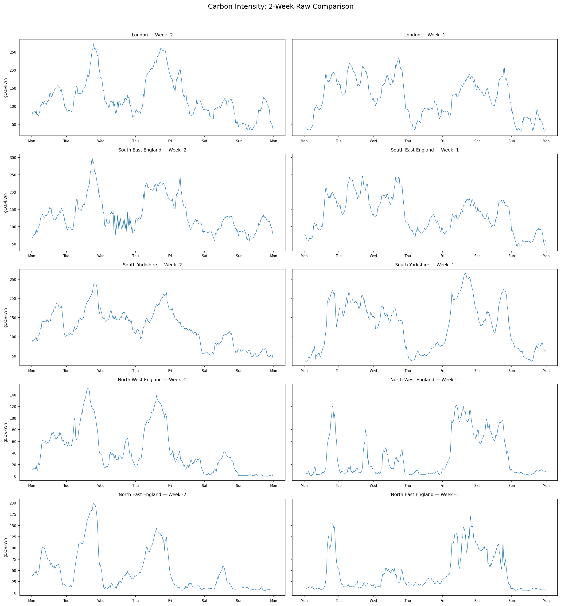
/// caption
Raw carbon intensity time series across all five regions, highlighting the two-regime structure.
///

/// caption
STL decomposition revealing strong daily seasonality in southern regions and weather-dominated residuals in northern regions.
///

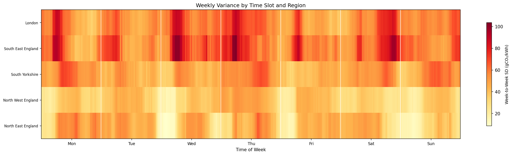
/// caption
Weekly variance patterns differ markedly between gas-heavy and wind-heavy regions.
///

### What It Motivated

The two-regime structure meant any forecasting approach would need to handle both predictable (gas-heavy) and volatile (wind-heavy) regions. This ruled out simple seasonal models and pointed toward approaches that could incorporate weather information.

---

## Entry 2: Phase 1 -- Baseline Benchmark (18 Models)

### What We Did

We benchmarked 18 forecasting models across 7 categories: statistical (Ridge, SARIMAX, ARIMA, Seasonal Naive, Fourier, Holt-Winters), tree-based recursive (Random Forest, XGBoost, CatBoost, LightGBM), tree-based direct (Direct-Ridge, Direct-XGBoost), deep learning (Transformer-1K/5K/10K, N-BEATS, N-HiTS), and foundation models (Chronos-Tiny). Each was tested with both 7-day and full backfill (~83 days) training windows.

All models used lag-1 weather features (wind speed, temperature, solar radiation) from Open-Meteo where supported.

### Results

With full backfill training, Direct-Ridge won at MAE 32.99:

| Model | MAE | Time (s) |
| ----- | ---- | -------- |
| Direct-Ridge | 32.99 | 0.20 |
| Ridge | 33.04 | 0.00 |
| Direct-XGBoost | 33.50 | 1.15 |
| Fourier | 35.78 | 0.00 |
| Transformer-10K | 42.44 | 4.37 |
| Chronos-Tiny | 43.26 | 3.53 |
| Holt-Winters | 93.14 | 0.91 |

/// caption
Per-region MAE heatmap across all 18 models with full backfill training. Direct-Ridge consistently performs well across regions.
///

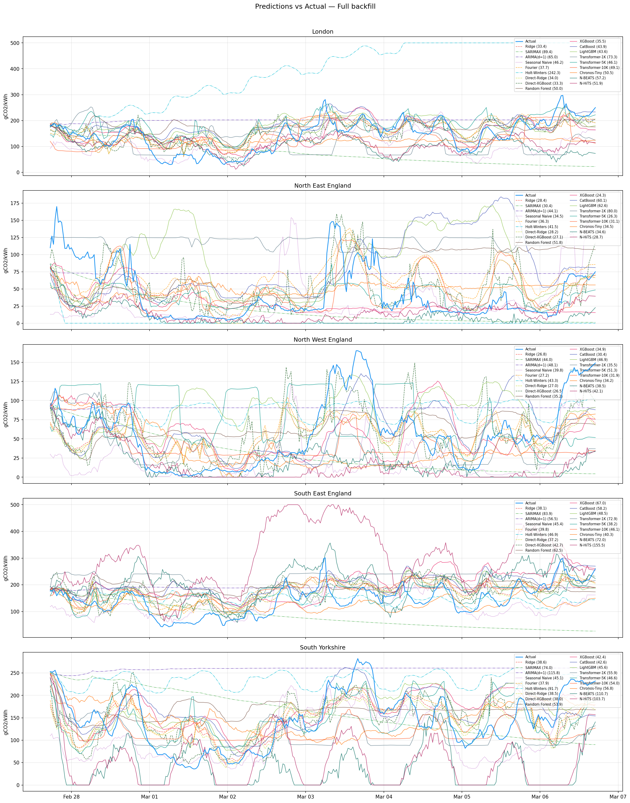
/// caption
Predicted vs actual carbon intensity for top-performing models over the 7-day test period.
///

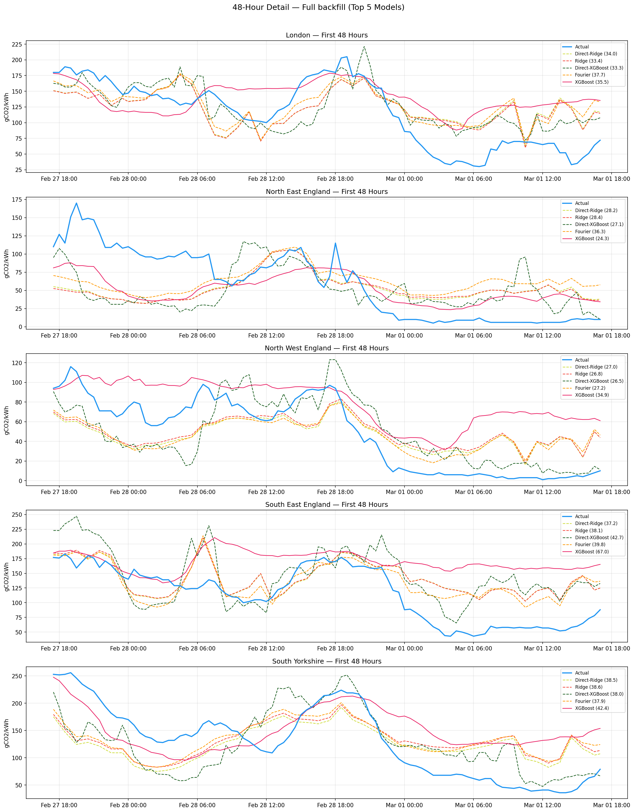
/// caption
48-hour zoomed view showing prediction quality at sub-daily resolution.
///

### What We Learned

1. **Direct forecasting avoids error compounding.** Direct-Ridge and Direct-XGBoost predicted each horizon independently, avoiding the 336-step recursive error cascade that hurt tree models. XGBoost recursive (40.84) was 22% worse than Direct-XGBoost (33.50).

2. **Weather features help direct models, hurt recursive ones.** The ablation study showed Direct-Ridge gained -11.56 MAE from weather, while LightGBM lost +4.30. Recursive models use lag-1 weather which becomes stale after step 10 of 336.

3. **More data helps.** Every model improved from 7-day to full backfill training. Direct-Ridge went from 47.01 to 32.99.

4. **Deep learning was not justified.** Transformer-10K (42.44) was 29% worse than Direct-Ridge. The data's regular periodicity and low dimensionality did not require attention mechanisms. N-BEATS (62.60) and N-HiTS (76.36) were worse still.

5. **Preprocessing experiments yielded no improvement.** Hour x Weather interactions (33.00), smoothed targets (33.08), one-hot encoding (33.96), and Fourier-3 (34.17) all failed to beat baseline (33.02). STL residual (52.11) and diff(48) (54.16) were dramatically worse.

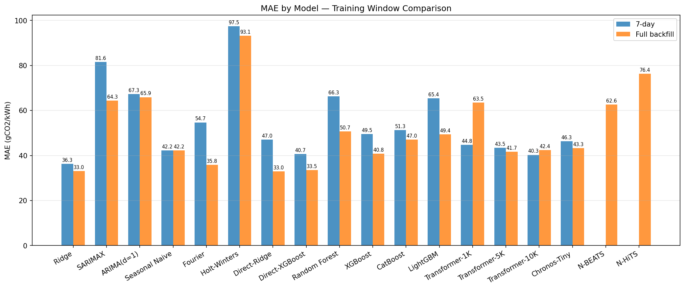
/// caption
Impact of training data volume: every model improved from 7-day to full backfill training.
///

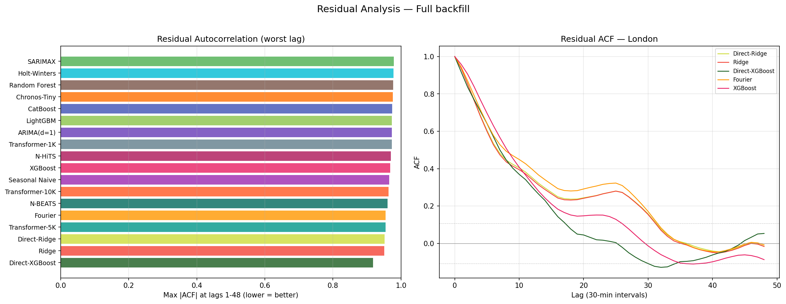
/// caption
Residual analysis for the top models, showing error distribution characteristics.
///

### What It Motivated

Direct-Ridge was deployed as the initial production model. Weather features were clearly important. The next question: could tree-based models catch up with better feature engineering?

---

## Entry 3: Phase 2 -- Enhanced Features for Tree Models

### What We Did

We redesigned the feature set for recursive tree models:

| Feature Group | Baseline (60 features) | Enhanced (33 features) |
| ------------- | ---------------------- | ---------------------- |
| Lags | 48 consecutive (1--48) | 19 sparse: 1--12, 24, 48, 72, 96, 144, 336 |
| Rolling stats | 3: mean_12, mean_48, std_48 | 5: + mean_336, std_336 |
| Cyclical | hour, dow, minute-of-day | hour, dow, week-of-year |
| Weather | 3 (unchanged) | 3 (unchanged) |

The key insight was adding the weekly lag (lag_336) to capture 7-day periodicity directly, while pruning the 48 consecutive lags down to a sparse set that reduces noise.

### Results

| Model | Baseline | Enhanced | Delta |
| ----- | -------- | -------- | ----- |
| LightGBM | 49.44 | 39.12 | -20.9% |
| XGBoost | 40.84 | 35.44 | -13.2% |
| CatBoost | 47.05 | 44.44 | -5.5% |
| Random Forest | 50.67 | 51.26 | +1.2% |
| Direct-XGBoost | 33.50 | 34.10 | +1.8% |

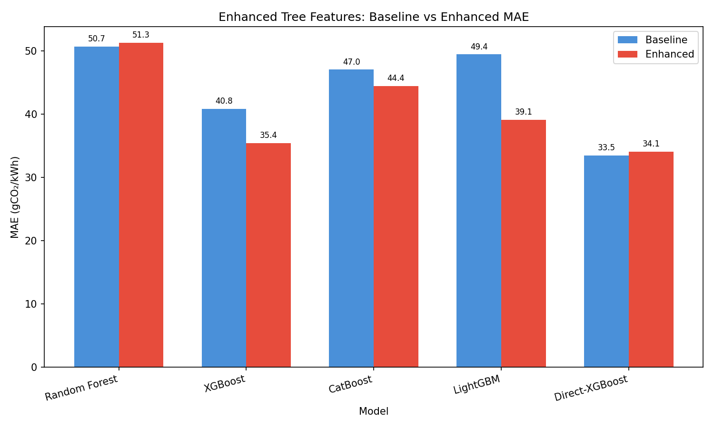
/// caption
Enhanced feature engineering produced dramatic improvements for boosting models, especially LightGBM (-20.9%).
///

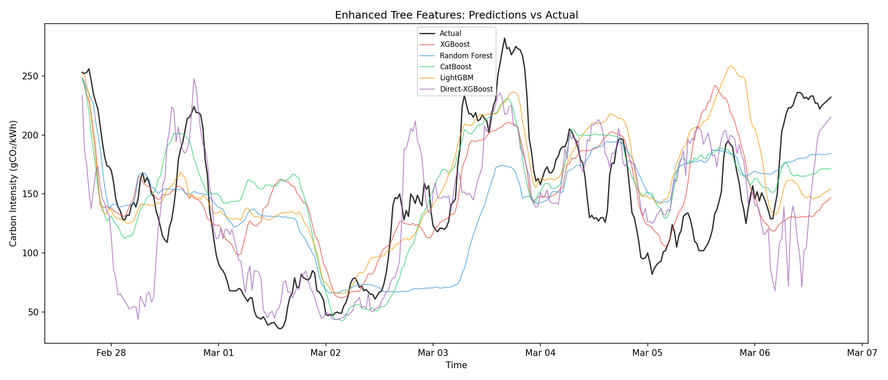
/// caption
Prediction comparison between baseline and enhanced feature sets.
///

### What We Learned

Boosting models (LightGBM, XGBoost) benefited dramatically from the weekly lag and reduced feature count. Random Forest was insensitive -- bagging already handles high-dimensional spaces. Direct-XGBoost slightly regressed because it does not compound errors recursively, so the weekly lag adds noise rather than signal.

### What It Motivated

LightGBM and XGBoost were now competitive (~35--39 MAE) but still behind Direct-Ridge (32.99). Next: could predicting residuals (deviation from persistence) help further?

---

## Entry 4: Phase 3 -- Residual Target

### What We Did

We changed the training target from raw carbon intensity `y` to persistence residuals `y - lag_1`. At inference, predictions are reconstructed as `lag_1 + model(features)`. The idea was to reduce target variance so the model only needs to learn the *change* from the previous step.

### Results

| Model | Enhanced MAE | Residual MAE | Delta |
| ----- | ------------ | ------------ | ----- |
| Random Forest | 51.26 | 46.61 | -4.66 |
| CatBoost | 44.44 | 41.04 | -3.40 |
| XGBoost | 35.44 | 37.16 | +1.72 |
| LightGBM | 39.12 | 39.70 | +0.58 |
| Direct-XGBoost | 34.10 | 34.47 | +0.37 |

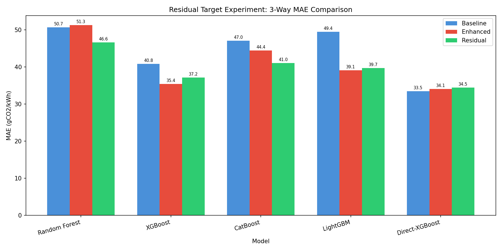
/// caption
Residual target training: mixed results across model families.
///

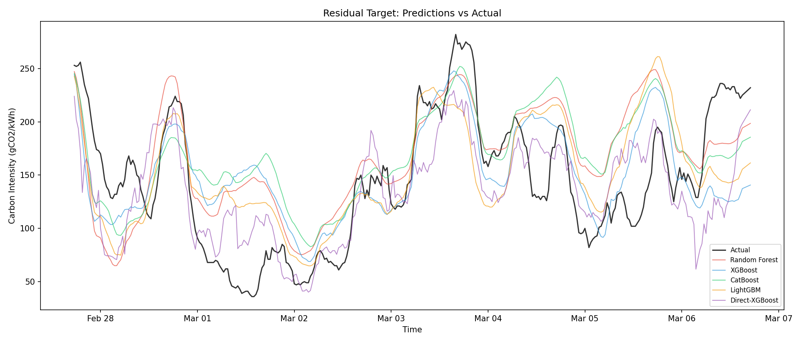
/// caption
Prediction traces for residual-target models vs enhanced baselines.
///

### What We Learned

Mixed results. Random Forest and CatBoost improved (reduced target variance helped), but XGBoost and LightGBM slightly regressed -- their gradient boosting already handles the raw target well. Direct models were unaffected since they do not compound errors.

We recorded the best variant per model for the next phase: RF -> residual (46.61), XGBoost -> enhanced (35.44), CatBoost -> residual (41.04), LightGBM -> enhanced (39.12), Direct-XGBoost -> baseline (33.50).

### What It Motivated

Individual model tuning was reaching diminishing returns. The next idea: use a full year of historical data instead of 83 days to capture seasonal patterns.

---

## Entry 5: Phase 4 -- Seasonal Data Expansion

### What We Did

We expanded training data from ~90 days to approximately 1 full year. Each model used its best-performing variant from Phases 2--3. We also added seasonal features:

- 11 cyclical: hour, dow, week, month, day-of-year sin/cos + daylight proxy
- 21 lags: extended to 672 (2-week) and 1344 (4-week) lags
- 8 rolling: mean/std at 12, 48, 336, 672, 1344

### Results

| Model | 90-day MAE | Full Year MAE | Delta |
| ----- | ---------- | ------------- | ----- |
| Random Forest | 46.61 | 34.97 | -11.64 |
| CatBoost | 41.04 | 31.63 | -9.41 |
| LightGBM | 39.12 | 40.79 | +1.67 |
| Direct-XGBoost | 33.50 | 37.74 | +4.24 |
| XGBoost | 35.44 | 43.91 | +8.47 |

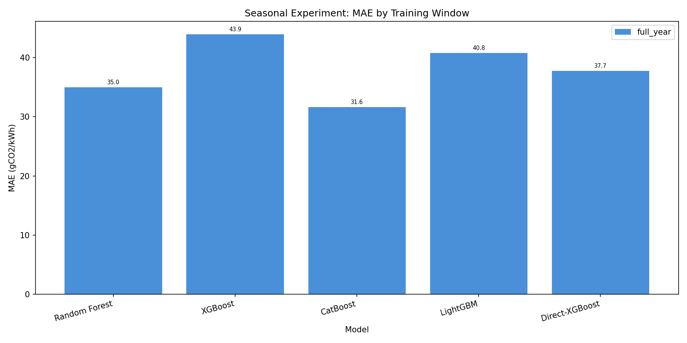
/// caption
Full-year seasonal data: high-variance ensemble models (RF, CatBoost) improved dramatically, while boosting models regressed.
///

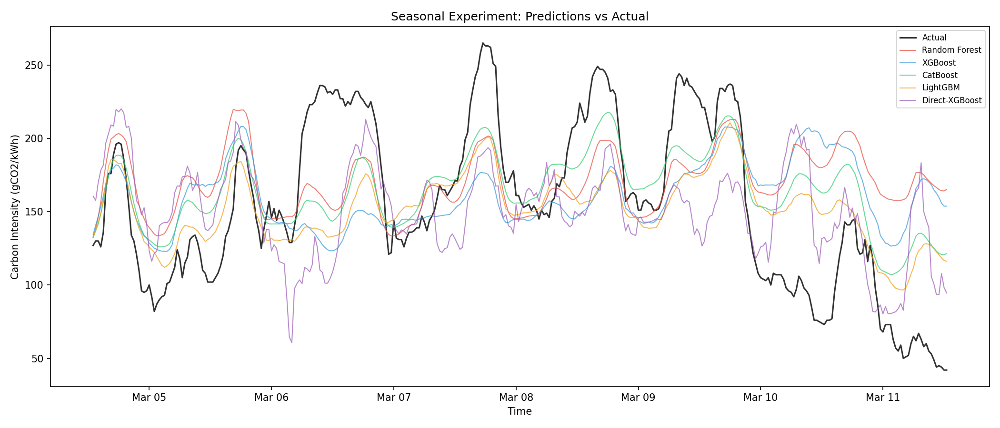
/// caption
Prediction quality with seasonal data expansion across regions.
///

### What We Learned

**CatBoost reached 31.63** -- the first model to beat Direct-Ridge's 32.99. Random Forest also improved dramatically (-11.64). But XGBoost regressed sharply (+8.47), likely overfitting to seasonal patterns. Per-region variance was extreme (20.25 in North East vs 66.42 in South East for XGBoost).

The result confirmed that more data helps high-variance ensemble methods (RF, CatBoost) but can hurt boosting models that overfit to spurious seasonal correlations.

### What It Motivated

CatBoost beating Direct-Ridge suggested the accuracy ceiling had not been reached. The obvious next lever: richer weather features, since the Phase 1 ablation showed weather was the single most impactful factor.

---

## Entry 6: Phase 5 -- Weather Enrichment

### What We Did

We extended weather features from 3 (wind speed, temperature, solar radiation) to three variants:

| Variant | Features | Count |
| ------- | -------- | ----- |
| A: Extended raw | 11 raw from Open-Meteo | 11 |
| B: Extended + engineered | 11 raw + 4 engineered | 15 |
| C: Engineered only | 3 original + 4 engineered | 7 |

Engineered features: wind_power_proxy (wind^3), solar_effective (radiation x (1 - cloud/100)), temp_demand_proxy (\|temp - 18\|).

### Results

| Model | Phase 4 Baseline | Best Weather Variant | Delta |
| ----- | ---------------- | -------------------- | ----- |
| Direct-XGBoost | 37.84 | 29.49 (A) | -8.34 |
| CatBoost | 33.02 | 29.77 (A) | -3.25 |
| XGBoost | 43.91 | 30.94 (A) | -12.97 |
| LightGBM | 40.79 | 30.79 (C) | -10.00 |
| Random Forest | 36.34 | 32.66 (B) | -3.68 |

Per-horizon analysis showed weather helped most at long horizons, where lag features are stale but weather remains informative:

| Horizon | Direct-XGBoost Baseline | Variant A | Improvement |
| ------- | ----------------------- | --------- | ----------- |
| Day 1 | 29.54 | 24.90 | -4.64 |
| Day 3 | 45.17 | 35.27 | -9.90 |
| Day 7 | 32.82 | 19.01 | -13.81 |

/// caption
Weather enrichment produced the top 5 results across all phases -- every model improved.
///

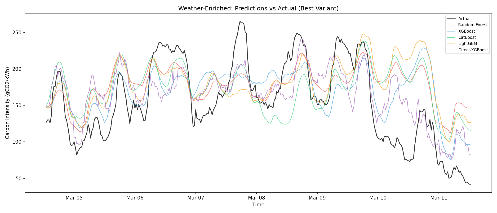
/// caption
Prediction quality with extended weather features.
///

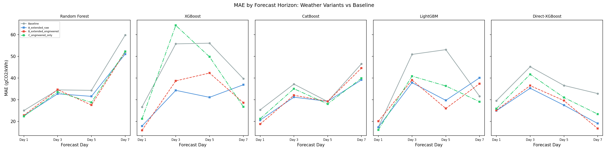
/// caption
Weather features provide the largest gains at long horizons (Day 7: -13.81 MAE), compensating for stale lag features.
///

### What We Learned

1. **Weather enrichment produced the top 5 results across all phases.** Every model's best Phase 5 variant beat its Phase 4 result.
2. **Variant A (11 raw) won for most models.** Tree models can learn their own transformations from raw data, so hand-engineered features added little.
3. **Day 7 MAE dropped from 32.82 to 19.01** for Direct-XGBoost -- confirming weather compensates for stale lag features at extended horizons.

### What It Motivated

Direct-XGBoost at 29.49 was the new best. Discussions with the client set a target of ~22 MAE, motivating a final round of experimentation exploring ensembles, neural networks, and feature engineering improvements.

---

## Entry 7: Ensemble Experiments -- Feature Overhaul

### What We Did

We completely redesigned the feature engineering pipeline, expanding from 14 features to 65:

- **Temporal**: 22 features -- 6 Fourier harmonics for hour-of-day, 2 for day-of-week, 2 for day-of-year, weekend flag, night flag
- **Horizon**: 4 features -- h, h^2, h^3, log(h)
- **Origin stats**: 13 -- last, mean/std/median/min/max for 24h and 7d windows, lag_24h, lag_7d, trend, same_hour_mean
- **Weather**: 16 -- 10 raw from Open-Meteo + 6 engineered (wind_power, wind_ramp, pressure_change, solar_clearness, temp_deviation, wind_dir sin/cos)
- **Interactions**: 10 -- last x horizon, weekend x hour, wind x hour, solar x hour, etc.

We also added StandardScaler preprocessing and switched to RidgeCV with 8 alpha candidates for automatic regularisation selection.

We switched to a **train/validation/test** split (train up to -14 days, 7-day validation, 7-day test) to properly evaluate ensemble weighting strategies.

### What We Learned

The 65-feature RidgeFull with StandardScaler achieved **MAE 24.88** -- the same model family as Phase 1's winner (Ridge) but with dramatically better features. This was a 24.6% improvement over the old Direct-Ridge (32.99) and 15.6% over the Phase 5 best (Direct-XGBoost, 29.49).

The key insight: **feature engineering dominates model selection.** The problem's underlying structure is fundamentally linear once the right features are engineered. Fourier harmonics capture complex daily patterns, interaction terms give linearity access to multiplicative effects, and StandardScaler prevents high-magnitude features (pressure ~1013 hPa) from dominating low-magnitude ones (wind_dir_sin in [-1, 1]).

---

## Entry 8: Ensemble Experiments -- Model Exploration

### What We Did

We trained multiple model architectures on the 65-feature set:

- **RidgeFull**: RidgeCV + StandardScaler, 65 features
- **RidgeBase**: Same but without the 10 interaction features (55 features)
- **PyTorch MLP**: 3-layer (2048, 1024, 512) with BatchNorm1d, GELU activation, Dropout(0.3), AdamW optimiser, CosineAnnealingLR scheduler. Trained with MPS acceleration on Apple Silicon.
- **LightGBM**: 150K subsample, num_leaves=255, n_jobs=1
- **Conditioned MLP**: Single MLP trained across all regions with one-hot region encoding

### Technical Challenges

**OpenMP thread conflict**: Running LightGBM followed by PyTorch in the same process caused segfaults (exit code 139). Root cause: LightGBM's `n_jobs=2` spawns OpenMP threads that conflict with PyTorch's internal OpenMP. Fix: set `OMP_NUM_THREADS=1` and `MKL_NUM_THREADS=1` at module level, and `n_jobs=1` for LightGBM. We also switched the benchmark from parallel ThreadPoolExecutor to sequential execution.

### Results

| Model | AVG MAE | Time / Region |
| ----- | ------- | ------------- |
| **RidgeFull** | **24.88** | < 1 sec |
| RidgeBase | 25.22 | < 1 sec |
| PyTorch MLP | 27.30--28.20 | 3--5 min |
| LightGBM | 27.70--27.86 | 5--10 sec |
| Conditioned MLP | 30.45 | 5+ min |

### What We Learned

1. **MLP was regionally inconsistent.** It achieved 17--19 MAE on wind-dominated northern regions but 34--41 on gas-heavy southern regions. A 20+ MAE spread is unacceptable for cross-region scheduling.
2. **MLP was non-deterministic.** 2--5 MAE variation between runs due to random initialisation, mini-batch ordering, and dropout.
3. **LightGBM underperformed Ridge** on the same features. Trees partition feature space into axis-aligned rectangles and cannot naturally represent the smooth weather-CI relationships that Ridge captures through learned coefficients.
4. **Conditioned MLP failed** (30.45). Forcing one model to learn all 5 regions jointly degraded per-region accuracy. The regimes are too different.

---

## Entry 9: Ensemble Experiments -- Ensemble Strategies

### What We Did

We tested three ensemble strategies combining subsets of the individual models:

| Strategy | Models Combined | AVG MAE |
| -------- | --------------- | ------- |
| Median | RidgeFull, RidgeBase, MLP, LightGBM | 24.85 |
| Val-weighted | RidgeFull, RidgeBase, MLP, LightGBM | 24.78--24.83 |
| Trimmed mean | RidgeFull, RidgeBase, MLP | 24.76--25.08 |

Val-weighted used inverse validation-MAE as per-model weights. Trimmed mean dropped the highest and lowest predictions.

### What We Learned

The best ensemble (median, 24.85) improved over RidgeFull (24.88) by **only 0.03 MAE** (0.1%). This marginal gain does not justify:

- 4 models to train, debug, and monitor
- 15--25 minutes of MLP training per prediction cycle (3--5 min x 5 regions)
- Non-determinism from the MLP component
- Inconsistent improvement (ensemble sometimes hurts where MLP or LightGBM pulls the aggregate away from Ridge's correct answer)

**Decision**: Deploy RidgeFull as the production model. The simplicity, speed (<1s per region), determinism, and minimal dependencies (scikit-learn only) make it the right choice for a production API that retrains on every prediction cycle. Critically, the Stats service runs as an oracle server that must remain lightweight -- it shares infrastructure with the Scheduler and UI, so a model that requires GPU acceleration or multi-minute training would impose unacceptable resource overhead on the serving environment.

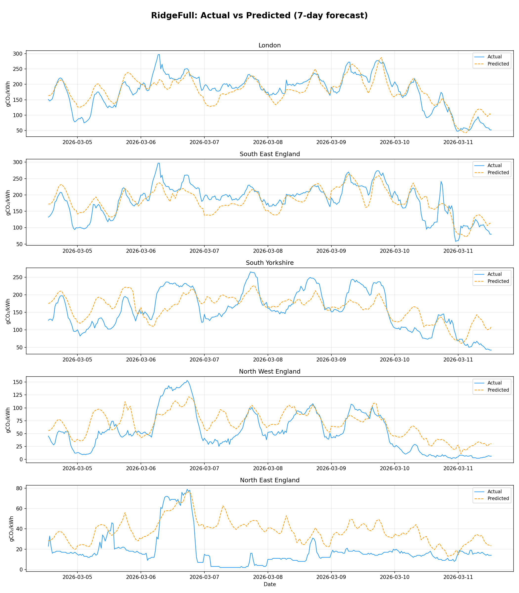
/// caption
RidgeFull actual vs predicted carbon intensity across all regions -- the final production model.
///

---

## Entry 10: Production Deployment

### What We Did

We created `predictors/ridge_enhanced.py` as the clean production predictor:

- Reads directly from `carbon_intensity.db` for full historical data
- 65-feature engineering pipeline with weather from Open-Meteo
- Pickle-based weather caching
- StandardScaler + RidgeCV
- 30-min predictions upsampled to 5-min for API compatibility

We updated `predictor.py` to import from the new module and removed the 60-day history cap for carbon intensity predictions.

The old `predictor_direct_ridge.py` (MAE 32.99) is kept for reference. The experiment file `predictor_ensemble.py` retains all benchmark code (PyTorch MLP, LightGBM, ensemble strategies) for future experimentation.

### Production Characteristics

| Property | Value |
| -------- | ----- |
| Training time | < 1 sec / region |
| Dependencies | scikit-learn, numpy, pandas, requests |
| Deterministic | Yes |
| Model state | ~1 KB / region (65 coefficients + scaler) |
| Hyperparameters | 0 manual (RidgeCV auto-selects alpha) |

---

## Summary: Model Evolution

| Phase | Best Model | MAE | Key Change |
| ----- | ---------- | ---- | ---------- |
| 1 | Direct-Ridge | 32.99 | 18-model benchmark, direct forecasting |
| 2 | XGBoost (enhanced) | 35.44 | Sparse lags, weekly periodicity |
| 3 | CatBoost (residual) | 41.04 | Persistence residual target |
| 4 | CatBoost (seasonal) | 31.63 | Full-year training data |
| 5 | Direct-XGBoost + Weather A | 29.49 | 11 raw weather features |
| Ensemble | **RidgeFull** | **24.88** | 65-feature overhaul, StandardScaler |

Total improvement from worst (Holt-Winters, 93.14) to best (RidgeFull, 24.88): **73.3% reduction in MAE**.

### Key Lessons

1. **Feature engineering > model complexity.** Ridge regression with 65 engineered features beats every tree model, neural network, and ensemble tested. The underlying relationship between weather and carbon intensity is fundamentally linear once properly encoded.

2. **Weather is the strongest predictor.** Across all phases, weather features provided the largest improvements. Engineered weather features (wind_power, solar_clearness, pressure_change) encode domain-relevant physical relationships that raw values miss.

3. **Direct forecasting avoids error compounding.** Predicting each horizon step independently prevents the 336-step recursive error cascade that plagues tree-based models.

4. **More data helps -- selectively.** Full-year data improved high-variance models (RF, CatBoost) but hurt overfitting-prone models (XGBoost). The full year is valuable for capturing seasonal weather patterns.

5. **Production constraints matter.** The best ensemble gained 0.03 MAE over RidgeFull but added minutes of training time, PyTorch dependency, non-determinism, and 4x maintenance burden. Since the Stats service runs as a lightweight oracle server on shared infrastructure, the model must remain CPU-only and low-overhead -- Ridge's sub-second training and ~1 KB model state per region satisfy this constraint easily.
