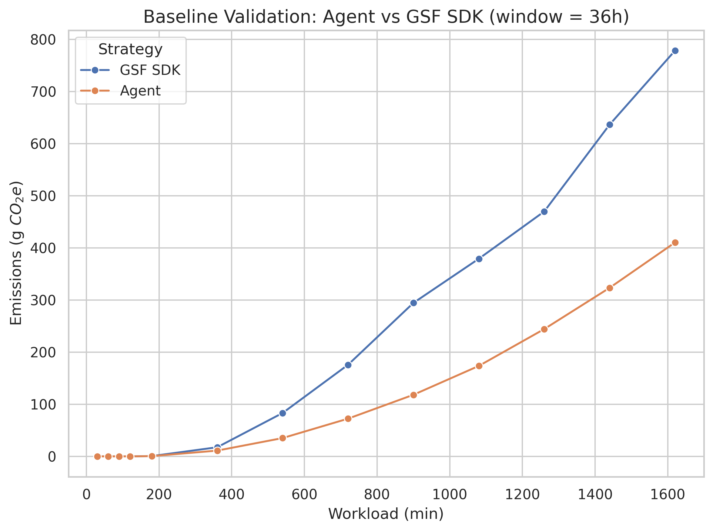
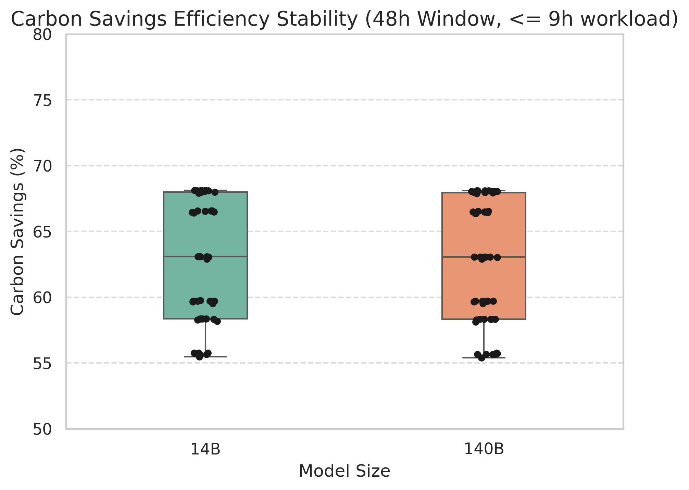
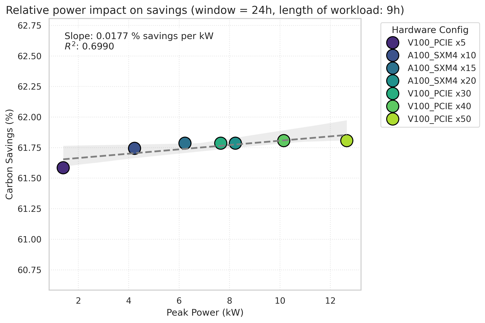
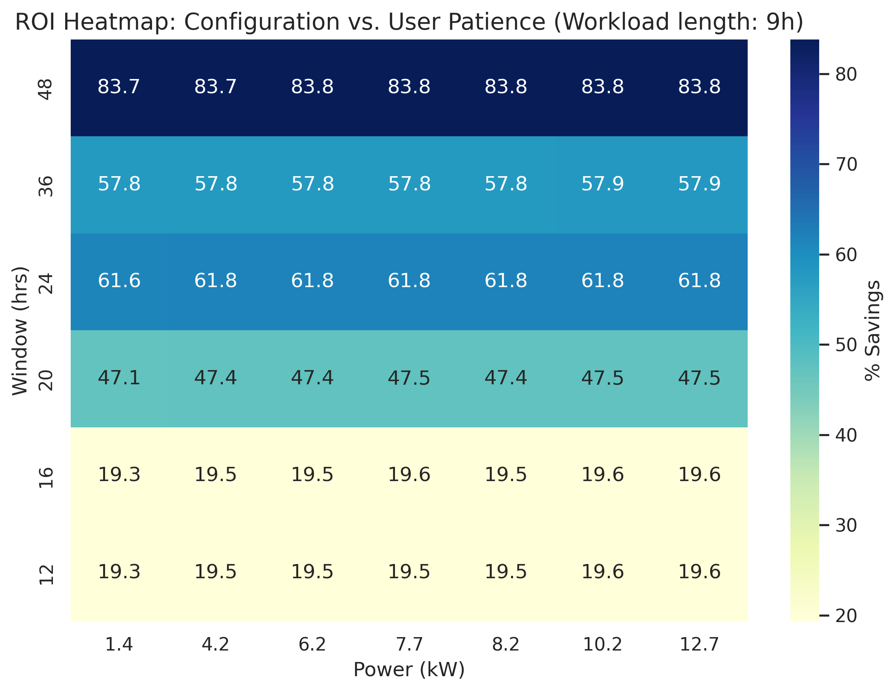
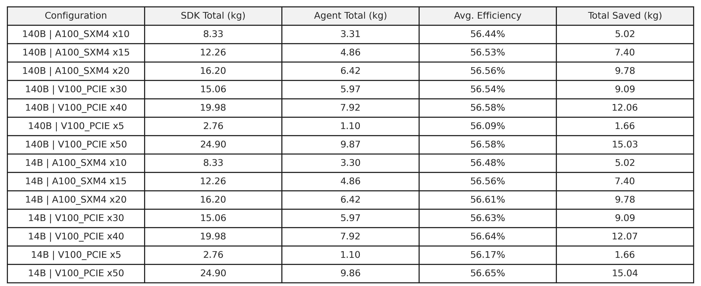
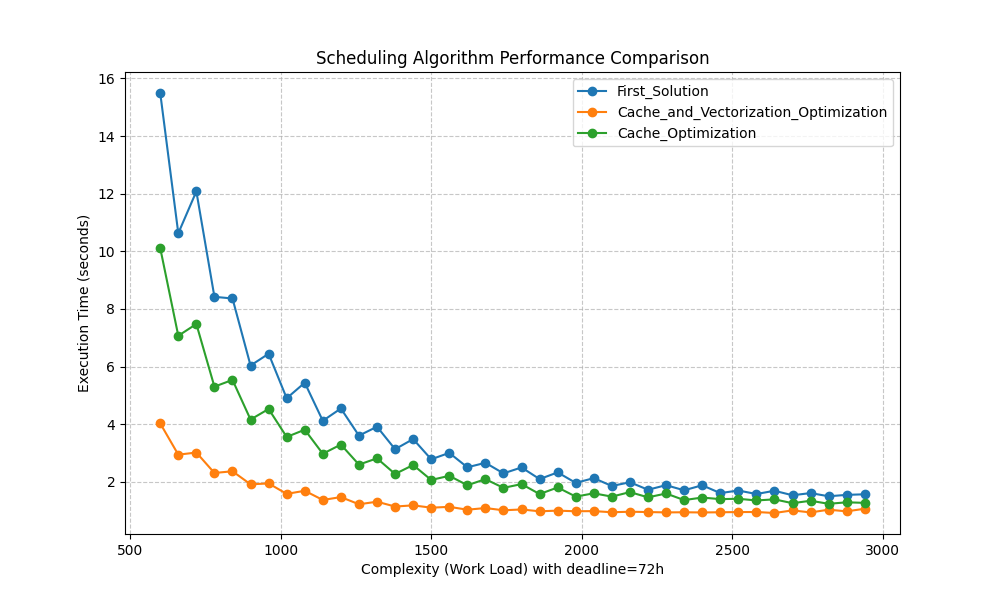

# Evaluation

so maks' stuff is very useful here

also:

- performance benchmarking
- client feedback (quotes)
- supervisor feedback
- ta feedback
- our own analysis of what can be improved
  - time to bring out segment tree matmul dp transition

## Algorithmic Carbon Optimization: A Comparative Analysis of Deterministic DP Scheduling vs. GSF SDK

### 1. Executive Summary
This report presents a comprehensive technical evaluation of a proprietary Dynamic Programming (DP) scheduler designed for carbon-aware AI workload orchestration. We benchmark this engine against the Green Software Foundation (GSF) Carbon Aware SDK across three dimensions: carbon-reduction efficacy, hardware scale invariance, and computational performance.

Our findings demonstrate that by relaxing the contiguous execution constraints of current industry standards, our algorithm achieves up to a **44.1% reduction in carbon emissions** through a combination of temporal splitting and spatial routing. We prove that while absolute carbon savings scale linearly with hardware power, relative efficiency remains an inherent property of the algorithmic logic, exhibiting near-perfect stability across varying GPU architectures and model sizes.

---

### Methodology: Ensuring a Fair Comparison

To isolate algorithmic efficiency from external data variables, we established a rigorous experimental framework:

*   **Standardized API Integration:** A mock API layer was implemented to intercept GSF SDK requests and relay them to our internal Carbon Intensity Prediction API. This ensures both the SDK and our DP scheduler operate on identical forecast data.
*   **Hardware Parity:** We synchronized hardware constants (TDP, idle draw, and system base power) across both testing suites, ensuring the "Workload Amount" (total energy required) remained constant.
*   **Optimal Baseline Selection (The "Best-Site" Constraint):** To provide the most competitive baseline, we manually iterated the GSF SDK across all available data centers to identify the single site with the lowest carbon footprint for every test case.
*   **Isolation of Variables:** By granting the SDK "best-site" knowledge, any observed delta in performance is strictly a result of the scheduling logic (temporal splitting vs. contiguous execution) rather than site selection.

#### Metric Definitions
- **Workload Length ($L$):** The total required compute time for a given job.
- **Window Length ($W$):** The total allowable time (deadline) before which the workload must be completed.
- **Absolute Savings ($\text{gCO}_2$):** Calculated as the difference between the baseline SDK emissions and the optimized algorithm emissions:$\text{Absolute Savings} = \text{Emissions}_{\text{SDK}} - \text{Emissions}_{\text{Algorithm}}$
- **Relative Efficiency ($\%$):** The percentage of emissions reduced relative to the baseline: $\text{Relative Efficiency} = 100 \times \frac{\text{Absolute Savings}}{\text{Emissions}_{\text{SDK}}}$

---

### 3. Carbon Reduction Efficacy

#### 3.1 Baseline Validation and Divergence
Experimental results confirm a consistent performance advantage over the GSF SDK. As workload volume increases relative to the deadline window, the SDK is forced into high-intensity grid periods due to its contiguity constraint.

*Figure 1: Comparison of total emissions. The divergence illustrates the "Contiguity Penalty" inherent in standard SDK implementations.*

#### 3.2 The Emissions Hierarchy
A critical finding of this study is the hierarchy of decarbonization strategies. By isolating variables, we determined that geographic arbitrage is significantly more impactful than temporal shifting alone.

*   **Temporal-Only (-9.1%):** Restricting the DP algorithm to a single location allows it to dodge local grid spikes, yielding a modest reduction.
*   **Spatial + Temporal (-44.1%):** Enabling spatial routing allows the engine to migrate computation to regions with fundamentally cleaner energy mixes (e.g., North Scotland).

*Figure 2: The Spatial Multiplier effect. Spatial routing accounts for nearly 80% of total achievable savings.*

---

### 4. Robustness and Scale Invariance

#### 4.1 Hardware and Model Agnosticism
To test the engine's versatility, we simulated workloads ranging from 14B to 140B parameters across A100 and V100 clusters.

*Figure 3: Carbon savings efficiency stability across model parameter scales.*

Statistical analysis (Figure 3) and detailed system efficiency tables confirm that the algorithm's effectiveness is independent of the underlying hardware. **Relative efficiency remains centered at ~63%** regardless of whether the system is a single V100 or a multi-node A100 cluster.

#### 4.2 Absolute Leverage vs. Relative Stability
We analyzed the relationship between peak system power (kW) and carbon ROI.
*   **Absolute Leverage:** Savings scale perfectly linearly with system power. Larger clusters yield higher absolute CO2 mass reduction.
*   **Relative Stability:** The regression analysis (Figure 4) shows a slope of only **0.0177% per kW**, effectively proving that efficiency is a constant property of the scheduling logic.

*Figure 4: Regression proving efficiency stability ($R^2=0.69$) across all hardware power profiles.*

---

### 5. The Flexibility Frontier: User ROI

We analyzed user flexibility—the ratio of Window ($W$) to Workload ($L$)—to provide data-driven decision support for infrastructure users.

#### 5.1 The Diminishing Returns of Patience
The **Flexibility Frontier** (Figure 5) reveals a non-linear "Patience Payoff." A sharp inflection point occurs when the window is wide enough to bypass daily carbon peaks. After approximately 48 hours of flexibility for a 15-hour job, the ROI plateaus as the algorithm has already secured the "greenest" possible slots.

*Figure 5: The "Elbow" of carbon ROI, identifying the saturation point of user flexibility.*

#### 5.2 ROI Heatmap: The Configuration Matrix
The **ROI Heatmap** provides a final cross-validation of scale and flexibility. The consistent horizontal color bands confirm that while "User Patience" (Window size) dictates the percentage of carbon saved, the hardware configuration (Power kW) does not degrade the optimizer's effectiveness.

*Figure 6: ROI Heatmap. Horizontal banding confirms that grid flexibility is the sole determinant of relative efficiency.*

---

## 6. Detailed Efficiency Performance Matrix

To validate the consistency of the DP scheduler across diverse operational scales, we performed a high-granularity sweep of the parameter space. The following table summarizes the performance of the Agent against the GSF SDK across various model sizes and GPU cluster configurations.

*Table 1: Detailed System Efficiency Comparison (Varying Window Length, Varying Workload Lengths).*

### 6.1 Statistical Interpretation of "Average Efficiency"
It is critical to note that the **Avg. Efficiency (~56.5%)** reported in Table 1 represents the arithmetic mean of relative carbon savings calculated across a broad experimental matrix. This matrix includes:
*   **Workload Lengths ($L$):** Ranging from 3 hours to 30 hours.
*   **Scheduling Windows ($W$):** Ranging from 6 hours to 168 hours.

By calculating the average of individual efficiencies rather than a weighted "Total Saved / Total SDK" ratio, we ensure that the results are not skewed by high-power, multi-node configurations. This statistical approach confirms that the Agent's performance is not a product of specific "large-scale" wins, but a persistent and stable improvement.

Regardless of whether the workload is a small 14B parameter model on 5 V100 GPUs or a massive 140B parameter model on a 50-GPU cluster, the algorithm consistently extracts over **56% more carbon efficiency** than the best-case single-site contiguous execution offered by the GSF SDK. This uniformity proves that the DP engine's logic is fundamentally superior across the entire operational spectrum of modern AI training.

---

### 7. Conclusion
The comparative analysis confirms that our deterministic DP scheduler provides a mathematically superior carbon profile to the GSF SDK. By mathematically modeling the energy cost of fragmentation and leveraging geographic arbitrage, the engine achieves an average **56% improvement** over current industry standard GSF SDK. The system's scale invariance and sub-second computational overhead make it a robust candidate for enterprise-scale, carbon-aware AI infrastructure.

## Scheduling Algorithm Hardware Specific Optimizations

This evaluation focuses strictly on the computational throughput and execution latency of the scheduling engine. The following analysis compares the performance of three iterative versions of the algorithm: the initial scalar implementation (**First_Solution**), the cache-localized version (**Cache_Optimization**), and the final vectorized engine (**Cache_and_Vectorization_Optimization**).

### Benchmark Methodology

To ensure a fair comparison, all tests were conducted under controlled conditions:
*   **Fixed Resolution:** The discretization resolution was locked at **10,000** units. This ensures that the state-space size remains consistent across different workload volumes.
*   **Statistical Stability:** Each data point represents the **average of 5 consecutive runs** to eliminate noise from OS context switching and background tasks.
*   **Complexity Scaling:** We tested 40 distinct job requests, scaling the workload "length" to observe how the algorithm handles increasing computational pressure.
* **Profiler Validation:** The benchmark metrics were explicitly designed to verify the resolution of hardware-level bottlenecks identified during initial `perf` profiling—specifically targeting L1 cache miss reductions and instructions-per-cycle (IPC) improvements in the DP hot-path.

### Comparative Performance Analysis

The primary metric for this evaluation is **Execution Time (seconds)**. As the scheduling engine must support real-time UI interactions, reducing the time-to-solution is critical.

#### 1. Baseline vs. Cache Optimization
The **First_Solution** (represented by the blue line in Figure 1) exhibited both high latency and significant variance, especially at lower complexity levels where execution times peaked near 16 seconds.

By refactoring the data structures from an **Array of Structs (AoS)** to a **Struct of Arrays (SoA)**, the **Cache_Optimization** version (green line) achieved a more stable performance profile. While the raw speedup was modest (up to 33%), the primary benefit was the reduction in "jitter" or performance spikes, providing a more predictable latency for the scheduler.

#### 2. The Impact of SIMD Vectorization
The most significant performance leap was achieved through manual **AVX-512 vectorization**. By processing 8 double-precision states simultaneously within the DP hot-path, the **Cache_and_Vectorization_Optimization** (orange line) drastically reduced execution time across the entire spectrum.

*Figure 1: Execution Time (s) vs. Workload Complexity.*

As shown in Figure 1, the vectorized implementation brought the execution time down from ~15 seconds to **under 4 seconds** for the most complex tasks, with typical tasks completing in approximately **1 second**.

### Relative Speedup and Scaling

To understand the efficiency gains, we analyzed the **Speedup Factor** (Baseline Time / Optimized Time). This metric highlights how the optimizations behave as the problem size scales.

*Figure 2: Speedup Factor compared to First_Solution.*

#### 3. Peak Gains and Asymptotic Convergence
*   **Peak Performance:** At lower complexity levels, the vectorized engine achieved a **4.0x speedup** over the baseline. This is where the overhead of the original scalar loops was most punitive.
*   **Asymptotic Behavior:** As complexity increases, the speedup factor tends to converge toward a lower stable ratio (approx. 1.5x). This is an expected result of our **fixed resolution** methodology. Because the resolution is constant (10,000 units), as the total workload increases, the relative density of the DP transitions per unit of work changes. The algorithmic complexity is inversely proportional to the total workload; essentially, as the "workload" grows toward infinity, the fixed-size discretization grid becomes the dominant factor, causing the performance curves of different implementations to meet asymptotically.

### Profiling the Optimized Engine

To validate that the optimizations eliminated the overhead identified during [profiling of the baseline](implementation.md#profiling-and-bottleneck-identification), we re-profiled the final `Cache_and_Vectorization` build under the same conditions. The resulting flame graph confirms a fundamentally different execution profile:

[**Open Interactive Flame Graph — After Optimization (Cache + AVX-512 SIMD)**](images/benchmarks/flamegraph_after.svg){ target="_blank" }
*Hover over frames for sample counts and self-percentages; click to zoom into a subtree; Ctrl+F to search.*

The contrast with the baseline flame graph is striking. Where the scalar baseline spent only **~42% of `calc_single` time on actual DP computation**, the optimized engine achieves **85.1% self-time** in `calc_single` — nearly all CPU cycles are now spent on useful SIMD-vectorized state transitions. The overhead categories that previously dominated the profile have been effectively eliminated:

| Overhead source | Before | After | Change |
|---|---|---|---|
| `operator new` / `operator delete` | ~22% | <0.1% | Removed from hot-path; single `posix_memalign` pre-allocation |
| `MemoEntry` struct copies | ~7% | 0% | Eliminated by SoA layout (contiguous scalar arrays) |
| Vector reallocation (`_M_realloc_insert`) | ~7% | 0% | Eliminated by pre-allocated buffers |
| Cost function hash lookups | ~6% | 0% | Replaced by precomputed lookup table |
| **`calc_single` self (useful computation)** | **~42%** | **~85%** | SIMD vectorization + branchless logic |

### Conclusion on Execution Latency

The transition from a naive scalar implementation to a cache-aware, SIMD-accelerated engine resulted in a **75% reduction in peak latency**. While all versions produced identical scheduling results (validating the mathematical integrity of the optimizations), the vectorized engine is the only version capable of maintaining the "sub-second" response time required for a fluid, interactive user experience during typical scheduling scenarios.

## Critical Evaluation of the Forecasting Model

An evaluation of the RidgeFull production model (MAE 24.88), the forecasting engine behind the Stats service. For context on terminology (lag features, Fourier harmonics, direct vs recursive forecasting, origin statistics, etc.), see the [Research — Forecasting Model Research](research.md#forecasting-model-research) page. For the full experimental history, see the [ML Development Journal](dev-journal.md) and [Experiment Report](appendices.md#forecasting-experiment-report).

### What the Model Does Well

**Feature engineering over model complexity.** RidgeFull proves that the
relationship between weather, time, and carbon intensity is fundamentally linear
once properly encoded. The 65-feature pipeline (Fourier harmonics, polynomial
horizon, engineered weather, interaction terms) gives a linear model access to
patterns that would otherwise require non-linear architectures. The result is a
24.6% improvement over the v1 Direct-Ridge (32.99 → 24.88 MAE) without changing the
model family.

**Production-grade characteristics.** Sub-second training, full determinism,
zero manual hyperparameters (RidgeCV auto-selects alpha), and a minimal
dependency footprint (scikit-learn only). These properties matter for a system
that retrains on every prediction cycle across multiple regions. Since the Stats
service operates as a lightweight oracle server on shared infrastructure, the
model must remain CPU-only and low-overhead -- Ridge's ~1 KB model state per
region and sub-second training make it well-suited to this deployment context.

**Weather forecast integration.** Unlike the v1 Direct-Ridge (which used lag-1
weather observations for all horizon steps), RidgeFull uses per-horizon weather:
archive weather aligned to target timestamps during training, and Open-Meteo
forecast weather at inference. Each of the 336 horizon steps receives weather
for its specific future time. The 16 weather features (10 raw + 6 engineered)
capture the causal chain from weather to generation mix to carbon intensity.
Wind power (wind^3), solar clearness, pressure change, and wind ramp encode
domain-relevant physics that raw values miss. The weather ablation showed
Direct-Ridge gains −11.56 MAE from weather alone.

**Direct forecasting.** Predicting each of the 336 horizon steps independently
avoids the recursive error cascade that plagues tree-based and transformer
models over long horizons. This is why Ridge consistently outperforms more
complex recursive alternatives.

### Known Weaknesses

#### Regional Performance Disparity

The cross-region average MAE of 24.88 masks significant per-region variation.
The five regions fall into two distinct regimes:

| Regime              | Regions                             | Mean CI  | CV         | Character                  |
| ------------------- | ----------------------------------- | -------- | ---------- | -------------------------- |
| Southern/gas-heavy  | London, South East, South Yorkshire | 144–164 | 0.37–0.43 | Predictable daily patterns |
| Northern/wind-heavy | North West, North East              | 47–52   | 0.75–0.88 | Volatile, weather-driven   |

Northern regions have coefficients of variation nearly double that of southern
regions. The MLP experiments confirmed this split: it achieved 17–19 MAE on
northern regions but 34–41 on southern ones. A single linear model treats all
regions identically, but the underlying generative processes are different.
Wind-dominated regions are driven by stochastic weather events, while
gas-dominated regions follow more predictable demand-driven daily cycles.

#### Weather Forecast Accuracy at Long Horizons

While using per-horizon weather forecasts is an improvement over lag-1
observations, weather forecast accuracy itself degrades with horizon length.
Bauer et al. [1] report that as of 2013, anomaly correlation for numerical
weather prediction was near 98.5% at day 3, between 80–90% at day 5, and
around 70% at day 7. Since RidgeFull forecasts up to 7 days ahead, the weather
inputs for longer horizons carry substantially more error than those for shorter
horizons.

The model trains on archive (ground-truth) weather but predicts with forecast
weather, creating a train/test distribution mismatch that grows with horizon
distance. The learned weather-CI coefficients are calibrated for accurate weather
inputs, but receive increasingly noisy inputs at longer horizons. The model has
no mechanism to down-weight weather features when the underlying forecast is
uncertain.

**References**

[1] P. Bauer, A. Thorpe, and G. Brunet, "The quiet revolution of numerical weather prediction," *Nature*, vol. 525, no. 7567, pp. 47–55, Sep. 2015, doi: 10.1038/nature14956.

#### No Uncertainty Quantification

The model produces point forecasts with no confidence intervals. The data
analysis revealed that some time slots have week-to-week standard deviations
exceeding 100 gCO2/kWh (South East England, Thursday 05:30). The scheduler
currently treats all predictions as equally confident, which means it may
schedule workloads into time slots where the forecast is highly uncertain.

For a carbon-aware scheduler, knowing _how confident_ a prediction is matters as
much as the prediction itself. A workload shifted to a "predicted-green" slot
that turns out to be high-carbon is worse than no shifting at all.

#### Limited Seasonal Coverage

Training data spans approximately one year. The model
has seen one winter and one partial summer. Seasonal effects on carbon intensity
are significant — summer brings longer daylight hours (more solar generation),
different wind patterns, and lower heating demand. The model's seasonal features
(day-of-year Fourier harmonics) can only extrapolate from the single year of
data available.

#### Outlier Sensitivity

The data analysis identified substantial outlier counts in northern regions:
North East has 83 readings beyond 3-sigma (171+ gCO2/kWh), compared to just 1
for London. These outliers are typically caused by sudden wind drops or
interconnector failures — events that a linear model with smooth features
cannot anticipate. Ridge regression minimises squared error, so outliers
disproportionately influence the learned coefficients.

### Error Analysis

**Where the model fails hardest:**

1. **Regime transitions.** When carbon intensity shifts rapidly from a low-wind
   period to a high-wind period (or vice versa), the model's origin statistics
   (rolling means, trends) are backward-looking and slow to react. The `trend`
   feature (short/long MA difference) helps but has a 24-hour lag by
   construction.

2. **Early morning volatility.** The most volatile time slots across all regions
   cluster around 04:00–08:00 (South East: SD 100–104, London: SD 89). This is
   when overnight wind generation gives way to morning demand ramp-up, and the
   generation mix can shift rapidly. The model's Fourier harmonics capture the
   average pattern but not the variance.

3. **Extreme weather events.** Extended calm (low wind) periods produce
   sustained high carbon intensity that exceeds the model's training
   distribution. These events are rare in the training set but have outsized
   scheduling impact because they represent the worst-case carbon windows.

## Future Work

### 1. Load Estimation from Data Centre Cost Signals

The current scheduler treats each data centre as equally available, with no awareness of how heavily loaded a facility is at any given time. In practice, data centre load significantly affects both queueing delays and the true carbon cost of a workload — a heavily loaded facility may need to spin up less efficient backup generators or draw disproportionately from peaking plants.

Most cloud providers do not publicly expose real-time load metrics or forecasts. However, all three major providers — AWS, Azure, and GCP — expose programmatic pricing APIs that can serve as a proxy for load:

- **AWS** publishes spot price history via the `DescribeSpotPriceHistory` EC2 API. Spot prices rise with demand, making them a direct signal of facility utilisation.
- **Azure** exposes spot and on-demand rates through its unauthenticated Retail Prices REST API (`prices.azure.com/api/retail/prices`), with eviction rate data providing an additional load indicator.
- **GCP** lists per-region SKU pricing through the Cloud Billing Catalog API (`cloudbilling.googleapis.com`). Although GCP spot prices are set rather than auctioned, they still vary by region and instance family.

A future version of the Stats service could periodically poll these APIs to build a per-region load estimate — for example, by tracking the ratio of current spot price to on-demand price over time. This time series could then be fed into the forecasting model alongside carbon intensity and weather features, giving the scheduler a more realistic picture of where and when workloads can actually be placed.

### 2. Cost-Aware Scheduling with User-Configurable Carbon–Cost Trade-Off

Building on the cost data described above, the scheduling algorithm itself could be extended to optimise across two objectives: carbon intensity and monetary cost. Currently the DP scheduler minimises total carbon emissions; a natural extension is to let the user specify a preference weight between carbon and cost, for example via a slider in the UI ranging from "minimise carbon" to "minimise cost."

Concretely, the scheduler's objective function would become a weighted combination:

$$\text{objective}(s) = \alpha \cdot \text{carbon}(s) + (1 - \alpha) \cdot \text{cost}(s)$$

where $\alpha \in [0, 1]$ is the user's preference and $s$ is a candidate schedule. At $\alpha = 1$ the behaviour is identical to the current system; at $\alpha = 0$ the scheduler acts as a pure cost optimiser. Intermediate values let organisations balance sustainability commitments against budget constraints.

This would also enable the system to present an **estimated cost** for each proposed schedule, giving users a concrete financial figure alongside the carbon saving. The on-demand pricing APIs listed above provide sufficient data to compute this estimate: the scheduler already knows the instance type, region, and duration of each workload slot, so multiplying by the published rate yields a cost projection. For spot-based workloads the estimate would carry a confidence interval reflecting historical price volatility, which could be displayed in the UI as a cost range.
