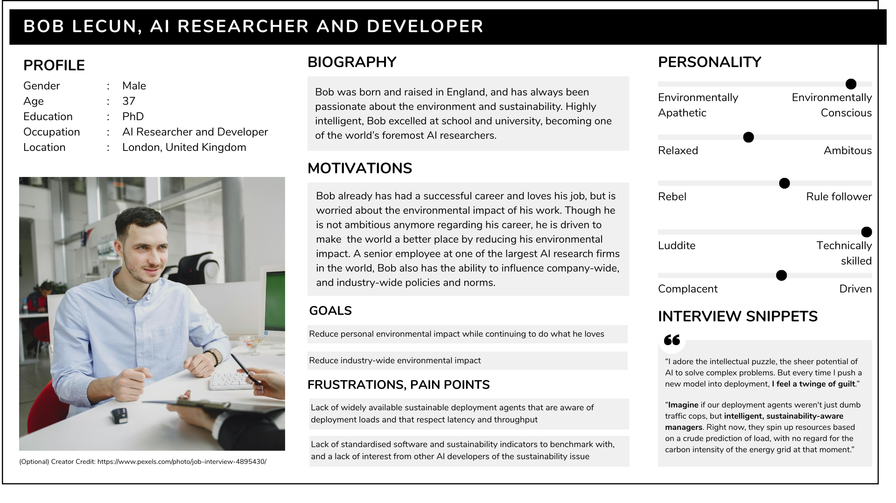

# Requirements
---
### Project Background

AI workloads (e.g., training large models, inference services) are resource-intensive and often deployed without sustainability considerations. As AI demand is rapidly rising, it becomes increasingly important we prioritise reducing carbon emissions for sustainable development of AI technologies. NTTData, as a Green Software Foundation (GSF) Steering Member, has been working towards providing a trusted ecosystem of people, standard, and tools for delivering green software.  
As our client, NTTData assigned us the job of Investigating carbon‑aware scheduling within on‑premise and distributed datacentre environments. The aim is to make environmental performance a first‑class consideration in workload placement, using forecasted carbon‑intensity data and workload flexibility to shift execution toward cleaner periods and locations. By integrating prediction, scheduling, and impact reporting into a single system, the project provides a practical pathway for organisations to reduce emissions from AI operations without redesigning their existing pipelines.

### Project Goals

The overarching goal is to reduce the environmental impact of AI workloads by optimising when and where they run, while keeping the system realistic for real‑world deployment.
More specifically, the framework aims to:
- Minimise emissions by selecting execution windows and locations with lower carbon intensity.
- Enable carbon‑aware decisions using both forecasted and historical grid‑intensity data.
- Take advantage of workload flexibility by breaking parallelisable jobs into short, schedulable blocks.
- Evaluate results using recognised green‑software metrics, including the Software Carbon Intensity (SCI) methodology.
- Deliver an end‑to‑end system—covering prediction, scheduling, and results visualisation—that teams and organisations can adopt directly.

### Requirement Gathering
We conducted a series of semi-structured interviews on potential users of the program to find the specific needs of our users.

=== "Autonomous Agent Developer"
	**Question:** Would you say the disaster drone algorithms are built with sustainability in mind? 
	**Answer:** No, usually the primary focus has always been on speed and reliability because these drones are used in life-saving situations like disaster response. Sustainability tends to take a back seat when performance is critical.

	**Question:** What challenges do you face in achieving sustainable practices while working on disaster drones? 
	**Answer:** Sustainability isn’t always a priority in fast-paced tech environments. Disaster scenarios need low-latency, high-GPU workloads, so balancing performance with environmental goals is tough. Plus, there aren’t many tools that make this easy.

	**Question:** If you could design the perfect solution, what would it look like? 
	**Answer:** I’d like a platform that helps me deploy workloads efficiently while showing real-time sustainability metrics-like carbon intensity and energy use. It would be ideal if I could see the impact and make informed choices without slowing down operations.

	**Question:** How do you personally measure success when balancing performance and sustainability? 
	**Answer:** For me, success means it operates like usual, like low latency for disaster response, while reducing energy consumption and carbon emissions as much as possible. Even small improvements matter. If I can deploy workloads that use fewer resources without compromising performance, that’s a win. I also look for transparency, having clear metrics on energy use and emissions helps me make informed decisions and track progress over time.
=== "AI Researcher"
    **Question:** What motivates you to focus on sustainability in AI?  
    **Answer:** AI workloads are incredibly resource intensive, training large models can consume thousands of kilowatt hours. I believe we have a responsibility to make this process more efficient and environmentally conscious.

    **Question:** What challenges do you face in achieving this?  
    **Answer:** The biggest challenge is the lack of standardised tools and benchmarks for sustainability. Most platforms prioritise speed and cost, not environmental impact. It’s hard to convince teams to adopt sustainability practices when they don’t see immediate benefits.

    **Question:** If you could design the perfect solution, what would it look like?  
    **Answer:** I like the idea of an intelligent system that optimises workload placement across cloud and on-prem environments based on real time carbon intensity and resource efficiency. It should provide transparent metrics like the SCI scores you mentioned and allow me to make trade offs without sacrificing performance.

    **Question:** Do you think the industry is moving toward sustainability?  
    **Answer:** Slowly, yes. There’s growing awareness, but use is uneven. We need more tools that make sustainability easy and measurable, so it becomes a natural part of AI development rather than something optional.

### Personas
Using the data collected, we created personas and scenarios for our target users.

/// caption
Persona 1, Bob Lecun. AI Researcher and Developer
///

/// caption
Persona 2, Tim Jackson. Junior Devops Technician of Autonomous Drones Company
///

### Use Cases
TO-DO

### MoSCoW Requirements
#### Functional Requirements

| ID | Requirement | Priority |
| --- | --- | --- |
| 1 | Ingest AI workload parameters and generate valid schedules. | Must Have |
| 2 | Optimize scheduling across time and datacenter location to reduce emissions. | Must Have |
| 3 | Use carbon-intensity signals in scheduling decisions. | Must Have |
| 4 | Calculate and report emissions for optimized schedules. | Must Have |
| 5 | Provide API and UI outputs for scheduling and results. | Must Have |
| 6 | Compare optimized schedules against a baseline to show savings. | Should Have |
| 7 | Split workloads into short execution blocks for finer optimization. | Should Have |
| 8 | Include datacenter-level operating factors in optimization decisions. | Should Have |
| 9 | Persist schedule history and enable previous-job review. | Should Have |
| 10 | Support configurable scheduling constraints and optimization settings. | Should Have |
| 11 | Handle incomplete upstream data with fallback behavior. | Should Have |
| 12 | Richer visual reporting for trends and per-job impact. | Could Have |
| 13 | Multi-objective readiness for carbon, timing, and operational trade-offs. | Could Have |
| 14 | Support dynamic datacenter options configured in the UI. | Could Have |
| 15 | Generate own forecast of carbon intensity using factors that influence carbon intensity (e.g. weather). | Could Have |
| 16 | Full cross-cloud autonomous orchestration and billing integration. | Won’t Have |
| 17 | Embodied carbon accounting of hardware lifecycle. | Won’t Have |

#### Non-Functional Requirements 

| ID | Requirement | Priority |
| --- | --- | --- |
| 1 | Reliable execution of core scheduling and prediction flows. | Must Have |
| 2 | Accurate and consistent impact calculations. | Must Have |
| 3 | Clear and interpretable outputs for non-specialist users. | Must Have |
| 4 | Standards-aligned impact reporting using SCI-oriented principles. | Must Have |
| 5 | Modular, testable architecture across services and UI. | Should Have |
| 6 | End-to-end traceability from workload input to impact output. | Should Have |
| 7 | Interactive performance for schedule generation and result display. | Should Have |
| 8 | Scalability for larger job volumes and longer planning horizons. | Should Have |
| 9 | Observability through logs and diagnostics. | Should Have |
| 10 | Reproducible outputs under fixed inputs and configuration. | Should Have |
| 11 | Robust input validation and safe API handling. | Should Have |
| 12 | Audit-friendly historical records for review and reporting. | Should Have |
| 13 | Extended analytics views for stakeholder reporting. | Could Have |
| 14 | Configurability for organization-specific policy tuning. | Could Have |
| 15 | Readiness for broader enterprise integration paths. | Could Have |
| 16 | Formal enterprise-grade HA/SLA guarantees. | Won’t Have |
| 17 | Full IAM and compliance certification stack. | Won’t Have |
