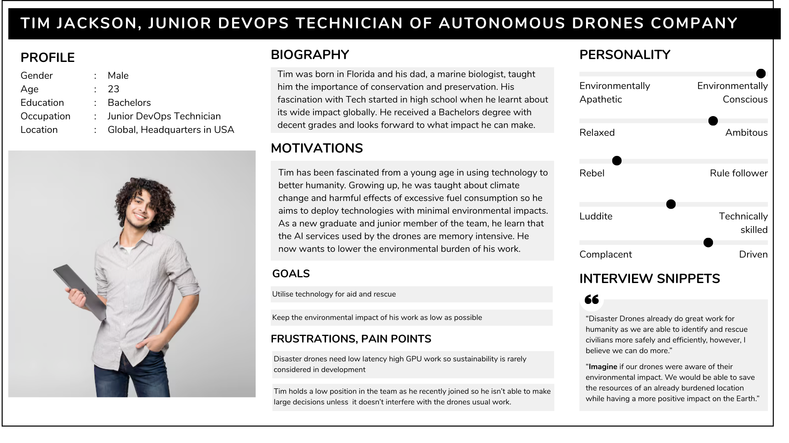
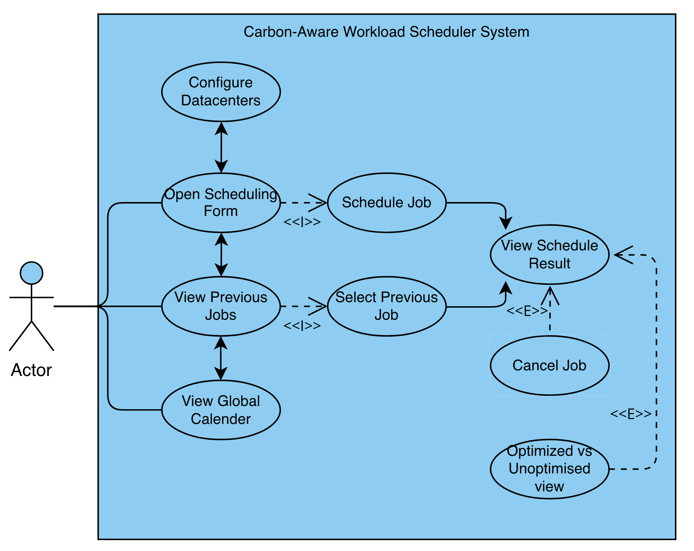

# Requirements
---

### Project Motivation

AI workloads (e.g., training large models, inference services) are resource-intensive and often deployed without sustainability considerations. As AI demand is rapidly rising, it becomes increasingly important we prioritize reducing carbon emissions for sustainable development of AI technologies.

### NTT DATA

NTT Data is a global provider of digital and IT services, focused on combining advanced computing capabilities with environmental responsibility. The company works on integrating high-performance computing with sustainable practices, particularly in how large-scale AI workloads interact with energy systems. By developing carbon-aware workload placement strategies, NTT Data aims to raise the standard for sustainability in distributed data centre operations.

As our client, NTT Data tasked us with investigating carbon-aware scheduling across distributed data centre environments. The goal is to make environmental impact a central factor in deciding where and when workloads run. Using carbon-intensity forecasts and workload flexibility, tasks can be shifted to times and locations powered by cleaner energy. By combining prediction, scheduling, and impact reporting into a unified system, this project offers organisations a practical way to reduce emissions from AI operations without redesigning their existing pipelines.

### Project Goals

The overarching goal is to reduce the environmental impact of AI workloads by optimising when and where they run. To achieve this, the project focuses on three core pillars: **spatial and temporal optimization** (moving jobs in both time and location), **granularity** (breaking jobs into blocks for flexibility), and **transparency** (using SCI-aligned reporting to prove impact). These pillars ensure the system is both environmentally effective and operationally practical for NTT DATA’s distributed infrastructure.

### Requirement Gathering

To ensure our solution effectively balances high-performance compute needs with environmental responsibility, we adopted a multi-method approach to requirement gathering. Relying on a single method can lead to biased assumptions, so we combined quantitative data, industry standards analysis, and qualitative user feedback to build a comprehensive understanding of our users' needs.

Our requirement gathering process consisted of the following methods:

**1. Literature and Standards Review**  
Before engaging with users, we analyzed existing industry frameworks, specifically focusing on the Green Software Foundation (GSF) guidelines and the Software Carbon Intensity (SCI) specification. This helped us establish a baseline understanding of how carbon emissions and energy consumption are currently quantified in cloud and on-premise environments, ensuring our eventual metrics align with industry standards.

**2. Broad Industry Survey**  
We distributed a quantitative questionnaire to 120 professionals across DevOps, AI research, and autonomous systems engineering. The survey focused on ranking their priorities (e.g., latency, cost, carbon footprint) and assessing their current tooling. 

*Key Finding:* Over 75% of respondents indicated they would optimize for lower carbon intensity if the metrics were transparent and didn't disrupt their existing CI/CD pipelines, highlighting a severe lack of accessible sustainability tooling.

**3. Focus Group Workshops**  
We hosted two interactive brainstorming sessions with a mix of cloud architects and autonomous drone operators. Through user journey mapping, we analyzed their current workload deployment pipelines. This exercise helped us identify the exact bottlenecks where sustainability trade-offs are currently being ignored due to high-stress, low-latency requirements (such as disaster response scenarios).

**4. Semi-Structured Interviews**  
To gain deeper qualitative insights into the pain points uncovered by our survey and focus groups, we conducted a series of one-on-one, semi-structured interviews with potential core users of the program. This allowed us to explore the specific, day-to-day needs, motivations, and frustrations of our users. 

Below is an excerpt of the key findings from these interviews:

=== "Autonomous Agent Developer"
 **Question:** Would you say the disaster drone algorithms are built with sustainability in mind? 
 **Answer:** No, usually the primary focus has always been on speed and reliability because these drones are used in life-saving situations like disaster response. Sustainability tends to take a back seat when performance is critical.

 **Question:** What challenges do you face in achieving sustainable practices while working on disaster drones? 
 **Answer:** Sustainability isn’t always a priority in fast-paced tech environments. Disaster scenarios need low-latency, high-GPU workloads, so balancing performance with environmental goals is tough. Plus, there aren’t many tools that make this easy.

 **Question:** If you could design the perfect solution, what would it look like? 
 **Answer:** I’d like a platform that helps me deploy workloads efficiently while showing real-time sustainability metrics-like carbon intensity and energy use. It would be ideal if I could see the impact and make informed choices without slowing down operations.

 **Question:** How do you personally measure success when balancing performance and sustainability? 
 **Answer:** For me, success means it operates like usual, like low latency for disaster response, while reducing energy consumption and carbon emissions as much as possible. Even small improvements matter. If I can deploy workloads that use fewer resources without compromising performance, that’s a win. I also look for transparency, having clear metrics on energy use and emissions helps me make informed decisions and track progress over time.
=== "AI Researcher"
    **Question:** What motivates you to focus on sustainability in AI?  
    **Answer:** AI workloads are incredibly resource intensive, training large models can consume thousands of kilowatt hours. I believe we have a responsibility to make this process more efficient and environmentally conscious.

    **Question:** What challenges do you face in achieving this?  
    **Answer:** The biggest challenge is the lack of standardised tools and benchmarks for sustainability. Most platforms prioritise speed and cost, not environmental impact. It’s hard to convince teams to adopt sustainability practices when they don’t see immediate benefits.

    **Question:** If you could design the perfect solution, what would it look like?  
    **Answer:** I like the idea of an intelligent system that optimises workload placement across cloud and on-prem environments based on real time carbon intensity and resource efficiency. It should provide transparent metrics like the SCI scores you mentioned and allow me to make trade offs without sacrificing performance.

    **Question:** Do you think the industry is moving toward sustainability?  
    **Answer:** Slowly, yes. There’s growing awareness, but use is uneven. We need more tools that make sustainability easy and measurable, so it becomes a natural part of AI development rather than something optional.

### Personas

Using the data collected, we created personas and scenarios for our target users.

/// caption
Persona 1, Tim Jackson. Junior Devops Technician of Autonomous Drones Company
///

/// caption
Persona 2, Bob Lecun. AI Researcher and Developer
///

The following high-level architectural requirements were derived from our research to ensure the system addresses the specific pain points of our personas:

1. **Optimise placement across multiple premises**: Existing carbon-aware tools typically optimise when a workload runs, but assume it will always run in a single datacentre. To achieve deeper carbon reductions, the system should consider both time and location. Allowing workloads to move between premises enables the scheduler to take advantage of cleaner regions rather than relying on the variability of a single site. This also requires accounting for practical overheads, such as the startup cost of launching a job in a new datacentre.
2. **Split workloads into smaller, schedulable blocks**: Many AI workloads are naturally parallelisable, which means they can be broken into smaller units without affecting correctness. By dividing jobs into short, discrete execution blocks, the scheduler gains far more flexibility to place work in low-carbon windows and distribute it across cleaner regions. This fine-grained structure is essential for achieving meaningful carbon savings rather than coarse, all-or-nothing shifts.
3. **Provide a clear comparison against an unoptimised schedule**: Users need to understand the impact of carbon-aware scheduling in real, tangible terms. The system should therefore generate both an optimised schedule and a baseline schedule that prioritises speed alone. The UI should present these side-by-side, along with intuitive metrics showing the carbon saved, so users can easily interpret the benefits of the optimisation.
4. **Ensure the system remains practical and deployable**: Carbon-aware scheduling must work within real operational constraints. The system should respect job deadlines, datacentre availability, and workload requirements, and it should integrate cleanly with existing pipelines. The goal is not to redesign how AI workloads are written, but to make smarter decisions about when and where they run.
5. **Support transparent, standards-aligned reporting**: To make the results meaningful and comparable, the system should produce impact estimates aligned with recognised green-software metrics (e.g., SCI). This ensures that organisations can trust and reuse the outputs in their own sustainability reporting.

Further conclusions are drawn in the MoSCoW requirements at the bottom of the page.

### Use Cases

The use case diagram below illustrates how different users interact with the carbon‑aware scheduling system. It highlights the core actions available to users, including submitting AI workloads, adjusting datacentre availability, and reviewing both optimised and baseline schedules. These interactions reflect the system’s goal of making carbon‑aware decision‑making accessible and intuitive. By combining workload submission, carbon‑intensity forecasting, and visual comparison tools, the platform supports a smooth end‑to‑end experience that helps users understand and reduce the environmental impact of their AI operations.

/// caption
Use-Case Diagram for the program
///

Below, you can see a list of use cases for our program:

| ID | Use Case |
| --- | --- |
| UC1 | Open Scheduling Form |
| UC2 | Submit Job for Scheduling |
| UC3 | View Global Workload |
| UC4 | View Previous Jobs |
| UC5 | Select Previous Job |
| UC6 | View Schedule Result |
| UC7 | Compare Optimised vs Unoptimised |
| UC8 | Cancel Scheduled Job |
| UC9 | Configure Datacenters |

#### Use Case Descriptions

|  | **Use Case** |
| --- | --- |
| ID | UC1 |
| Actor | User |
| Description | User opens the scheduling form |
| Preconditions | User loads into the site or navigates to page via top navigation bar |
| Main Flow | 1. User clicks on "Scheduling Form" tab in the top navigation.   2. System displays the scheduling form with input fields (job type, GPU type, GPU count, model size, time window, preferred datacenter).   3. Form is ready for user input. |
| Result | User is presented with an empty scheduling form |
| Alternative Flows | None |

|  | **Use Case** |
| --- | --- |
| ID | UC2 |
| Actor | User |
| Description | User submits a job for scheduling |
| Preconditions | User has opened the scheduling form and filled in all required fields (GPU count > 0, model size > 0, time window specified, within forecast range) |
| Main Flow | 1. User enters job parameters (job type, GPU type, GPU count, model size, estimated runtime, scheduling window, optional datacenter preference). 2. System validates all inputs. 3. User clicks "Submit" button. 4. System sends request to `/api/schedules` endpoint. 5. Scheduler optimizes job placement across datacenters using carbon-aware algorithm. 6. System receives optimized schedule result with schedule ID and impact metrics. 7. UC2 completes; system transitions to UC6 (View Schedule Result). |
| Result | Job is submitted and schedule ID is generated. User is redirected to schedule result view. |
| Alternative Flows | - **Validation Error:** If any required field is invalid or missing, system displays error message and remains on form.  - **Service Unavailable:** If scheduler service is unreachable, system displays error message and allows retry. - **Outside Forecast Range:** If latest finish time exceeds available carbon forecast window, system displays warning and rejects submission. |

|  | **Use Case** |
| --- | --- |
| ID | UC3 |
| Actor | User |
| Description | User view global workload page |
| Preconditions | User navigates to "Global Workload" tab using top navigation bar |
| Main Flow | 1. User clicks on "Global Workload" tab in the top navigation. 2. System fetches all scheduled jobs across all active datacenters. 3. System displays interactive workload calendar with one row per datacenter. 4. Each row shows scheduled jobs, carbon intensity (red line), capacity (purple line), and current time marker. 5. User can scroll horizontally to view time range. |
| Result | Global workload view is displayed with real-time data aggregation. |
| Alternative Flows | - **No Data Available:** If no scheduled jobs exist, system displays "No scheduled blocks found" message. - **Forecast Unavailable:** If carbon forecast cannot be retrieved, charts still display workload but without carbon intensity overlay. |

|  | **Use Case** |
| --- | --- |
| ID | UC4 |
| Actor | User |
| Description | User opens the page to view previous jobs |
| Preconditions | User navigates to "Scheduled Jobs" tab via top navigation bar |
| Main Flow | 1. User clicks on "Scheduled Jobs" tab in the top navigation. 2. System fetches all previous job summaries from `/api/schedules/summary`. 3. System displays list of jobs sorted by most recent first. 4. For each job, system shows: schedule ID, start/end time, datacenters used, total load (PFLO), emissions (kg CO₂), and savings % (if optimized vs unoptimized). 5. Each job entry is clickable. 6. User selects a job to view details (proceeds to UC5). |
| Result | List of previous jobs is displayed in scrollable card format. |
| Alternative Flows | - **No Previous Jobs:** If no jobs exist, system displays "No previous jobs found" message with option to schedule new job. - **Load Error:** If job summary fetch fails, system displays error message. |

|  | **Use Case** |
| --- | --- |
| ID | UC5 |
| Actor | User |
| Description | User selects a previous job to view full schedule details |
| Preconditions | User has opened the "Scheduled Jobs" list (UC4) and is viewing previous jobs |
| Main Flow | 1. User clicks on a job card in the previous jobs list. 2. System fetches full schedule details for the selected job from `/api/schedules/{schedule_id}`. 3. System also fetches unoptimised (trivial) schedule from `/api/schedules/{schedule_id}/trivial`. 4. System transitions to UC6 (View Schedule Result) with the selected job data. |
| Result | Schedule result view is displayed for the selected previous job. |
| Alternative Flows | - **Job Not Found:** If schedule ID is invalid, system displays error message. - **Trivial Schedule Unavailable:** If unoptimised schedule cannot be fetched, system continues without comparison data. |

|  | **Use Case** |
| --- | --- |
| ID | UC6 |
| Actor | User |
| Description | User views schedule result details and visualisations |
| Preconditions | Job schedule has been submitted (UC2) or previous job has been selected (UC5) |
| Main Flow | 1. System displays schedule result page with: schedule ID; environmental impact metrics (carbon intensity g CO₂/kWh, total emissions kg CO₂, SCI per unit); and data centre workload distribution chart. 2. Chart shows time-series workload across selected datacentre with existing load (gray area), new job load (green area for optimised, orange for unoptimised), carbon intensity line (red), capacity line (purple), and current time marker (amber). 3. User can switch between datacentres via tabs. 4. User can access UC7, UC8, or UC9 from this view. |
| Result | Schedule result is fully displayed with all metrics and visualisations loaded. |
| Alternative Flows | - **Data Load Error:** If schedule blocks cannot be fetched, system displays partial results with available data. - **Forecast Unavailable:** Chart displays workload without carbon intensity overlay. |

|  | **Use Case** |
| --- | --- |
| ID | UC7 |
| Actor | User |
| Description | Interactive toggle to overlay baseline (speed-first) metrics against the carbon-aware schedule for impact validation. |
| Preconditions | User is viewing UC6 (View Schedule Result) and unoptimised schedule data is available |
| Main Flow | 1. System displays comparison toggle buttons: "Optimised" and "Unoptimised" in the environmental impact card. 2. User clicks "Unoptimised" button. 3. System switches view to show unoptimised (trivial) schedule metrics and workload. 4. System updates impact card background colour (orange tint for unoptimised), chart data (orange areas instead of green), and comparison savings percentages (displayed as badges showing % improvement). 5. User can toggle back to "Optimised" to see original optimised schedule. |
| Result | Schedule result view displays toggled data with updated visualisations and savings indicators. |
| Alternative Flows | - **Unoptimised Unavailable:** If trivial schedule was not computed, toggle buttons are not displayed. |

|  | **Use Case** |
| --- | --- |
| ID | UC8 |
| Actor | User |
| Description | User cancels a scheduled job |
| Preconditions | User is viewing UC6 (View Schedule Result) and has a scheduled job to cancel |
| Main Flow | 1. User clicks "Cancel Job" button on the schedule result page. 2. System displays confirmation dialog with message: "This will remove the job (ID: {schedule_id}) from the schedule." 3. User confirms cancellation. 4. System sends DELETE request to `/api/schedules/{schedule_id}`. 5. System removes job from database. 6. System navigates to "Scheduled Jobs" page or home page. |
| Result | Job is removed from scheduler queue and database. User is redirected to previous page. |
| Alternative Flows | - **Cancellation Rejected:** If job is already in execution state, system displays error "Cannot cancel job in progress." - **Database Error:** If deletion fails, system displays error message but allows user to retry or navigate away. |

|  | **Use Case** |
| --- | --- |
| ID | UC9 |
| Actor | User |
| Description | User configures which datacentres are available for scheduling |
| Preconditions | User presses config button in scheduling form |
| Main Flow | 1. User clicks "Config" in scheduling form. 2. Configure Datacentre page is displayed. 3. User can enable/disable datacentres used in scheduling. 4. User presses save configuration to let the system know which datacentres are in use. |
| Result | User can modify which datacentres can run their job. |
| Alternative Flows | - **Datacentres cannot be fetched:** Text is displayed that datacentres cannot be fetched from stats component and items are not rendered. System still allows the user to return back to the scheduling form. |

### MoSCoW Requirements

#### Functional Requirements

| ID | Requirement | Priority |
| --- | --- | --- |
| 1 | Ability to schedule a workload using specified parameters (e.g. total workload, deadline). | Must Have |
| 2 | Display information about emissions (e.g. total carbon emissions, SCI, electrical usage) after scheduling. | Must Have |
| 3 | Retrieve and display a historical log of all previously submitted AI workloads. | Must Have |
| 4 | Remove or cancel pending scheduled jobs from the database. | Must Have |
| 5 | Graphically display when and where a workload is scheduled to run. | Should Have |
| 6 | Ability to view all workloads scheduled with the software simultaneously on a single graph. | Should Have |
| 7 | Provide information about carbon intensity at different times and datacentres, so users can evaluate the optimality of the schedule themselves. | Should Have |
| 8 | Provide the user with information about the maximum forecasting window. | Should Have |
| 9 | Provide the user with the percentage of carbon saved compared to a trivial schedule. | Should Have |
| 10 | Display maximum capacity and exogenous load at each datacentre, providing more insight to the user. | Could Have |
| 11 | Workload description and configuration using hardware-specific information (GPU type, model size, number of GPUs, duration). | Could Have |
| 12 | Allow modification of the available datacentre set to schedule on. | Could Have |
| 13 | Map presenting the geographical location of datacentres. | Could Have |
| 14 | Allow the user to visually compare a trivial schedule to the optimised schedule. | Could Have |
| 15 | Ability to run actual workloads on datacentres. | Won’t Have |
| 16 | Full IAM and compliance certification stack. | Won’t Have |

#### Non-Functional Requirements

| ID | Requirement | Priority |
| --- | --- | --- |
| 1 | The forecasting service must predict carbon intensity and load served for the defined prediction window. | Must Have |
| 2 | The forecasting service must make predictions available for any time period within the prediction window. | Must Have |
| 3 | The forecasting service must support a prediction window length of at least 2 days. | Must Have |
| 4 | The scheduling engine must optimise workloads constrained by user specifications (e.g. total workload in kWh). | Must Have |
| 5 | The scheduling engine must account for both temporal and spatial optimisation. | Must Have |
| 6 | The scheduling engine must be deterministic, producing reproducible results. | Must Have |
| 7 | The forecasting service should fetch predicted and actual carbon intensity data from the Carbon Intensity API. | Should Have |
| 8 | The forecasting service should support live fetching and provision of data. | Should Have |
| 9 | The forecasting service should support a prediction window of at least 3 days. | Should Have |
| 10 | The scheduling engine should support additional optimisation constraints (startup overhead, datacentre capacity, exogenous load). | Should Have |
| 11 | The scheduling engine should calculate a trivial schedule for comparison. | Should Have |
| 12 | The scheduling engine should persist schedules and trivial schedules to the database to allow later retrieval. | Should Have |
| 13 | The forecasting service could support a prediction window of at least 7 days. | Could Have |
| 14 | The forecasting service could provide historical carbon intensity data up to a year back with high efficiency. | Could Have |
| 15 | The forecasting service could predict carbon intensity using a lightweight proprietary model. | Could Have |
| 16 | The forecasting service could provide capacity data for each datacentre. | Could Have |
| 17 | The forecasting service could support a prediction granularity of at least 5 minutes. | Could Have |
| 18 | The scheduling engine could allow workloads to be described using hardware specifics (GPU type, number of GPUs, workload duration, model size). | Could Have |
| 19 | The scheduling engine could improve algorithm efficiency to allow for quick schedule computation. | Could Have |
| 20 | The scheduling engine could ensure high and easy scalability with hardware (number of threads, vCPUs). | Could Have |
| 21 | The forecasting service will not support predictions for locations outside the United Kingdom. | Won’t Have |
| 22 | The forecasting service will not support a prediction window longer than 7 days. | Won’t Have |
| 23 | The scheduling engine will not execute actual workloads on datacentres. | Won’t Have |
| 24 | The scheduling engine will not support parallel computation of different scheduling requests. | Won’t Have |
