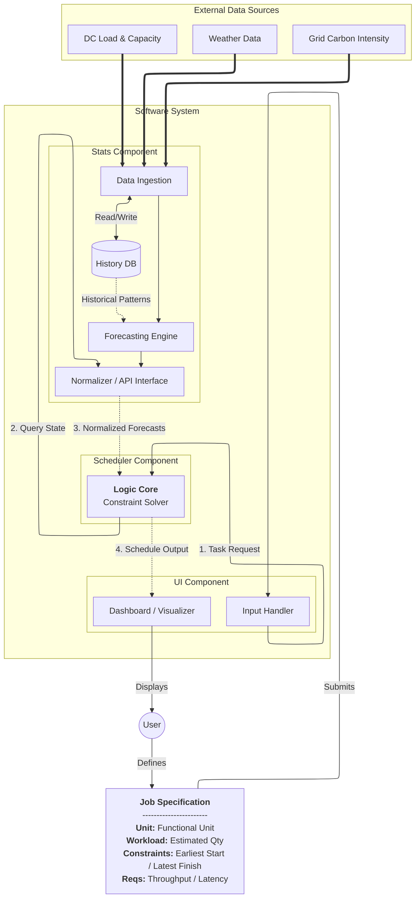
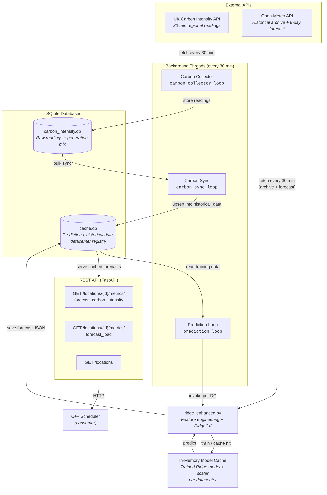
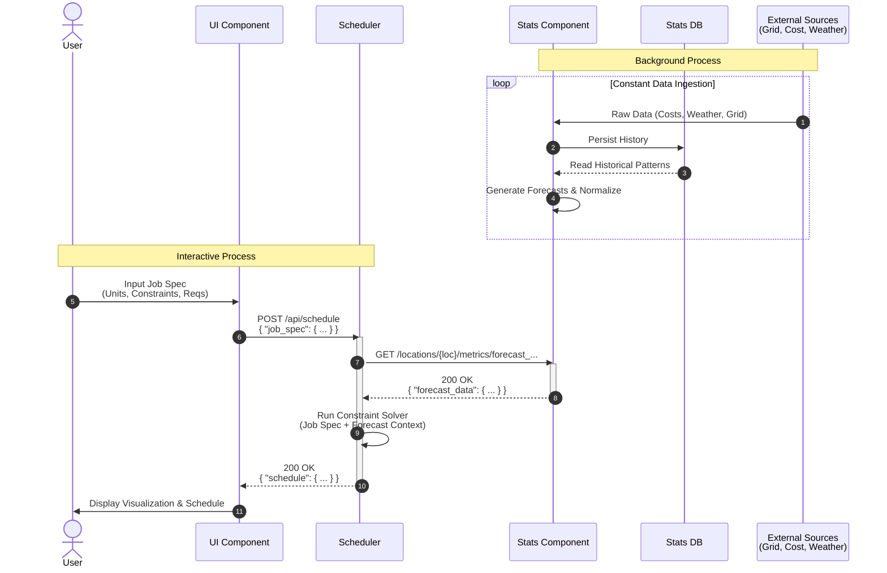
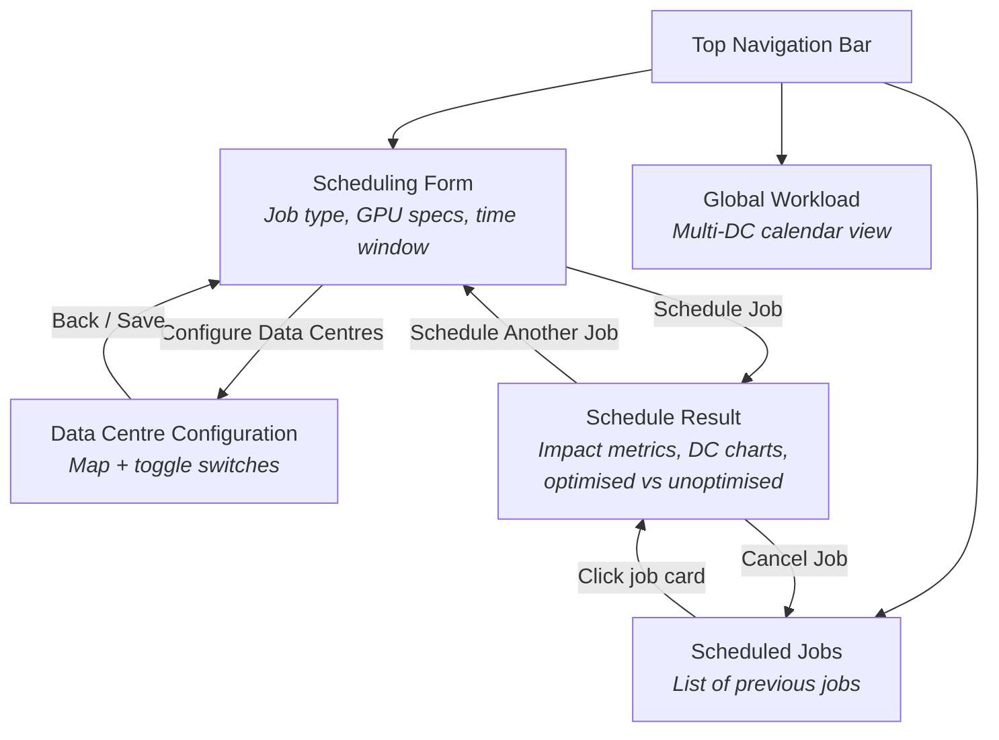
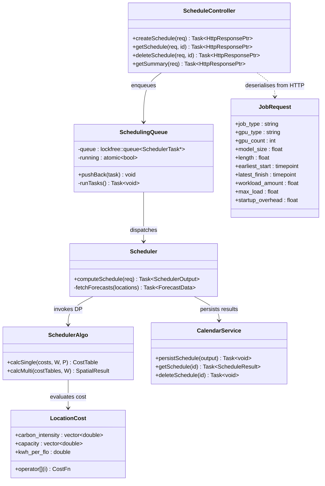
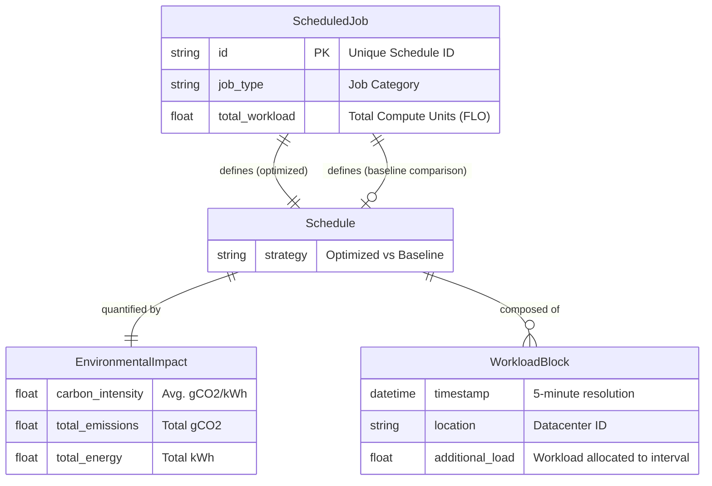

# System Design

## Architecture

The Carbon-Aware AI Agent is composed of three decoupled components communicating over HTTP RESTful APIs. This microservices-oriented architecture maximizes modularity and allows independent development across appropriate technology stacks.

/// caption
System Architecture Diagram showing the flow of data between external providers and the core system components.
///

### Component Descriptions

| Component | Technology | Role |
|-----------|-----------|------|
| **UI** | Next.js 14 / React, shadcn/ui, Recharts, Leaflet | Server-side rendered web application. Provides the scheduling form, schedule result visualisation, global workload calendar, and data centre configuration page. Communicates with the Scheduler via REST. |
| **Scheduler** | C++23, Drogon HTTP framework, PostgreSQL | Stateless optimisation service. Receives job requests from the UI, fetches forecasts from Stats via parallel coroutine HTTP calls, runs the two-phase DP solver (see [Algorithms](algorithms.md)), persists results to PostgreSQL, and returns the optimised schedule. |
| **Stats** | Python 3.12, FastAPI, SQLite, scikit-learn | Data ingestion and forecasting service. Three background threads continuously collect carbon intensity data from the UK Carbon Intensity API, sync it into the serving database, and retrain a Ridge regression model per data centre every 30 minutes. Serves 7-day carbon intensity and load forecasts at 5-minute resolution to the Scheduler. |

### Stats Component — Internal Architecture

While the high-level architecture above shows the Stats component as a single block, its internal design involves a multi-stage data pipeline with two SQLite databases, three background threads, and an in-memory model cache. The diagram below details how external carbon and weather data flows through the service — from ingestion to trained model to cached forecast — before being served to the Scheduler via the REST API.

/// caption
Internal architecture of the Stats component, showing the data pipeline from external API ingestion through model training and caching to forecast delivery.
///

For a detailed explanation of the databases, caching strategy, retraining cadence, and the Ridge regression model itself, see [Implementation — Forecasting Service](implementation.md#stats-forecasting-service).

## Sequence Diagrams

Component interactions follow a RESTful request-response pipeline. Because the scheduling environment is shared, typical "preview" functions are susceptible to race conditions. To resolve this, the process uses a **Two-Phase Commit-Cancel** workflow.

/// caption
Sequence diagram showing the continuous ingestion pipeline and an interactive user scheduling request.
///

## Site Map

The UI is structured as a single-page dashboard with tab-based navigation. The diagram below shows the page hierarchy and the transitions between views.

/// caption
Site map showing page hierarchy and navigation flows.
///

| Page | Route | Purpose |
|------|-------|---------|
| Scheduling Form | `/` | Primary entry point. Users define hardware specs, time constraints, and submit jobs for optimisation. |
| Schedule Result | `/schedule/{id}` | Displays the optimised schedule with environmental impact metrics, per-DC workload charts, and optimised/unoptimised comparison toggle. |
| Global Workload | `/workload-calendar` | Multi-data-centre, multi-day calendar showing all scheduled workloads overlaid with carbon intensity, load, and capacity curves. |
| Scheduled Jobs | `/scheduled-jobs` | Paginated list of all previously submitted jobs with summary metrics and carbon savings badges. Clicking a card navigates to the Schedule Result page. |
| Data Centre Config | `/config` | Leaflet map of all 14 UK regions with toggle switches to enable/disable data centres for scheduling. Changes are persisted to the Stats API. |

## API Specification

The three components communicate exclusively over HTTP REST. The tables below document the inter-service contracts.

### Scheduler API (consumed by UI)

| Method | Endpoint | Request Body | Response | Description |
|--------|----------|-------------|----------|-------------|
| `POST` | `/api/schedules` | `JobRequest` JSON (job type, GPU type/count, model size, runtime, earliest start, latest finish) | `ScheduleResult` with schedule ID, impact metrics, and scheduled blocks | Submit a job for optimisation. The schedule is immediately persisted (Phase 1 of Commit-Cancel). |
| `GET` | `/api/schedules/{id}` | — | Full schedule with blocks and impact | Retrieve a previously computed schedule. |
| `GET` | `/api/schedules/{id}/trivial` | — | Trivial (unoptimised) schedule and impact | Retrieve the baseline contiguous schedule for comparison. |
| `GET` | `/api/schedules/summary` | Optional `start`, `end`, `location` query params | List of job summaries | List all scheduled jobs with summary metrics. |
| `DELETE` | `/api/schedules/{id}` | — | 204 No Content | Cancel a scheduled job and release reserved capacity (Phase 2 of Commit-Cancel). |

### Stats API (consumed by Scheduler and UI)

| Method | Endpoint | Response | Description |
|--------|----------|----------|-------------|
| `GET` | `/locations` | List of active data centres with IDs and coordinates | Returns only data centres currently enabled for scheduling. |
| `GET` | `/datacenters` | Full list of all 14 data centres with active state | Returns all registered data centres regardless of active status. |
| `PATCH` | `/datacenters/{id}` | Updated data centre record | Toggle a data centre's active/inactive state. |
| `GET` | `/locations/{id}/metrics/forecast_carbon_intensity` | Time series of carbon intensity (gCO2/kWh) at 5-min resolution | 7-day forecast stitching historical observations with predicted values. Accepts optional `start_time` and `end_time` query params. |
| `GET` | `/locations/{id}/metrics/forecast_load` | Time series of load at 5-min resolution | 7-day synthetic load forecast for the specified data centre. |
| `GET` | `/predictionWindow` | `{ "hours": 168 }` | Returns the current forecast window length. |

---

## Class Diagram — Scheduler Core

The Scheduler's internal architecture separates HTTP transport, business logic, and persistence into distinct layers. The diagram below shows the key classes and their relationships.

/// caption
Class diagram of the Scheduler component showing the separation between HTTP controllers, the lock-free scheduling queue, the DP algorithm, and the persistence layer.
///

---

## Design Patterns

1. **Two-Phase Commit-Cancel**: Solves concurrency issues by immediately persisting computed schedules (reserving resources). Users review the optimal placement and can optionally discard it via a `DELETE` request, meaning the view presented is fully guaranteed to represent reality if accepted.
2. **Stateless Optimization Engine**: Inside the Scheduler, the core logic is divorced from state. The optimizer only receives parameters (from APIs and databases) and returns a raw result without handling HTTP framing or ORM persistence. This ensures isolated execution and simplifies unit testing.
3. **Data Transfer Object (DTO) / Niebloid Pattern**: Strict typing boundaries are enforced. Internal allocation structures (`InternalBlock`) are isolated from persistence representations (`JobModel`) and external API responses (`ScheduleResult`). Isolated mapping objects resolve boundary serialization.
4. **Coroutine-based Concurrency**: The Scheduler handles high-throughput API integration via C++23 coroutines (`drogon::Task`), using a custom `when_all` implementation to await parallel HTTP calls to the Stats component without blocking OS threads.
5. **Repository Pattern**: External persistence interfaces, like the `CalendarService`, wrap Drogon's Object-Relational Mapping (ORM) to yield predictable transactions to the core logic layer.

## Data Storage & Schemas

Storage is decentralized into bounded contexts, matching the microservice strategy.

### 1. Stats Persistence

The Stats module utilizes two **SQLite** databases to separate write-heavy collection from read-heavy serving:

- **`carbon_intensity.db`** — Owned by the Carbon Collector thread. Stores raw 30-minute carbon intensity readings and generation mix data from the UK Carbon Intensity API. On first startup, performs a 365-day historical backfill.
- **`cache.db`** — The serving database. Contains synced historical data, cached forecast JSON (with 40-minute TTL expiry), pre-upsampled 5-minute historical data for the trailing 7 days, and the data centre registry (all 14 UK regions with active/inactive state and coordinates).

This separation ensures the collector can write freely without contending with API read traffic on the serving layer.

### 2. Scheduler Persistence

The Scheduler connects to a **PostgreSQL** cluster for persistent record-keeping. While the physical schema is normalized for the relational database, the semantic relationship centers on the concept of a **Scheduled Job** and its associated optimization plans.

/// caption
Semantic Data Model showing the relationship between a high-level Job, its optimized/baseline schedules, and the atomic blocks that make them up.
///

The fundamental atomic unit is the **Workload Block**, representing a 5-minute slice of compute time. A complete **Schedule** is formed by a collection of these blocks distributed across time and space (datacenters). Each schedule is measured by its **Environmental Impact**, allowing the user to compare the carbon footprint of the solver's optimal placement against a trivial baseline.
