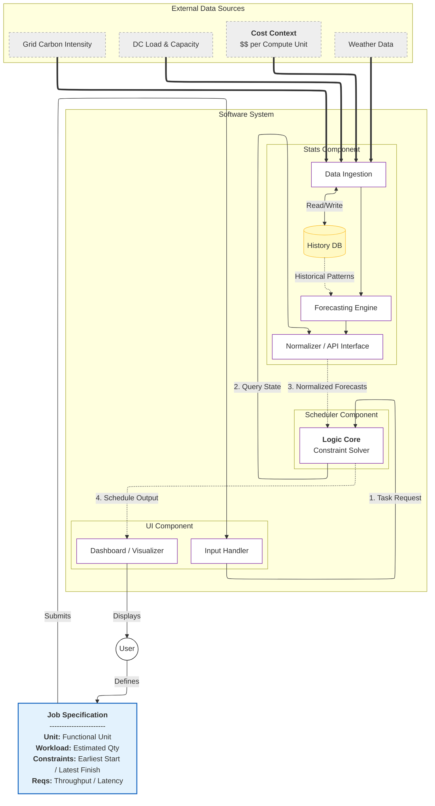
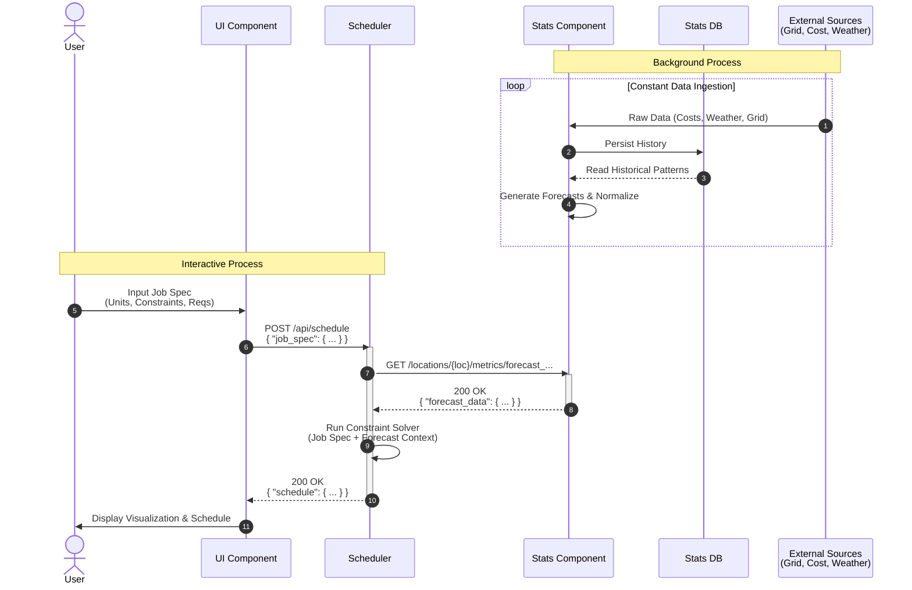
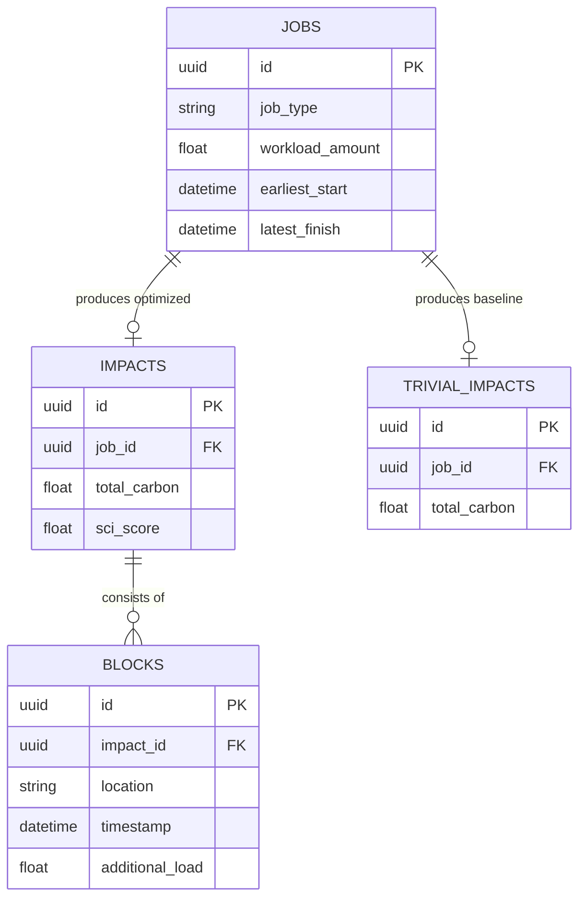

# System Design

## Architecture

The Carbon-Aware AI Agent is composed of three decoupled components communicating over HTTP RESTful APIs. This microservices-oriented architecture maximizes modularity and allows independent development across appropriate technology stacks.

/// caption
System Architecture Diagram showing the flow of data between external providers and the core system components.
///

### Component Descriptions

- **UI Component**: A modern, server-side rendered web application built with Next.js. It acts as the primary human-computer interface, visualizing global data center states, plotting environmental metrics, and allowing users to submit task requests and analyze optimized schedules.
- **Scheduler Component**: The core logical computation engine written in C++23. Leveraging the Drogon HTTP framework, it acts as a stateless optimization service. It pulls telemetry and forecasts from the Stats module, runs a constraint solver based on Dynamic Programming (detailed in [Algorithms](./algorithms.md)), and determines the optimal workload distribution to minimize software carbon intensity.
- **Stats Component**: A Python-based FastAPI background service that acts as a uniform data interface. It continuously ingests, normalizes, and forecasts external information such as grid carbon intensity, baseline data center load, and regional weather. 

## Sequence Diagrams

Component interactions follow a RESTful request-response pipeline. Because the scheduling environment is shared, typical "preview" functions are susceptible to race conditions. To resolve this, the process uses a **Two-Phase Commit-Cancel** workflow.

/// caption
Sequence diagram showing the continuous ingestion pipeline and an interactive user scheduling request.
///

## Site Map

The UI is structured as a unified dashboard tailored for geographic context and deep schedule insights. The primary navigation includes:

- **Datacenter Map**: A geographic visualization overlaying the positions of datacenters with hardware capacities and environmental metrics.
- **Workload Calendar**: A time-series grid showing both predicted baseline load across nodes and previously scheduled user workloads.
- **Scheduling Form**: Inputs for new job requirements (Workload type, computing amount, and chronological availability window).
- **Results & History View**: After successful scheduling, this displays the environmental impact metrics of the job compared to a non-optimized trivial placement, alongside historical logs of prior runs.

## Design Patterns

1. **Two-Phase Commit-Cancel**: Solves concurrency issues by immediately persisting computed schedules (reserving resources). Users review the optimal placement and can optionally discard it via a `DELETE` request, meaning the view presented is fully guaranteed to represent reality if accepted.
2. **Stateless Optimization Engine**: Inside the Scheduler, the core logic is divorced from state. The optimizer only receives parameters (from APIs and databases) and returns a raw result without handling HTTP framing or ORM persistence. This ensures isolated execution and simplifies unit testing.
3. **Data Transfer Object (DTO) / Niebloid Pattern**: Strict typing boundaries are enforced. Internal allocation structures (`InternalBlock`) are isolated from persistence representations (`JobModel`) and external API responses (`ScheduleResult`). Isolated mapping objects resolve boundary serialization.
4. **Coroutine-based Concurrency**: The Scheduler handles high-throughput API integration via C++23 coroutines (`drogon::Task`), using a custom `when_all` implementation to await parallel HTTP calls to the Stats component without blocking OS threads.
5. **Repository Pattern**: External persistence interfaces, like the `CalendarService`, wrap Drogon's Object-Relational Mapping (ORM) to yield predictable transactions to the core logic layer.

## Data Storage & Schemas

Storage is decentralized into bounded contexts, matching the microservice strategy.

### 1. Stats Persistence
The Stats module utilizes **SQLite** for rapid reading and writing of transient historical context. A background worker continuously writes synthetic or retrieved metrics to the local database, allowing the main web threads to handle GET requests instantly with negligible latency overhead.

### 2. Scheduler Persistence
The Scheduler connects to a **PostgreSQL** cluster for persistent record-keeping of jobs. The schema explicitly handles mapping a unified scheduled job to granular functional chunks. It records unoptimized variations to expose tangible ROI metrics for users.

/// caption
Entity-Relationship diagram of the Scheduler's relational PostgreSQL schema.
///

The fundamental atomic unit tracked across the pipeline is the **Workload Block**. It defines compute load spanning a specific 5-minute interval mapped to an explicit datacenter. The `Blocks` table unifies this to represent the overall schedule timeline dynamically evaluated by the algorithms.