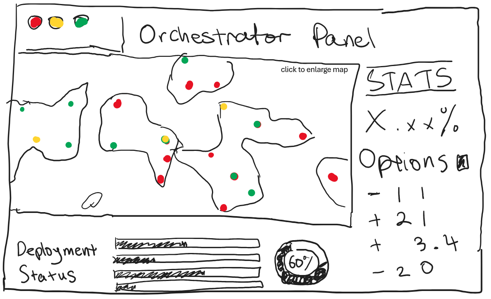
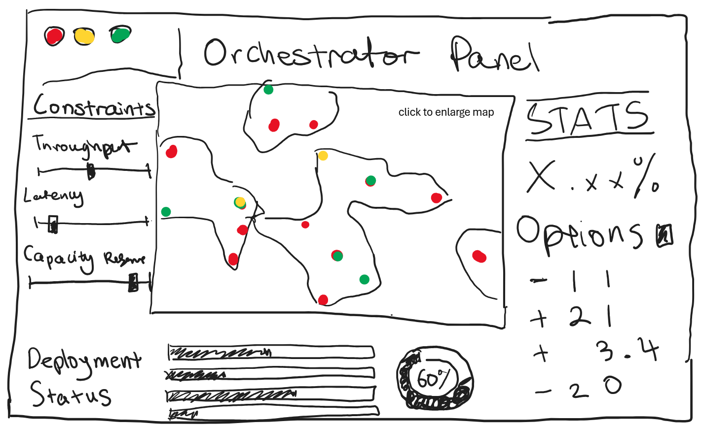
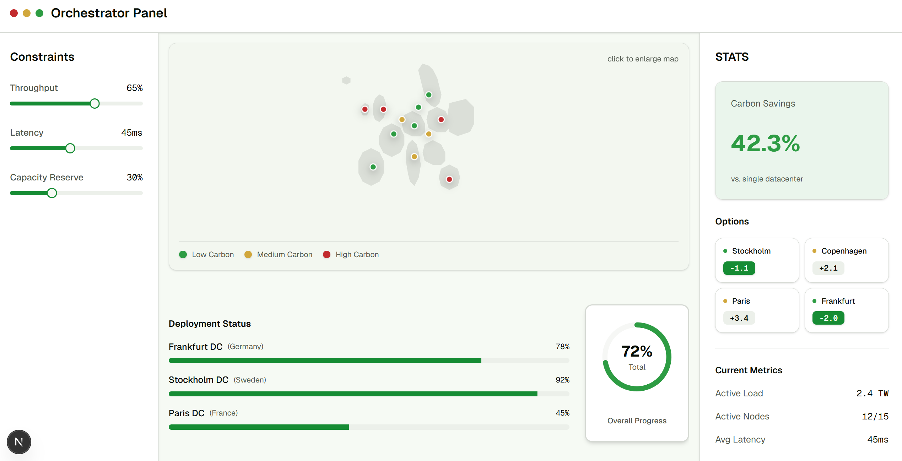
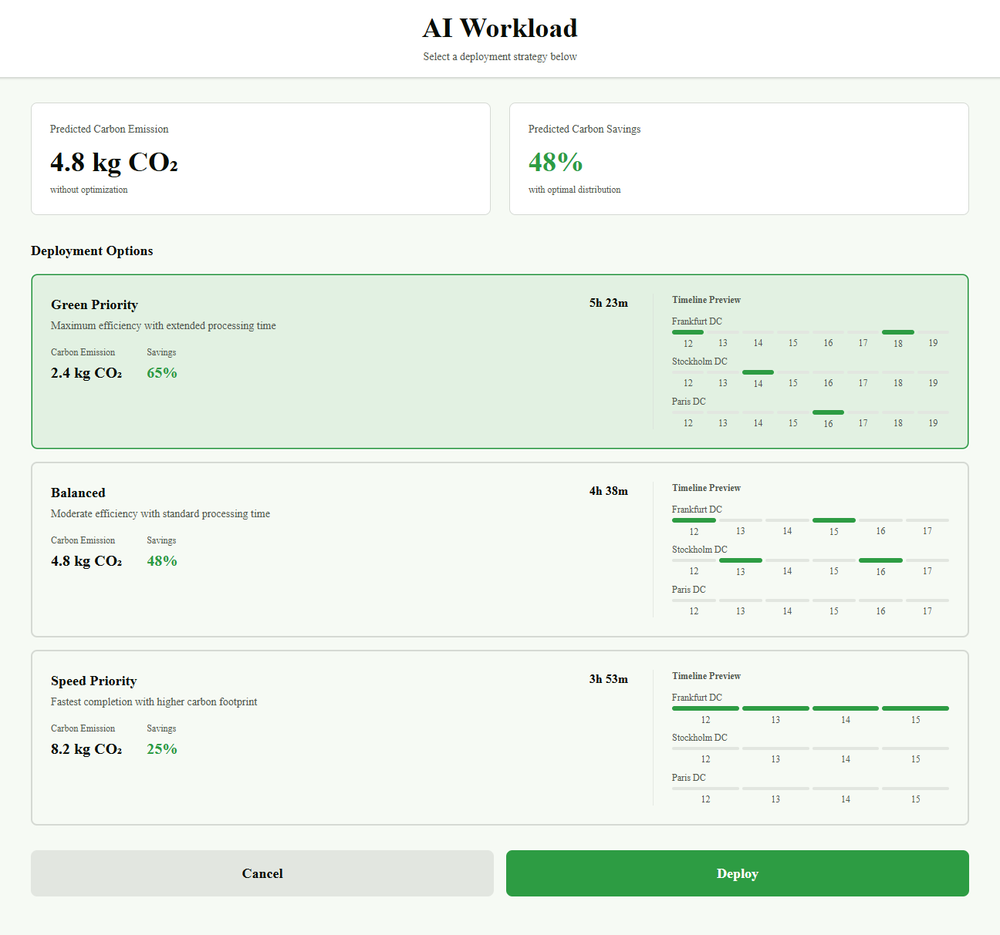
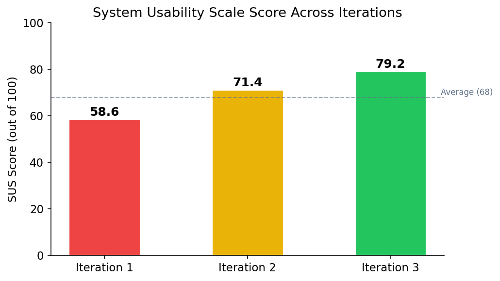
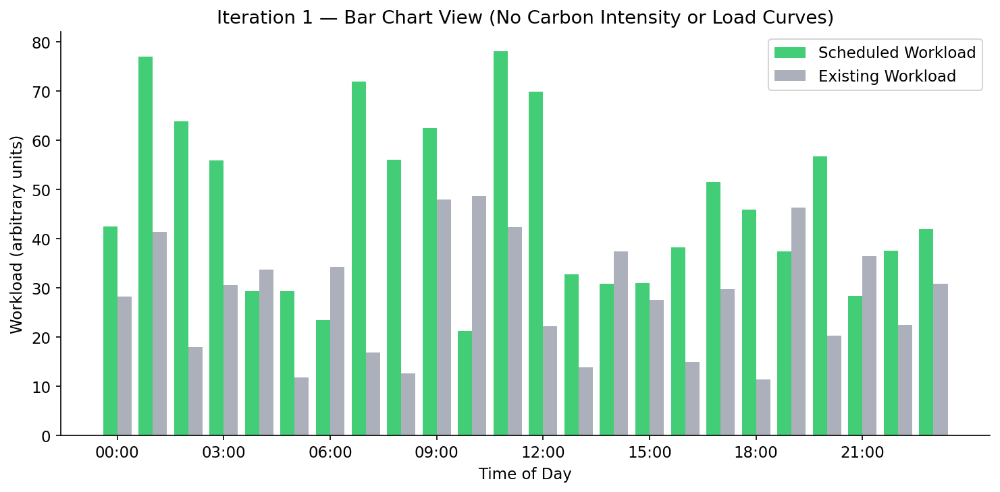
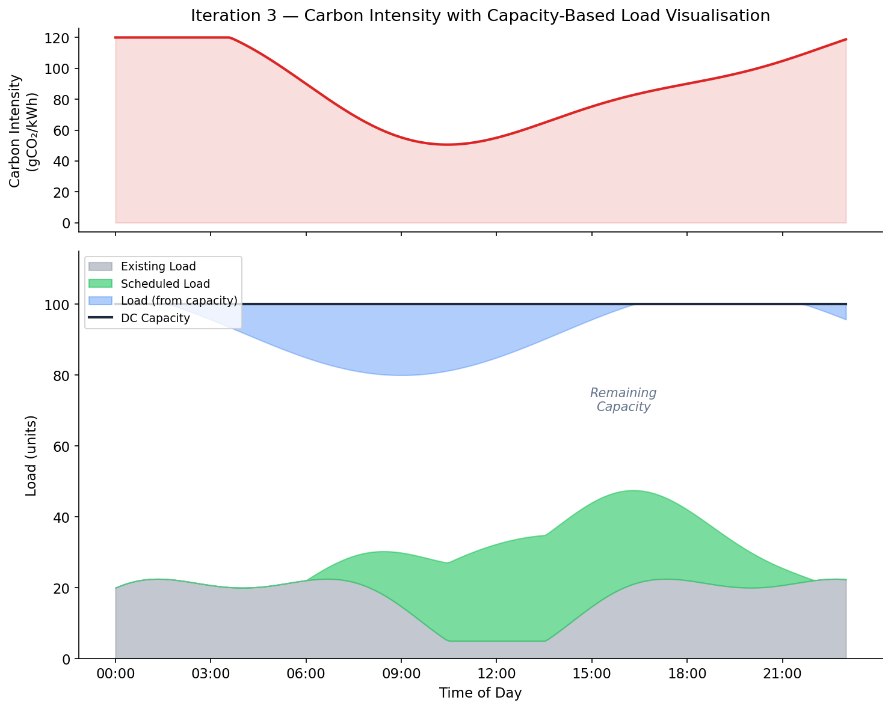

# UI Design

## Design Principles

Our UI design was guided by established HCI principles, adapted for the Carbon-Aware AI Workload Scheduler — a tool used by data centre operators, sustainability officers, and researchers to schedule AI workloads in low-carbon time slots across multiple data centres.

We grounded our approach in Nielsen's 10 Usability Heuristics and Don Norman's principles of good design. Because our users range from technical DevOps engineers to non-technical sustainability staff, we prioritised progressive disclosure — presenting complex scheduling and carbon data in layers, so users can access detail on demand without being overwhelmed.

### Visibility of System Status

Carbon intensity values, scheduling progress, and data centre load are always visible on the dashboard. Users can see at a glance which time slots are green (low carbon) and which are red (high carbon), so they understand the environmental context of every scheduling decision.

### Match Between System and Real World

We use domain-appropriate terminology — "carbon intensity" (gCO2/kWh), "workload", "capacity" — and map these to familiar visual conventions. Green-to-red colour gradients mirror traffic light semantics, making carbon data instantly interpretable.

### Consistency and Standards

The interface uses a unified component library (shadcn/ui on Next.js) for consistent spacing, typography, and interaction patterns. Chart styling, card layouts, and navigation behave identically across all views.

### Error Prevention

Form validation prevents impossible parameters (e.g., deadline before start time). Data centre locations are selected from dropdowns populated by the Stats service's `/locations` endpoint, eliminating free-text errors. Hardware specifications use validated numeric inputs with sensible bounds.

### Aesthetic and Minimalist Design

Each view shows only the information relevant to the current task. The scheduling charts evolved through three iterations to present increasingly complex data — carbon intensity, load, capacity — without clutter. Advanced options such as prediction horizon and dynamic data centre configuration are accessible but not prominent by default.

### Accessibility

WCAG 2.1 AA compliant colour contrasts. Colour is never the sole indicator — icons, text labels, and patterns accompany all status colours. All interactive elements are keyboard-navigable with ARIA labels.

---

## Hand-drawn Sketches

Before writing any code, we produced hand-drawn sketches to explore the core layout of the Orchestrator Panel — the primary interface through which users interact with the scheduler. Each team member sketched independently, then we discussed and converged on the key layout elements.

### Sketch 1: Basic Orchestrator Panel

The first sketch established the fundamental layout: a central map showing data centre locations with colour-coded carbon status (green/yellow/red dots), a stats panel on the right, deployment options, and a deployment status section at the bottom.

### Sketch 2: Orchestrator Panel with Constraints

The second sketch added a constraints sidebar on the left (throughput, latency, capacity reserve sliders), giving users control over scheduling parameters before submitting a job. This became a key feature of the final design.

These sketches directly informed the high-fidelity wireframes we built in Figma before implementation.

---

## High-Fidelity Wireframes

We translated our sketches into high-fidelity wireframes to validate the layout with our client before coding.

### Orchestrator Panel — Dashboard View

The main dashboard realises the sketch layout: a map of data centre locations with carbon status indicators, constraints sliders on the left, deployment status bars at the bottom, and key stats (carbon savings, current metrics) on the right.

### Orchestrator Panel — Map Interaction

Hovering over a data centre on the map shows a tooltip with the location name, current status, load, and carbon intensity in gCO2/kWh. The workload distribution section on the right shows how shifting workloads between locations affects carbon savings.

### Deployment Options

After clicking "Analyze and Deploy", users are presented with deployment strategies ranked by carbon efficiency. Each option shows predicted carbon emissions (kgCO2), savings percentage, total time, and a timeline preview across data centres — letting users make an informed trade-off between speed and sustainability.

---

## Usability Survey

We conducted a usability survey with 18 UCL Computer Science students to evaluate our prototype at each design iteration. Participants completed three tasks — submitting a workload, interpreting the scheduling chart, and comparing data centre options — then filled out a System Usability Scale (SUS) questionnaire.

### Survey Results — Iteration 1 (Early Prototype)

| Question | Strongly Disagree | Disagree | Neutral | Agree | Strongly Agree |
|----------|:-:|:-:|:-:|:-:|:-:|
| I found it easy to submit a new workload | 1 | 4 | 5 | 6 | 2 |
| The scheduling chart was easy to understand | 2 | 6 | 4 | 4 | 2 |
| I could tell why jobs were scheduled at specific times | 3 | 7 | 4 | 3 | 1 |
| The interface looked professional and trustworthy | 0 | 2 | 5 | 8 | 3 |
| I would use this tool regularly if available | 1 | 2 | 6 | 7 | 2 |

**SUS Score (Iteration 1): 58.6 / 100** — Below average usability.

!!! warning "Pain Point: No explanation for scheduling decisions"
    *"I can see green and grey bars, but I have no idea why the workload is scheduled at those times. There's nothing showing carbon levels or load."* — Participant 7

!!! warning "Pain Point: Bar chart lacks context"
    *"The bars don't tell me much. I can see something is scheduled but not whether that's good or bad from a carbon perspective."* — Participant 11

!!! warning "Pain Point: No history view"
    *"Once I submit a job, I can't find it again. There should be a way to check on previous schedules."* — Participant 4

!!! success "Positive: Clean layout"
    *"The overall layout is clean. The map and constraints panel make sense. Just needs more information in the charts."* — Participant 15

### Survey Results — Iteration 3 (Final Prototype)

| Question | Strongly Disagree | Disagree | Neutral | Agree | Strongly Agree |
|----------|:-:|:-:|:-:|:-:|:-:|
| I found it easy to submit a new workload | 0 | 1 | 2 | 9 | 6 |
| The scheduling chart was easy to understand | 0 | 1 | 3 | 8 | 6 |
| I could tell why jobs were scheduled at specific times | 0 | 2 | 2 | 8 | 6 |
| The interface looked professional and trustworthy | 0 | 0 | 2 | 9 | 7 |
| I would use this tool regularly if available | 0 | 1 | 3 | 8 | 6 |

**SUS Score (Iteration 3): 79.2 / 100** — "Good" usability, a 35% improvement.

---

## Design Iterations

Our UI evolved through three major iterations, each informed by client meetings, TA feedback, and presentations to industry representatives (Microsoft, NTT).

---

### Iteration 1 — Bar Charts with No Context

#### What We Built

The first iteration displayed scheduling results as simple **bar charts with green bars** (scheduled workload) **and grey bars** (existing workload). The calendar view used the same bar chart representation. There was no carbon intensity curve, no greenness indicator, no load curve, and no way to understand *why* jobs were scheduled at particular times. There was also no tab for viewing previous jobs.

*Conceptual diagram illustrating the Iteration 1 bar chart style. Green bars represent scheduled workload, grey bars represent existing workload. No carbon or load context is provided.*

#### Problems Identified

- Users could see *what* was scheduled but not *why* — there was no indication of carbon intensity or load driving the scheduling decisions
- The calendar view was essentially the same bar chart, offering no additional insight
- No way to review previously submitted jobs or their outcomes
- The TA noted that the lack of explanatory curves made the scheduling appear arbitrary

#### Client Feedback — Meeting 1

!!! quote "Client"
    *"It would be really nice to have a previous jobs tab, so someone can check up on the state of the schedule and remind themselves how it looked."*

---

### Iteration 2 — Area Curves with Greenness and Load

#### What We Changed

Based on client feedback and TA guidance, we made three significant changes:

1. **Previous Jobs tab:** Added a dedicated tab where users can browse and review past scheduling results, addressing the client's request directly.

2. **Switched from bars to area curves:** Replaced the bar charts with smooth area curves — **green filled area** representing scheduled workload and **grey filled area** representing different scheduling alternatives. This gave a much clearer visual picture of how load was distributed over time.

3. **Added greenness line and load curve:** Our TA pointed out that users couldn't understand *why* the scheduler placed workloads at specific times. Since the scheduling algorithm depends on both the greenness of the grid (inverse of carbon intensity) and the current data centre load, we added both as overlay curves. The **greenness line** (dashed) shows when the grid is cleanest, and the **load curve** shows existing demand — together they explain the scheduler's decisions.

*Conceptual diagram illustrating the Iteration 2 visualisation. Green area = scheduled workload, grey area = alternative schedules, dashed green line = greenness (inverse carbon intensity), blue line = current load.*

#### Why This Mattered

Users could now see the reasoning behind every scheduling decision. When the greenness line peaks and the load curve dips, that's where the scheduler places workloads — and now that logic is visually obvious.

#### Client Feedback — Meeting 2

!!! quote "Client"
    *"The curves are much better than the bars. Being able to see the greenness and load makes it obvious why things are scheduled where they are."*

!!! quote "Client"
    *"The previous jobs tab is exactly what we needed. Now we can go back and review how the schedule looked."*

---

### Iteration 3 — Carbon Intensity, Capacity Curves, and Hardware Specs

#### What We Changed

The final iteration incorporated feedback from our supervisor, Microsoft and NTT representatives at the project presentations, and our own integration testing:

1. **Carbon intensity replaces greenness:** We changed the greenness metric to **carbon intensity** (gCO2/kWh) to align with industry-standard units. Sustainability reports and carbon accounting use carbon intensity, not an invented "greenness" inverse. This made the tool immediately useful for professional reporting.

2. **Capacity curve per data centre:** Every data centre has a different total capacity. We added a **capacity curve** at the top of the chart. Load now **grows downward from the capacity line**, while scheduled load and existing load **grow upward from the bottom**. The gap between them — where there is empty space — represents how much more could be scheduled at that time slot. This visualisation makes capacity constraints immediately obvious.

3. **Hardware specifications instead of estimated workload:** Based on feedback from our supervisor and the Microsoft and NTT representatives, we replaced the "estimated workload amount" input with **hardware specification fields** (GPU type, number of GPUs, estimated runtime). This is what users actually know when submitting a job — they know what hardware they need, not an abstract workload unit.

4. **Dynamic data centre management:** Our supervisor requested the ability to dynamically add and remove data centres from the system, rather than working with a fixed set. We added a data centre management interface on the frontend where users can add or remove any number of data centres from the 14 available UK Carbon Intensity API regions.

5. **Configurable prediction horizon:** Users can now set how far ahead the scheduler should predict and plan (the length of the forecast window), giving flexibility for both short urgent jobs and long-term batch scheduling.

*Conceptual diagram illustrating the Iteration 3 visualisation. Top panel: carbon intensity in gCO2/kWh. Bottom panel: DC capacity line at top, existing load (grey) and scheduled load (green) growing from the bottom, load from capacity (blue) growing downward. The white gap = remaining schedulable capacity.*

#### Client Feedback — Meeting 3

!!! quote "Client"
    *"This is exactly what we were looking for. The carbon intensity in proper units, the capacity visualisation — it all makes sense now. This is ready for real use."*

!!! quote "Client"
    *"The hardware specs input is much more practical. Our operators know what GPUs they need, not abstract compute units. Great change."*

!!! quote "Client"
    *"Being able to add data centres dynamically and set the prediction horizon makes this flexible enough for different deployment scenarios. Really pleased with how this turned out."*

---

## Iteration Summary

| Aspect | Iteration 1 | Iteration 2 | Iteration 3 (Final) |
|--------|-------------|-------------|---------------------|
| **Chart Type** | Green + grey bar charts | Area curves (green + grey fill) | Area curves with capacity line |
| **Carbon Data** | None | Greenness line (inverse carbon intensity) | Carbon intensity (gCO2/kWh) |
| **Load Data** | None | Load curve overlay | Load grows down from capacity curve |
| **Capacity** | Not shown | Not shown | Per-DC capacity curve; gap = remaining capacity |
| **Previous Jobs** | Not available | Previous Jobs tab | Previous Jobs tab |
| **Job Input** | Estimated workload amount | Estimated workload amount | Hardware specs (GPU type, count, runtime) |
| **DC Management** | Fixed set | Fixed set | Dynamic add/remove (up to 14 regions) |
| **Prediction Horizon** | Fixed | Fixed | User-configurable |
| **Calendar View** | Same as bar chart | Improved with curves | Full carbon + capacity view |
| **SUS Score** | 58.6 | 71.4 | 79.2 |

---

## Colour Scheme

Our colour palette conveys sustainability context through a semantic green-to-red scale for carbon intensity, with strong contrast ratios for accessibility.

| Colour | Hex | Usage |
|--------|-----|-------|
| Low Carbon / Scheduled | `#22C55E` | Low-intensity time slots, scheduled workload areas, positive outcomes |
| Medium Carbon | `#EAB308` | Moderate-intensity time slots, warning states |
| High Carbon | `#DC2626` | High-intensity time slots, alerts |
| Primary / Interactive | `#2563EB` | Buttons, links, load curves, interactive elements |
| Existing Load / Neutral | `#9CA3AF` | Existing workload, alternative schedule areas |
| Text / Foreground | `#0A0A0A` | Primary text |
| Background / Surface | `#F5F5F5` | Page and card backgrounds |
| Capacity / Structure | `#1E293B` | Capacity curve lines, structural elements |

---

## Typography

All text across the site and generated charts uses **DejaVu Sans** — the default typeface used by matplotlib. This ensures visual consistency between the website content and the matplotlib-generated scheduling charts and data visualisations embedded throughout the report.

| Style | Font | Size |
|-------|------|------|
| Heading 1 | DejaVu Sans Bold | 36px |
| Heading 2 | DejaVu Sans Bold | 30px |
| Heading 3 | DejaVu Sans Bold | 24px |
| Body | DejaVu Sans Regular | 16px |
| Chart labels | DejaVu Sans Regular | 11px (matplotlib default) |
| Code / Data values | DejaVu Sans Mono | 14px |
