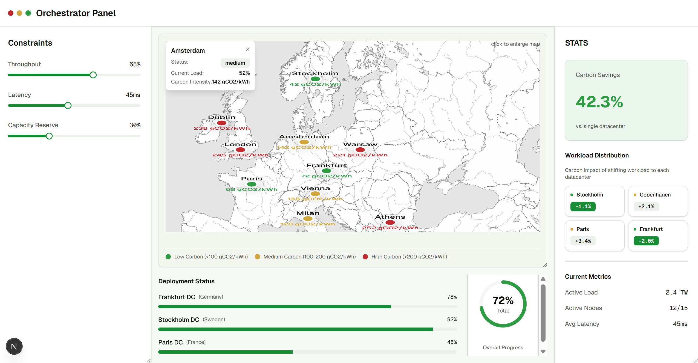
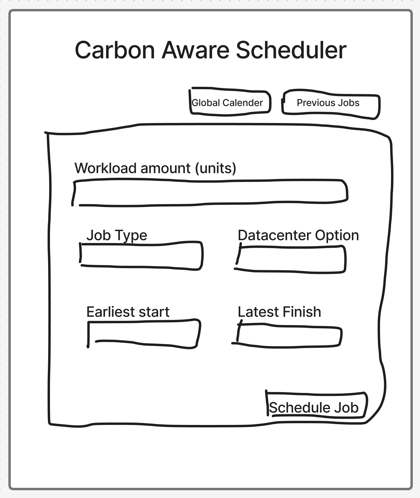
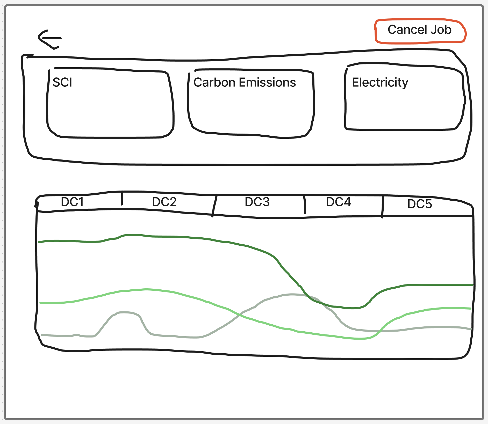
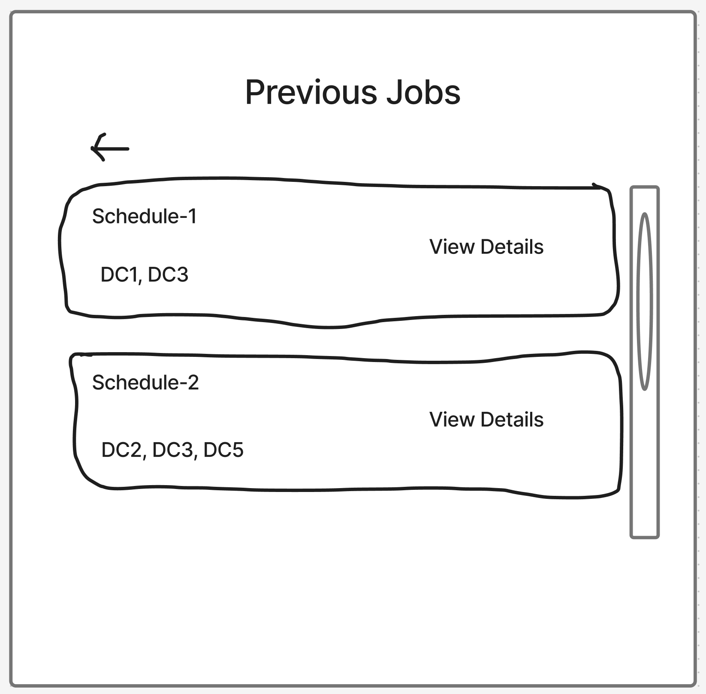
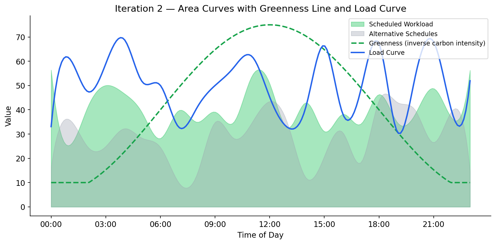
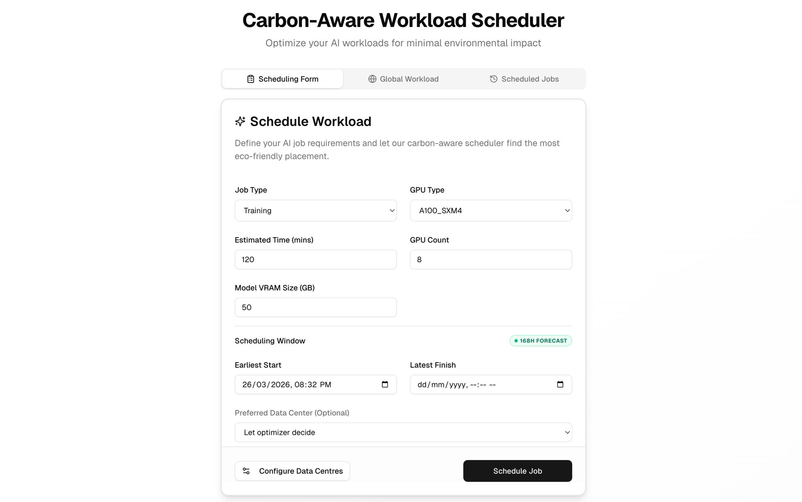
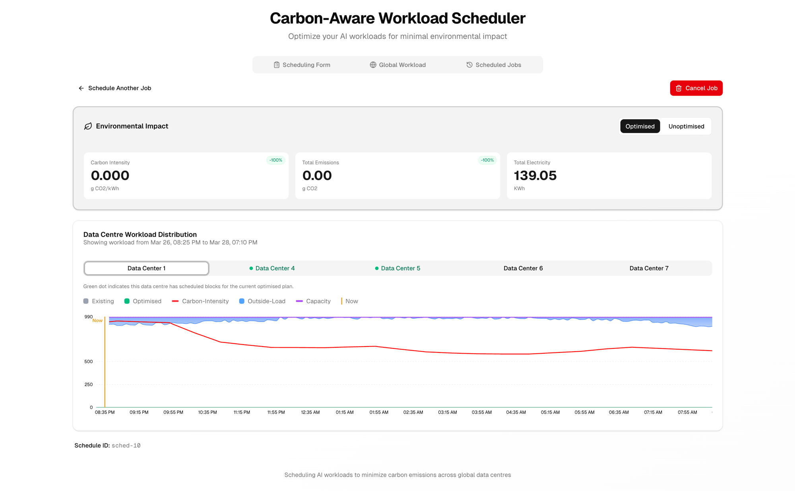
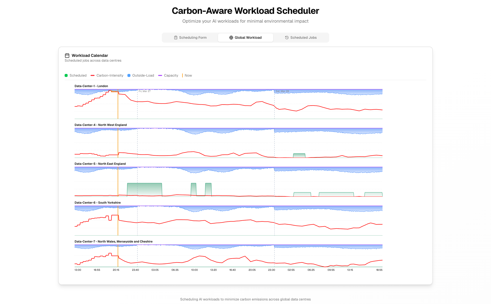
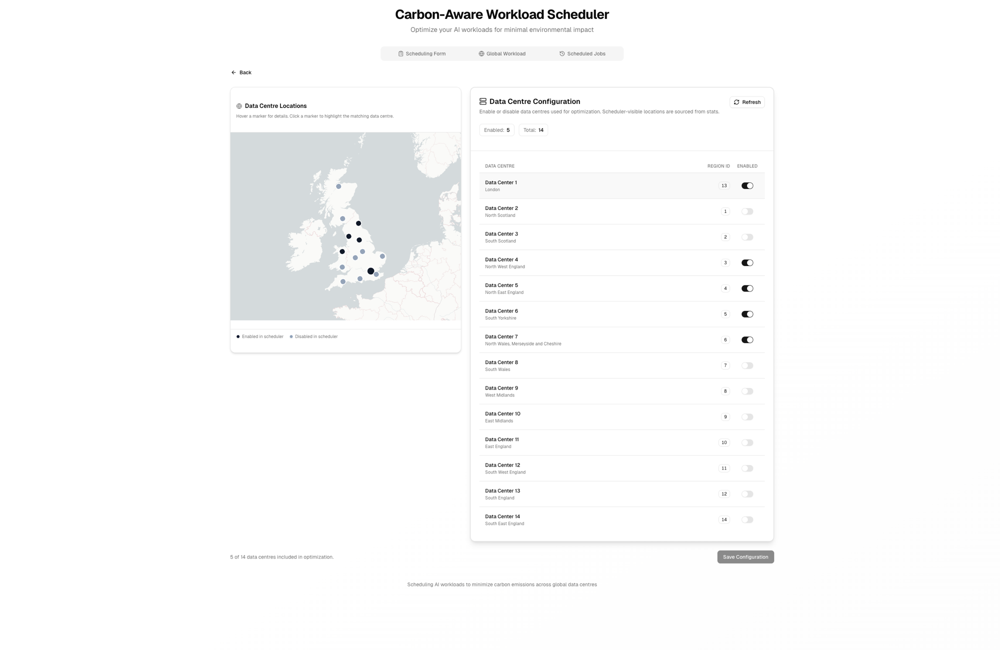

# UI Design

## Design Principles

Our UI design was guided by established HCI principles, adapted for the Carbon-Aware AI Workload Scheduler — a tool used by data centre operators, sustainability officers, and researchers to schedule AI workloads in low-carbon time slots across multiple data centres.

We grounded our approach in Nielsen's 10 Usability Heuristics and Don Norman's principles of good design. Because our users range from technical DevOps engineers to non-technical sustainability staff, we prioritised progressive disclosure — presenting complex scheduling and carbon data in layers, so users can access detail on demand without being overwhelmed.

### Visibility of System Status

The interface keeps users informed about what the system is doing at every stage. Key information, such as the status of submitted jobs, is always accessible from the dashboard. Users can quickly see which jobs are running, which have completed, and how their workloads were allocated across datacentres. The system also surfaces relevant statistics, including carbon‑intensity forecasts and historical performance, so users understand the context behind each scheduling decision without needing to navigate through complex menus.

### Match Between System and Real World

We use terminology that aligns with the domain — terms like carbon intensity (gCO₂/kWh), workload, and capacity — so the interface speaks the same language as its users. Visual elements follow familiar real‑world conventions: all chart colours are clearly labelled and chosen to reflect intuitive meanings, such as green for the impact of the user’s new job on a datacentre and grey for the background load from other jobs.

### Consistency and Standards

The interface uses a unified component library (shadcn/ui on Next.js) for consistent spacing, typography, and interaction patterns. Chart styling, card layouts, and navigation behave identically across all views.

### Error Prevention

Form validation prevents impossible parameters (e.g., deadline before start time). Data centre locations are selected from dropdowns populated by the Stats service's `/locations` endpoint, eliminating free-text errors. Hardware specifications use validated numeric inputs with sensible bounds.

### Aesthetic and Minimalist Design

Each view shows only the information relevant to the current task. The scheduling charts evolved through three iterations to present increasingly complex data — carbon intensity, load, capacity — without clutter. Advanced options such as prediction horizon and dynamic data centre configuration are accessible but not prominent by default.

### Accessibility

WCAG 2.1 AA compliant colour contrasts. Colour is never the sole indicator — icons, text labels, and patterns accompany all status colours. All interactive elements are keyboard-navigable with ARIA labels.

---

## Initial UI Concept - Iteration 1

Before writing any code, we produced hand-drawn sketches to explore the core layout of the Orchestrator Panel — the primary interface through which users interact with the scheduler. Each team member sketched independently, then we discussed and converged on the key layout elements.

### Sketch 1: Basic Orchestrator Panel

The first sketch established the fundamental layout: a central map showing data centre locations with colour-coded carbon status (green/yellow/red dots), a stats panel on the right, deployment options, and a deployment status section at the bottom.

/// caption
Basic Orchestrator Panel
///

### Sketch 2: Orchestrator Panel with Constraints

The second sketch added a constraints sidebar on the left (throughput, latency, capacity reserve sliders), giving users control over scheduling parameters before submitting a job. This addition reflected an early insight from our personas: users need to customise workload requirements before scheduling. Providing these controls upfront made the interface more aligned with real‑world scheduling workflows.

/// caption
Orchestrator Panel with Constraints
///

These sketches formed the foundation for our initial Figma wireframes, allowing us to test layout ideas and gather early feedback before moving into high‑fidelity design.

---

### Initial Figma Orchestrator Panel

The first high‑fidelity wireframe translated our sketches into a functional dashboard layout. Key elements included:

- **Central map of data centres**
    - Colour‑coded carbon status indicators (green/yellow/red)
    - Tooltip on hover showing:
        - Location name, Current operational status, Load percentage, Carbon intensity (gCO₂/kWh)
- **Left‑hand constraints panel**
    - Throughput slider
    - Latency slider
    - Capacity reserve slider
    - Designed to let users customise workload requirements before scheduling
- **Right‑hand statistics panel**
    - Displays Carbon savings, Active load, Active nodes, Average latency 
    - Workload distribution showing carbon impact of shifting workloads between regions
- **Bottom deployment status section**
    - Per‑datacentre deployment progress bars
    - Overall progress indicator

/// caption
Orchestrator Panel with map interaction
///

### Initial Figma Deployment Options

After clicking "Analyze and Deploy", users are presented with deployment strategies ranked by carbon efficiency. Each option shows predicted carbon emissions (kgCO2), savings percentage, total time, and a timeline preview across data centres — letting users make an informed trade-off between speed and sustainability.

/// caption
Deployment options with timeline previews
///

### Initial Figma Scheduling Result 

The first iteration displayed scheduling results as simple **bar charts with green bars** (scheduled workload) **and grey bars** (existing workload). The calendar view used the same bar chart representation. There was no carbon intensity curve, no greenness indicator, no load curve, and no way to understand *why* jobs were scheduled at particular times.

/// caption
Iteration 1 chart concept — green and grey bars only
///

---

### Usability Survey for Initial Draft

We conducted a usability survey with 18 UCL Computer Science students to evaluate our prototype. Participants completed three tasks — submitting a workload, interpreting the scheduling chart, and comparing data centre options — then filled out a System Usability Scale (SUS) questionnaire.

#### Survey Results — Iteration 1 (Early Prototype)

| Question | Strongly Disagree | Disagree | Neutral | Agree | Strongly Agree |
|----------|:-:|:-:|:-:|:-:|:-:|
| I found it easy to submit a new workload | 1 | 4 | 5 | 6 | 2 |
| The scheduling chart was easy to understand | 2 | 6 | 4 | 4 | 2 |
| I could tell why jobs were scheduled at specific times | 3 | 7 | 4 | 3 | 1 |
| The interface looked professional and trustworthy | 0 | 2 | 5 | 8 | 3 |
| I would use this tool regularly if available | 1 | 2 | 6 | 7 | 2 |

**SUS Score (Iteration 1): 58.6 / 100** — Below average usability.

!!! warning "Pain Point: No explanation for scheduling decisions"
    *"I can see green and grey bars, but I have no idea why the workload is scheduled at those times. There's nothing showing carbon levels or load."* — Participant 7

!!! warning "Pain Point: Bar chart lacks context"
    *"The bars don't tell me much. I can see something is scheduled but not whether that's good or bad from a carbon perspective."* — Participant 11

!!! warning "Pain Point: No history view"
    *"Once I submit a job, I can't find it again. There should be a way to check on previous schedules."* — Participant 4

!!! warning "Pain Point: Layout of the UI is messy and cluttered"
    *"The overall layout is messy. The map and constraints panel can probably be simplified and spread across multiple pages. Also, need more information in the charts."* — Participant 15

#### Client Feedback to Iteration 1

!!! quote "Client"
    *"I would like the program to be simpler. Right now there is a lot of stuff going on and it makes it hard to navigate, especially from the non-technical users. Also, it would be really nice to have a previous jobs tab, so someone can check up on the state of the schedule and remind themselves how it looked."*

#### Problems Identified

- Users could see *what* was scheduled but not *why* — there was no indication of carbon intensity or load driving the scheduling decisions
- The calendar view was essentially a bar chart, offering no additional insight
- No way to review previously submitted jobs or their outcomes
- The TA noted that the lack of explanatory curves made the scheduling appear arbitrary

---

## Developed UI - Iteration 2

### Sketch 3: Updated menu for Iteration 2

Following the feedback received from classmates, the TA and our client, we decided to redesign the UI to match the feedback given to us.

#### Scheduling form

/// caption
Iteration 2 wireframe — Scheduling Form
///

This new UI allowed the user to input all constraints without needing to bloat the screen with unnecessary components. It contains fields for:

- Workload amount in arbirtary units
- Job type
- Preffered Datacenter option
- Earliest Start
- Latest Finish

#### Schedule Result

/// caption
Iteration 2 wireframe — Schedule Result
///

After scheduling a job, user will be redirected to a simple results page that displays environmental statistics about the schedule and a chart with area curves instead.

#### Previous Jobs Page

/// caption
Iteration 2 wireframe — Previous Jobs
///

As per the clients instructions, we also planned the addition of a previous jobs page. The user can see information about where the job is scheduled and can click "View Details" to bring up its Schedule Result page.

#### What We Changed

Based on client feedback and TA guidance, we made three significant changes:

1. **Previous Jobs tab:** Added a dedicated tab where users can browse and review past scheduling results, addressing the client's request directly.

2. **Switched from bars to area curves:** Replaced the bar charts with smooth area curves — **green filled area** representing scheduled workload and **grey filled area** representing different scheduling alternatives. This gave a much clearer visual picture of how load was distributed over time.

3. **Added greenness line and load curve:** Our TA pointed out that users couldn't understand *why* the scheduler placed workloads at specific times. Since the scheduling algorithm depends on both the greenness of the grid (inverse of carbon intensity) and the current data centre load, we added both as overlay curves. The **greenness line** (dashed) shows when the grid is cleanest, and the **load curve** shows existing demand — together they explain the scheduler's decisions.

/// caption
Iteration 2 chart concept — area curves with greenness and load
///

#### Why This Mattered

Users could now see the reasoning behind every scheduling decision. When the greenness line peaks and the load curve dips, that's where the scheduler places workloads — and now that logic is visually obvious.

---

### Usability Survey for Iteration 2

| Question | Strongly Disagree | Disagree | Neutral | Agree | Strongly Agree |
|----------|:-:|:-:|:-:|:-:|:-:|
| I found it easy to submit a new workload | 0 | 2 | 4 | 9 | 3 |
| The scheduling chart was easy to understand | 1 | 3 | 5 | 7 | 2 |
| I could tell why jobs were scheduled at specific times | 1 | 4 | 6 | 5 | 2 |
| The interface looked professional and trustworthy | 0 | 1 | 3 | 10 | 4 |
| I would use this tool regularly if available | 0 | 2 | 5 | 8 | 3 |

**SUS Score (Iteration 1): 71.4 / 100** — Above average usability.

#### Feedback

!!! quote "Client"
    *"The curves are much better than the bars. Being able to see the greenness and load makes it obvious why things are scheduled where they are."*

!!! quote "Client"
    *"The previous jobs tab is exactly what we needed. Now we can go back and review how the schedule looked."*

!!! quote "Representative from Microsoft"
    *"Everything looks very good but right instead of using arbitrary units for workload, you should use estimated time to reflect real life scenarios and other similar products."*

---

### Iteration 3 — Carbon Intensity, Capacity Curves, and Hardware Specs

#### What We Changed

The final iteration incorporated feedback from our supervisor, Microsoft and NTT representatives at the project presentations, and our own integration testing:

1. **Carbon intensity replaces greenness:** We changed the greenness metric to **carbon intensity** (gCO2/kWh) to align with industry-standard units. Sustainability reports and carbon accounting use carbon intensity, not an invented "greenness" inverse. This made the tool immediately useful for professional reporting.

2. **Capacity curve per data centre:** Every data centre has a different total capacity. We added a **capacity curve** at the top of the chart. Load now **grows downward from the capacity line**, while scheduled load and existing load **grow upward from the bottom**. The gap between them — where there is empty space — represents how much more could be scheduled at that time slot. This visualisation makes capacity constraints immediately obvious.

3. **Hardware specifications instead of estimated workload:** Based on feedback from our supervisor and the Microsoft and NTT representatives, we replaced the "estimated workload amount" input with **hardware specification fields** (GPU type, number of GPUs, estimated runtime). This is what users actually know when submitting a job — they know what hardware they need, not an abstract workload unit. The system automatically translates these specs into mathematical parameters for the DP engine (see [Research](research.md#hardware-specifications-and-energy-to-computation-modeling) for details).

4. **Dynamic data centre management:** Our supervisor requested the ability to dynamically add and remove data centres from the system, rather than working with a fixed set. We added a data centre management interface on the frontend where users can add or remove any number of data centres from the 14 available UK Carbon Intensity API regions.

5. **Configurable prediction horizon:** Users can now set how far ahead the scheduler should predict and plan (the length of the forecast window), giving flexibility for both short urgent jobs and long-term batch scheduling.

/// caption
Iteration 3 chart concept — carbon intensity with capacity-based load
///

#### Client Feedback — Meeting 3

!!! quote "Client"
    *"This is exactly what we were looking for. The carbon intensity in proper units, the capacity visualisation — it all makes sense now. This is ready for real use."*

!!! quote "Client"
    *"The hardware specs input is much more practical. Our operators know what GPUs they need, not abstract compute units. Great change."*

!!! quote "Client"
    *"Being able to add data centres dynamically and set the prediction horizon makes this flexible enough for different deployment scenarios. Really pleased with how this turned out."*

---

## Final Design - Iteration 3

The following screenshots show the final production interface after all three iterations of design refinement.

### Scheduling Form

The primary entry point for users. Hardware-specific inputs (GPU type, GPU count, model VRAM size, estimated runtime) replace the abstract "workload amount" from earlier iterations. The scheduling window shows the available 168-hour forecast range, and users can optionally constrain the job to a single data centre or let the optimiser decide.

/// caption
Final Scheduling Form with hardware-specific inputs and configurable scheduling window.
///

### Schedule Result

After submission, the result page presents the environmental impact metrics (carbon intensity, total emissions, total electricity) with percentage savings badges. The Optimised/Unoptimised toggle allows direct comparison. The data centre workload distribution chart shows the schedule across all active data centres, with carbon intensity (red), outside load (blue), capacity (purple), and the "Now" reference line (amber).

/// caption
Schedule Result page showing environmental impact metrics and per-data-centre workload distribution.
///

### Global Workload Calendar

A multi-region, multi-day overview of all scheduled workloads. Each row represents a data centre, with scheduled blocks (green), carbon intensity (red), outside load (blue), and capacity (purple) overlaid. Day boundaries are marked with dashed vertical lines. This view enables operators to see the full system state at a glance.

/// caption
Global Workload Calendar showing scheduled jobs across all active data centres.
///

### Data Centre Configuration

The governance page for enabling and disabling data centres. A Leaflet map on the left shows all 14 UK regions with active (black) and inactive (grey) markers. The table on the right provides toggle switches per data centre. The "Save Configuration" button persists the selection to the Stats API.

/// caption
Data Centre Configuration page with interactive map and toggle controls.
///

---

### Survey Results — Iteration 3 (Final Prototype)

| Question | Strongly Disagree | Disagree | Neutral | Agree | Strongly Agree |
|----------|:-:|:-:|:-:|:-:|:-:|
| I found it easy to submit a new workload | 0 | 1 | 2 | 9 | 6 |
| The scheduling chart was easy to understand | 0 | 1 | 3 | 8 | 6 |
| I could tell why jobs were scheduled at specific times | 0 | 2 | 2 | 8 | 6 |
| The interface looked professional and trustworthy | 0 | 0 | 2 | 9 | 7 |
| I would use this tool regularly if available | 0 | 1 | 3 | 8 | 6 |

**SUS Score (Iteration 3): 79.2 / 100** — "Good" usability, a 35% improvement.

/// caption
SUS scores across iterations
///

---

## Iteration Summary

| Aspect | Iteration 1 | Iteration 2 | Iteration 3 (Final) |
|--------|-------------|-------------|---------------------|
| **Chart Type** | Green + grey bar charts | Area curves (green + grey fill) | Area curves with capacity line |
| **Carbon Data** | None | Greenness line (inverse carbon intensity) | Carbon intensity (gCO2/kWh) |
| **Load Data** | None | Load curve overlay | Load grows down from capacity curve |
| **Capacity** | Not shown | Not shown | Per-DC capacity curve; gap = remaining capacity |
| **Previous Jobs** | Not available | Previous Jobs tab | Previous Jobs tab |
| **Job Input** | Estimated workload amount | Estimated workload amount | Hardware specs (GPU type, count, runtime) |
| **DC Management** | Fixed set | Fixed set | Dynamic add/remove (up to 14 regions) |
| **Prediction Horizon** | Fixed | Fixed | User-configurable |
| **Calendar View** | Same as bar chart | Improved with curves | Full carbon + capacity view |
| **SUS Score** | 58.6 | 71.4 | 79.2 |